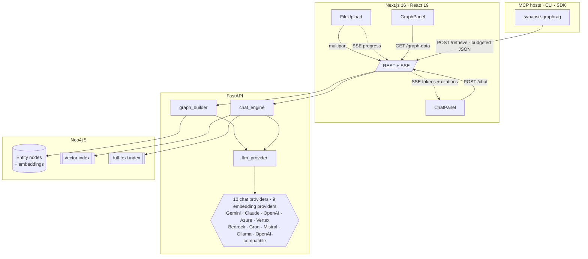
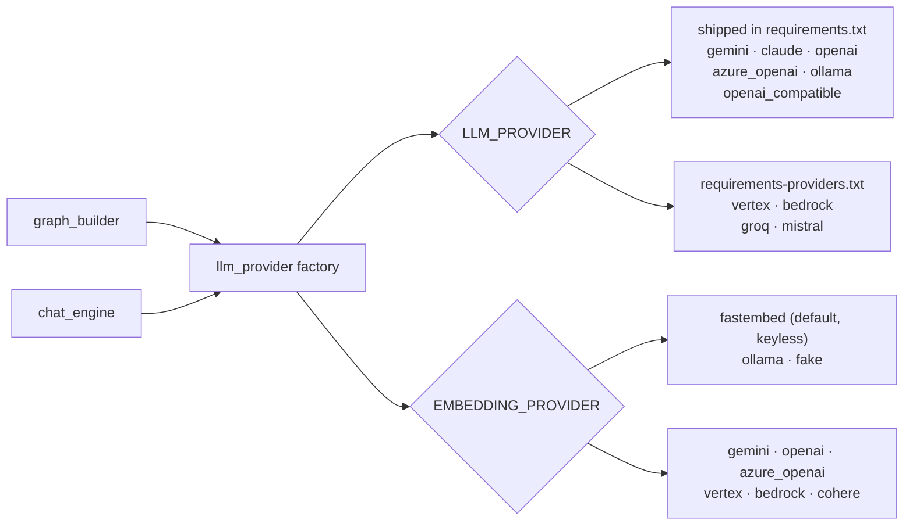
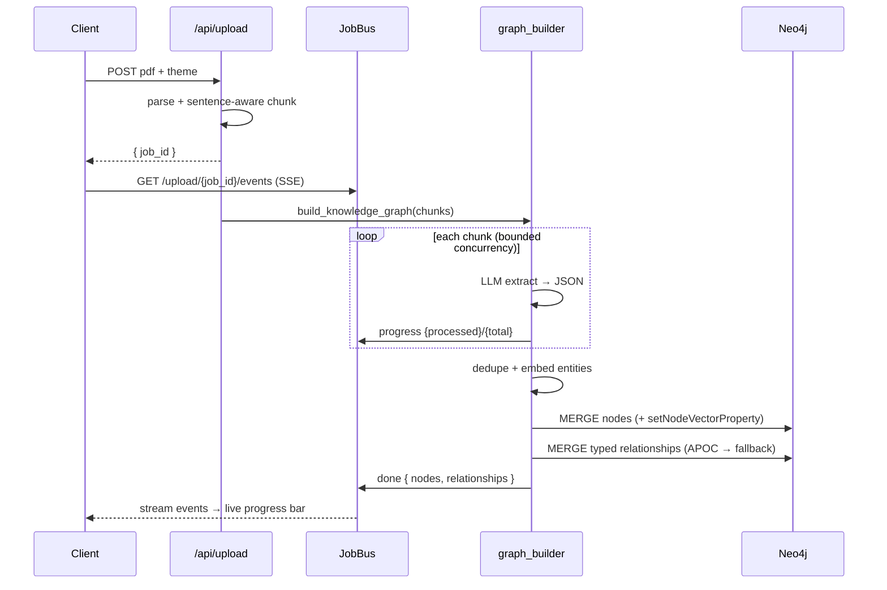
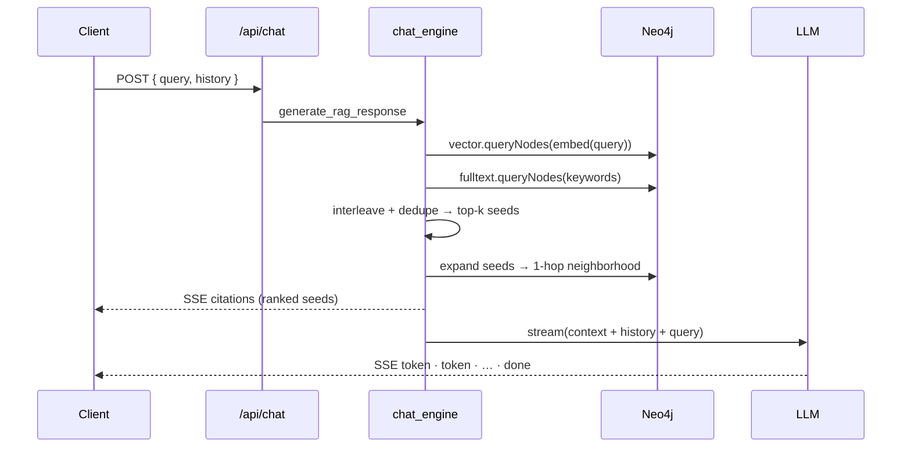
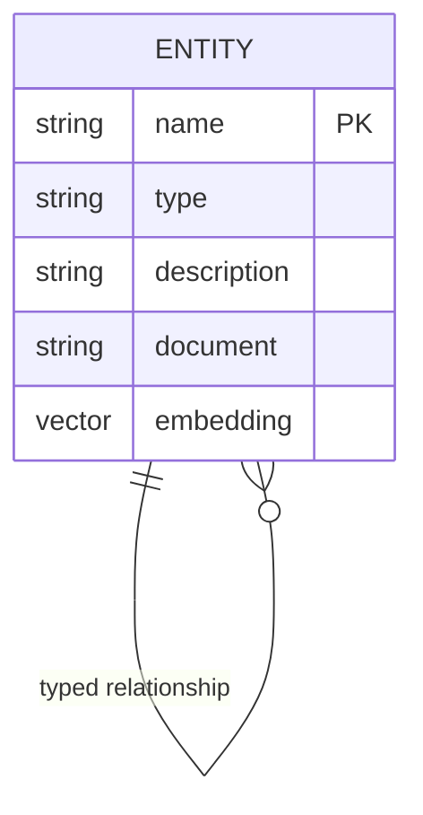
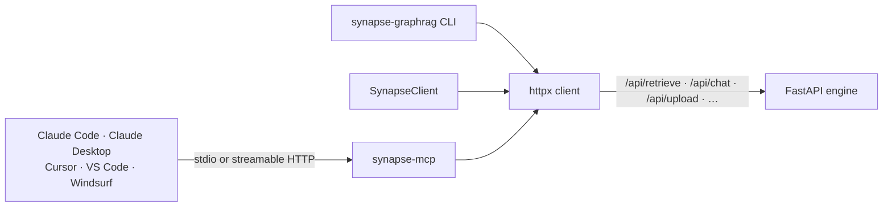

# Architecture

Synapse is a GraphRAG system in three tiers: a **Next.js** client, a
**FastAPI** engine, and **Neo4j** as both the knowledge store and the retrieval
index. This document covers the data flow, the graph model, and the design
decisions worth defending.

## System overview

## The provider layer

Everything AI-related is funnelled through one module,
`backend/app/services/llm_provider.py`, which exposes exactly two entry points:

- `get_chat_llm(streaming=…, json_mode=…, temperature=…)` → a LangChain
  `BaseChatModel` for the provider named by `LLM_PROVIDER`.
- `get_embeddings()` → a LangChain `Embeddings` for `EMBEDDING_PROVIDER`.

Three properties make this seam cheap to extend:

- **Lazy imports.** Each provider's SDK is imported *inside* its branch, so the
  app boots and the whole unit suite runs with none of the optional packages
  installed.
- **Credentials validated before the import.** A missing key raises a
  `ProviderConfigError` naming the env var and where to get one — which also
  means every branch is testable hermetically, with no network and no key.
- **Cached embeddings on primitives.** `_load_embeddings` is `@lru_cache`d over
  scalar arguments (not the `Settings` object, which isn't hashable) because
  model init — fastembed in particular — is expensive.

`openai_compatible` is a deliberate escape hatch: `ChatOpenAI` with a custom
`base_url` covers OpenRouter, Together, DeepSeek, Fireworks, vLLM, LM Studio and
llama.cpp with no extra dependency, so most "please add X" requests are already
satisfied. See [CONTRIBUTING.md](./CONTRIBUTING.md#add-a-new-ai-provider-in-20-lines)
for the walkthrough of adding a first-party branch.

## Ingestion pipeline

Upload returns immediately with a `job_id`; the heavy work runs in a background
task that publishes progress to an in-memory bus the client subscribes to.

## Retrieval (GraphRAG)

Two retrieval signals are combined:

- **Semantic** — the question is embedded and matched against the entity vector
  index (`db.index.vector.queryNodes`, cosine).
- **Lexical** — keywords (stopword-stripped, Lucene-escaped) hit the full-text
  index; a `CONTAINS` scan is the last-resort fallback.

Seeds are **interleaved** (so a strong lexical hit isn't buried behind weak
semantic ones), deduped, and the **top-k ranked seeds become the citations** —
their neighborhoods enrich the LLM context but don't dilute the ranking. This
ordering is what took Hit@1 from 12% → 88% in the eval.

The same retrieval is exposed **without generation** as `POST /api/retrieve`.
It returns the formatted context, the citations, the multi-hop reasoning
paths and the source excerpts under an optional `max_context_chars` budget,
plus a `usage` block — `context_chars`, `context_tokens_est`, `truncated`, and
the citation / path / source counts. `/api/chat` reports the same `context_*`
figures, plus `answer_chars`, on its `done` event. This is the endpoint the MCP
server and the CLI build on; see [Clients](#clients-mcp-server-cli-and-sdk).

## Graph model

- One label, `:Entity`, with a `type` **property** (`PERSON`, `TOOL`, …). The
  frontend colors by this property — a bug in the original returned the Neo4j
  *label* (`"Entity"`), which is why every node once rendered gray.
- A **uniqueness constraint** on `name` makes `MERGE` idempotent and dedup free.
- Relationships are typed via APOC (`apoc.merge.relationship`) with a static
  `:RELATED_TO` fallback so the system degrades gracefully without APOC.
- Embeddings are stored via `db.create.setNodeVectorProperty` and **never shipped
  to the browser** (stripped in the graph endpoint).

## Clients: MCP server, CLI and SDK

`packages/synapse-graphrag/` ships three front doors to the same engine — an
[MCP](https://modelcontextprotocol.io) server (`synapse-mcp`), a CLI
(`synapse-graphrag`) and an async Python client (`SynapseClient`) — and all
three are **thin HTTP clients** over the API above. The package depends on
`mcp` and `httpx` and nothing else.

**Why not embed the engine in the package?** Because the engine is the part
that owns secrets and state. Importing `chat_engine` into an agent host would
drag LangChain, the Neo4j driver, every provider SDK and the provider
credentials into that process — a process the user does not administer and
often cannot audit. Keeping the engine behind HTTP means one deployment to
secure, one schema to migrate, one place credentials live, and a client that
installs in seconds with `uvx`. It also keeps the wire contract honest: the
UI, the CLI and the MCP tools all consume the same endpoints, so a change that
breaks one breaks the tests of all three.

The MCP surface is deliberately small — eight tools, one resource and two
prompts (`answer_with_graph`, `safety_brief`) — and the tool the server's
instructions steer the model towards is
`synapse_retrieve`, which returns context rather than an answer. The host
already has a model; the `synapse_ask` tool exists for hosts that want the
backend's provider to generate, and its description says plainly that it is a
second LLM call. Tool annotations (`readOnlyHint`, `destructiveHint`) let hosts
auto-approve reads and confirm the one destructive tool, `synapse_clear_graph`,
which additionally refuses unless called with `confirm=true`.

### Context budget

Retrieval on a well-connected graph produces more text than a question needs:
eight seeds, their 1-hop neighborhoods, the reasoning paths between them and
the top source excerpts can run to many thousands of characters, and every
character is a token the host's model pays for. `POST /api/retrieve` therefore
accepts `max_context_chars` and enforces it in the engine, not the client:

- The context lists the **highest-ranked entities first**, so truncating the
  tail loses the least relevant material.
- The cut happens at the **last line break** at or before the budget, provided
  that keeps at least 60 % of it; otherwise it is a hard cut. Either way a
  trailing `…[context truncated to N chars]` marker tells the model the context
  is partial.
- The response carries `usage` — `context_chars`, `context_tokens_est`
  (`ceil(chars / 4)`, a deliberately provider-agnostic heuristic), `truncated`,
  and the counts of citations, paths and sources — so callers can log cost per
  question without a tokenizer.

The MCP server layers a default budget (`SYNAPSE_MAX_CONTEXT_CHARS`, 6000) and
a TTL cache keyed by `(query, k, budget)` on top, and adds `usage.cached` so a
repeated question is visibly free. Nothing in the budget is model-specific;
that is the point — the engine does not know which model will read the context.

## Design decisions

| Decision | Why |
| --- | --- |
| **Provider factory with lazy imports** | The app boots even if `langchain-aws` isn't installed; a missing key raises an *actionable* error only when that provider is invoked — not at startup. Ten chat backends behind one function, selected by one env var. |
| **Two requirements files** | `requirements.txt` ships the providers that add no weight (Gemini, Claude, OpenAI, Azure, Ollama, OpenAI-compatible). The heavy first-party SDKs — `google-cloud-aiplatform`, `boto3`, `cohere` — are opt-in via `requirements-providers.txt`, keeping the default image small. |
| **`fastembed` as default embeddings** | Real semantic retrieval with **no API key and no GPU** — the demo works offline. A `fake` deterministic embedder keeps tests hermetic. |
| **Pre-extracted demo graph** | `backend/scripts/seed_demo.py` loads a curated graph through the *production* write path (`ensure_schema` → `_embed_entities` → `_write_entities` → `_write_relationships`), skipping only the LLM extraction step. A fresh clone therefore shows a real, populated graph with **no API key** — see `make demo`. |
| **SSE over WebSockets** | Streaming is one-directional (server→client). SSE is simpler, proxy-friendly, and needs no extra client library. |
| **Retrieval-only endpoint + context budget** | `POST /api/retrieve` returns budgeted context with `usage` and no generation, so an MCP host or agent that already has an LLM pays for one generation, not two. The budget is enforced server-side and reported, never silently applied — see [Context budget](#context-budget). |
| **Clients are thin HTTP wrappers** | The MCP server, CLI and SDK never import the engine: secrets, schema and provider SDKs stay in one deployable, and the package installs with `uvx` in seconds — see [Clients](#clients-mcp-server-cli-and-sdk). |
| **In-memory job bus** | Single-replica-appropriate and dependency-free. The interface is deliberately small so swapping in Redis pub/sub for horizontal scaling is mechanical. |
| **Best-effort degradation** | No vector index yet? Fall back to full-text. No APOC? Fall back to `:RELATED_TO`. Embeddings fail? Keyword-only retrieval. The system stays useful under partial failure. |
| **Diffed graph polling** | The client only re-heats the force simulation when the node/link set actually changes, avoiding constant jitter. |

## Known coupling & limits

- **Embedding dimension is coupled to the model.** `EMBEDDING_DIM` sizes the
  Neo4j vector index and must match the active embedder (bge-small = 384,
  Gemini / Vertex / nomic = 768, Titan / Cohere = 1024, OpenAI
  `text-embedding-3-small` = 1536). Changing providers requires re-ingestion (or
  a re-run of `make demo`) so vectors share one space. This is documented in
  `.env.example` and the README table, and is a natural place for a future
  migration command.
- **The dependency tree is pinned to `langchain-core` 0.3.x.** The `<0.4` cap in
  `requirements.txt` is load-bearing: provider SDKs otherwise pull core to 1.x
  and break `langchain` / `langchain-community` / `langchain-ollama`. That cap,
  not the code, is what bounds which provider SDK versions are reachable —
  `requirements-providers.txt` documents the resolution per package.
- **Retrieval is bounded to `retrieval_max_hops` (default 2).** Deeper traversal is
  possible but the path search is deliberately capped: on a dense graph the
  candidate-path count grows fast, and beyond two hops the retrieved context
  starts adding noise rather than evidence.
- **Community detection runs in Python, not Neo4j.** The shipped
  `neo4j:5-community` image has APOC but *not* the Graph Data Science plugin, so
  `gds.louvain` is unavailable. We use `networkx` (`seed=42`, sorted input rows)
  which is dependency-light, portable, and reproducible. For very large graphs,
  moving to GDS is the natural scale-up.
- **Entity resolution is conservative by design.** A merge needs *two* agreeing
  signals and identical entity types, because a wrong merge silently corrupts the
  graph while a missed merge only leaves a duplicate.
- **Job state is per-process.** Fine for one backend replica; see the bus note above.

## Scaling notes

The stateless FastAPI engine scales horizontally behind a load balancer once the
job bus moves to Redis. Neo4j vector search handles the retrieval hot path; for
very large graphs, seed retrieval would move to approximate-NN with a re-rank
step, and ingestion would shift to a queue (e.g. Celery/RQ) instead of FastAPI
background tasks.
