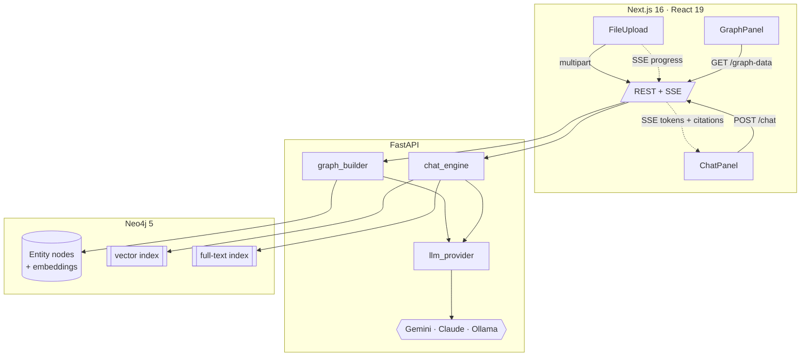
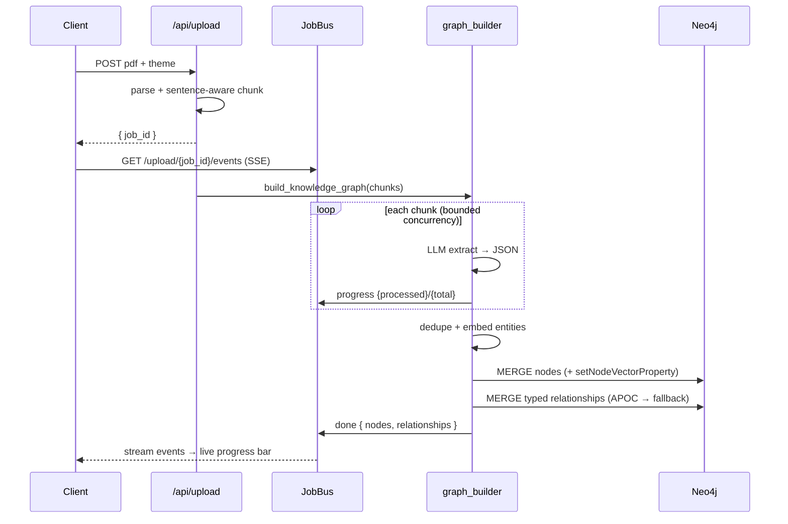
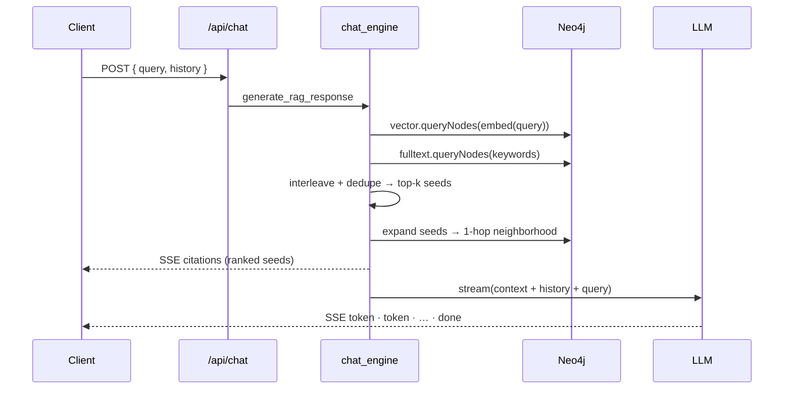
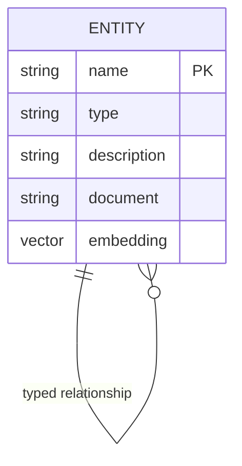

# Architecture

Project Synapse is a GraphRAG system in three tiers: a **Next.js** client, a
**FastAPI** engine, and **Neo4j** as both the knowledge store and the retrieval
index. This document covers the data flow, the graph model, and the design
decisions worth defending.

## System overview

## Ingestion pipeline

Upload returns immediately with a `job_id`; the heavy work runs in a background
task that publishes progress to an in-memory bus the client subscribes to.

## Retrieval (GraphRAG)

Two retrieval signals are combined:

- **Semantic** — the question is embedded and matched against the entity vector
  index (`db.index.vector.queryNodes`, cosine).
- **Lexical** — keywords (stopword-stripped, Lucene-escaped) hit the full-text
  index; a `CONTAINS` scan is the last-resort fallback.

Seeds are **interleaved** (so a strong lexical hit isn't buried behind weak
semantic ones), deduped, and the **top-k ranked seeds become the citations** —
their neighborhoods enrich the LLM context but don't dilute the ranking. This
ordering is what took Hit@1 from 12% → 88% in the eval.

## Graph model

- One label, `:Entity`, with a `type` **property** (`PERSON`, `TOOL`, …). The
  frontend colors by this property — a bug in the original returned the Neo4j
  *label* (`"Entity"`), which is why every node once rendered gray.
- A **uniqueness constraint** on `name` makes `MERGE` idempotent and dedup free.
- Relationships are typed via APOC (`apoc.merge.relationship`) with a static
  `:RELATED_TO` fallback so the system degrades gracefully without APOC.
- Embeddings are stored via `db.create.setNodeVectorProperty` and **never shipped
  to the browser** (stripped in the graph endpoint).

## Design decisions

| Decision | Why |
| --- | --- |
| **Provider factory with lazy imports** | The app boots even if `langchain-anthropic` isn't installed; a missing key raises an *actionable* error only when that provider is invoked — not at startup. |
| **`fastembed` as default embeddings** | Real semantic retrieval with **no API key and no GPU** — the demo works offline. A `fake` deterministic embedder keeps tests hermetic. |
| **SSE over WebSockets** | Streaming is one-directional (server→client). SSE is simpler, proxy-friendly, and needs no extra client library. |
| **In-memory job bus** | Single-replica-appropriate and dependency-free. The interface is deliberately small so swapping in Redis pub/sub for horizontal scaling is mechanical. |
| **Best-effort degradation** | No vector index yet? Fall back to full-text. No APOC? Fall back to `:RELATED_TO`. Embeddings fail? Keyword-only retrieval. The system stays useful under partial failure. |
| **Diffed graph polling** | The client only re-heats the force simulation when the node/link set actually changes, avoiding constant jitter. |

## Known coupling & limits

- **Embedding dimension is coupled to the model.** `EMBEDDING_DIM` must match the
  active embedder (bge-small = 384, Gemini = 768). Changing providers requires
  re-ingestion so vectors share a space. This is enforced by config, documented
  in `.env.example`, and a natural place for a future migration command.
- **Retrieval is 1-hop.** Multi-hop reasoning paths are on the roadmap.
- **Job state is per-process.** Fine for one backend replica; see the bus note above.

## Scaling notes

The stateless FastAPI engine scales horizontally behind a load balancer once the
job bus moves to Redis. Neo4j vector search handles the retrieval hot path; for
very large graphs, seed retrieval would move to approximate-NN with a re-rank
step, and ingestion would shift to a queue (e.g. Celery/RQ) instead of FastAPI
background tasks.
