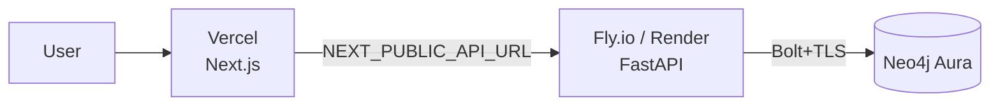

# Deployment

A production deploy is three managed pieces: **Neo4j Aura** (database),
**Fly.io or Render** (backend), and **Vercel** (frontend). Each has a free tier.



> **Heads up:** the steps below need *your* accounts and API keys, so they can't
> be automated for you. Everything you have to supply is called out as **[you]**.

---

## 1. Database — Neo4j Aura

1. Create a free instance at **[console.neo4j.io](https://console.neo4j.io/)** **[you]**.
2. Save the generated password and the connection URI (`neo4j+s://<id>.databases.neo4j.io`) **[you]**.
3. Aura includes APOC and vector indexes — no extra setup. Synapse creates its
   indexes automatically on first boot.

Optional: give the fresh database something to show before you wire up an LLM —
the demo seeder needs **no API key**.

```bash
cd backend
NEO4J_URI=neo4j+s://….databases.neo4j.io \
NEO4J_USER=neo4j NEO4J_PASSWORD=…        `# [you]` \
python -m scripts.seed_demo --clear
```

---

## 2. Backend — Fly.io *(or Render)*

**Fly.io** (config in [`backend/fly.toml`](./backend/fly.toml)).

> **Run every command from the repo root.** `backend/Dockerfile` builds from a
> **repo-root context** so the image can `COPY LICENSE NOTICE` — which
> [`NOTICE`](./NOTICE) requires of every container image. `fly deploy` otherwise
> defaults to the directory holding `fly.toml`, which would put `LICENSE` and
> `NOTICE` outside the context and fail the build. Hence the explicit flags:

```bash
# from the repo root — NOT from ./backend
fly launch --no-deploy --config backend/fly.toml   # creates the app
fly secrets set --config backend/fly.toml \
  LLM_PROVIDER=gemini \
  GOOGLE_API_KEY=…            `# [you]` \
  NEO4J_URI=neo4j+s://….databases.neo4j.io \
  NEO4J_USER=neo4j \
  NEO4J_PASSWORD=…            `# [you]` \
  CORS_ORIGINS=https://your-app.vercel.app
fly deploy --config backend/fly.toml --dockerfile backend/Dockerfile
```

Sanity-check the attribution actually shipped:

```bash
docker build -f backend/Dockerfile -t synapse-backend .   # from the repo root
docker run --rm synapse-backend ls /app/LICENSE /app/NOTICE
```

**Render** — push the repo, then **New → Blueprint** and point it at
[`render.yaml`](./render.yaml); fill the `sync: false` secrets in the dashboard.

Verify: `curl https://synapse-backend.fly.dev/health/ready` → `{"neo4j":"up"}`.

### Picking a provider for a hosted deploy

Any of the ten providers works — set `LLM_PROVIDER` plus that provider's
credentials as secrets (full list in [`.env.example`](./.env.example) and the
[README provider matrix](./README.md#-provider-matrix)).

| If you want… | Set | Notes |
| --- | --- | --- |
| A free hosted demo | `LLM_PROVIDER=gemini` + `GOOGLE_API_KEY` | Free tier, no card |
| Fast + cheap | `LLM_PROVIDER=groq` + `GROQ_API_KEY` | Needs the optional SDK (below) |
| Your existing cloud account | `azure_openai` / `vertex` / `bedrock` | IAM-based auth, see below |
| A gateway (OpenRouter, Together, DeepSeek…) | `openai_compatible` + `OPENAI_COMPATIBLE_BASE_URL` | No extra dependency |

Two deployment-specific gotchas:

- **Optional provider SDKs are not in the default image.** `vertex`, `bedrock`,
  `groq`, `mistral` and the `cohere` embedder live in
  `backend/requirements-providers.txt`. To deploy with one of them, add
  `RUN pip install --no-cache-dir -r requirements-providers.txt` to
  `backend/Dockerfile` after the existing install step, or install it in your
  platform's build command. Without it the app boots fine and fails with a clear
  "package is not installed" error the first time that provider is invoked.
- **IAM-based providers need credentials, not env keys.** `vertex` expects
  Application Default Credentials (mount a service-account JSON and set
  `GOOGLE_APPLICATION_CREDENTIALS`); `bedrock` expects the standard AWS chain
  (`AWS_ACCESS_KEY_ID`/`AWS_SECRET_ACCESS_KEY` secrets, or an instance role);
  `azure_openai` needs the endpoint and the **deployment names**, not model names.

---

## 3. Frontend — Vercel

1. **New Project** → import the repo, set **Root Directory = `frontend`** **[you]**.
2. Add env var `NEXT_PUBLIC_API_URL = https://synapse-backend.fly.dev` **[you]**.
3. Deploy. Then set the backend's `CORS_ORIGINS` to the Vercel URL and redeploy
   the backend so the browser is allowed to call it.

---

## Environment checklist

| Variable | Backend | Frontend | Notes |
| --- | :--: | :--: | --- |
| `LLM_PROVIDER` | ✅ | | `gemini` \| `claude` \| `openai` \| `azure_openai` \| `vertex` \| `bedrock` \| `groq` \| `mistral` \| `ollama` \| `openai_compatible` |
| the chosen provider's credentials | ✅ | | e.g. `GOOGLE_API_KEY`, `GROQ_API_KEY`, `AZURE_OPENAI_*`, `VERTEX_PROJECT`, `BEDROCK_REGION` — see [`.env.example`](./.env.example) |
| `EMBEDDING_PROVIDER` / `EMBEDDING_DIM` | ✅ | | must match (fastembed = 384, Gemini/Vertex = 768, Titan/Cohere = 1024, OpenAI small = 1536) |
| `NEO4J_URI` / `NEO4J_USER` / `NEO4J_PASSWORD` | ✅ | | Aura connection |
| `CORS_ORIGINS` | ✅ | | the frontend's public origin |
| `NEXT_PUBLIC_API_URL` | | ✅ | the backend's public URL (build-time) |

> **Note on Ollama:** it can't run on Vercel/Fly's free tier — use a cloud
> provider (`gemini`, `groq`, `claude`, …) for a hosted demo, and keep `ollama`
> for local and air-gapped installs.

> **Note on `fastembed`:** it downloads the ONNX model on first use (~130 MB) and
> needs `libgomp1`, which `backend/Dockerfile` already installs. On a tiny
> instance, or where cold starts matter, switch `EMBEDDING_PROVIDER` to a cloud
> embedder — and remember to change `EMBEDDING_DIM` and re-ingest.
