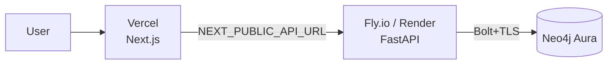

# Deployment

A production deploy is three managed pieces: **Neo4j Aura** (database),
**Fly.io or Render** (backend), and **Vercel** (frontend). Each has a free tier.
An optional fourth — the **MCP server** for agent hosts — runs from a published
container image; see [Container images (GHCR)](#container-images-ghcr).



> **Heads up:** the steps below need *your* accounts and API keys, so they can't
> be automated for you. Everything you have to supply is called out as **[you]**.

---

## 1. Database — Neo4j Aura

1. Create a free instance at **[console.neo4j.io](https://console.neo4j.io/)** **[you]**.
2. Save the generated password and the connection URI (`neo4j+s://<id>.databases.neo4j.io`) **[you]**.
3. Aura includes APOC and vector indexes — no extra setup. Synapse creates its
   indexes automatically on first boot.

Optional: give the fresh database something to show before you wire up an LLM —
the demo seeder needs **no API key**.

```bash
cd backend
NEO4J_URI=neo4j+s://….databases.neo4j.io \
NEO4J_USER=neo4j NEO4J_PASSWORD=…        `# [you]` \
python -m scripts.seed_demo --clear
```

---

## 2. Backend — Fly.io *(or Render)*

**Fly.io** (config in [`backend/fly.toml`](./backend/fly.toml)).

> **Run every command from the repo root.** `backend/Dockerfile` builds from a
> **repo-root context** so the image can `COPY LICENSE NOTICE` — which
> [`NOTICE`](./NOTICE) requires of every container image. `fly deploy` otherwise
> defaults to the directory holding `fly.toml`, which would put `LICENSE` and
> `NOTICE` outside the context and fail the build. Hence the explicit flags:

```bash
# from the repo root — NOT from ./backend
fly launch --no-deploy --config backend/fly.toml   # creates the app
fly secrets set --config backend/fly.toml \
  LLM_PROVIDER=gemini \
  GOOGLE_API_KEY=…            `# [you]` \
  NEO4J_URI=neo4j+s://….databases.neo4j.io \
  NEO4J_USER=neo4j \
  NEO4J_PASSWORD=…            `# [you]` \
  CORS_ORIGINS=https://your-app.vercel.app
fly deploy --config backend/fly.toml --dockerfile backend/Dockerfile
```

Sanity-check the attribution actually shipped:

```bash
docker build -f backend/Dockerfile -t synapse-backend .   # from the repo root
docker run --rm synapse-backend ls /app/LICENSE /app/NOTICE
```

**Render** — push the repo, then **New → Blueprint** and point it at
[`render.yaml`](./render.yaml); fill the `sync: false` secrets in the dashboard.

Verify: `curl https://synapse-backend.fly.dev/health/ready` → `{"neo4j":"up"}`.

### Picking a provider for a hosted deploy

Any of the ten providers works — set `LLM_PROVIDER` plus that provider's
credentials as secrets (full list in [`.env.example`](./.env.example) and the
[README provider matrix](./README.md#-provider-matrix)).

| If you want… | Set | Notes |
| --- | --- | --- |
| A free hosted demo | `LLM_PROVIDER=gemini` + `GOOGLE_API_KEY` | Free tier, no card |
| Fast + cheap | `LLM_PROVIDER=groq` + `GROQ_API_KEY` | Needs the optional SDK (below) |
| Your existing cloud account | `azure_openai` / `vertex` / `bedrock` | IAM-based auth, see below |
| A gateway (OpenRouter, Together, DeepSeek…) | `openai_compatible` + `OPENAI_COMPATIBLE_BASE_URL` | No extra dependency |

Two deployment-specific gotchas:

- **Optional provider SDKs are not in the default image.** `vertex`, `bedrock`,
  `groq`, `mistral` and the `cohere` embedder live in
  `backend/requirements-providers.txt`. To deploy with one of them, add
  `RUN pip install --no-cache-dir -r requirements-providers.txt` to
  `backend/Dockerfile` after the existing install step, or install it in your
  platform's build command. Without it the app boots fine and fails with a clear
  "package is not installed" error the first time that provider is invoked.
- **IAM-based providers need credentials, not env keys.** `vertex` expects
  Application Default Credentials (mount a service-account JSON and set
  `GOOGLE_APPLICATION_CREDENTIALS`); `bedrock` expects the standard AWS chain
  (`AWS_ACCESS_KEY_ID`/`AWS_SECRET_ACCESS_KEY` secrets, or an instance role);
  `azure_openai` needs the endpoint and the **deployment names**, not model names.

---

## 3. Frontend — Vercel

1. **New Project** → import the repo, set **Root Directory = `frontend`** **[you]**.
2. Add env var `NEXT_PUBLIC_API_URL = https://synapse-backend.fly.dev` **[you]**.
3. Deploy. Then set the backend's `CORS_ORIGINS` to the Vercel URL and redeploy
   the backend so the browser is allowed to call it.

---

## Container images (GHCR)

Every `v*` tag runs [`.github/workflows/release.yml`](./.github/workflows/release.yml), which
builds and pushes three images to the GitHub Container Registry:

| Image | Built from | Tags |
| --- | --- | --- |
| `ghcr.io/ahmedmaaloul/synapse-backend` | `backend/Dockerfile` | `<version>` · `<major>.<minor>` · `latest` (`latest` is skipped for pre-release tags) |
| `ghcr.io/ahmedmaaloul/synapse-frontend` | `frontend/Dockerfile` (build-arg `NEXT_PUBLIC_API_URL` from the repo variable of the same name, default `http://localhost:8000`) | same |
| `ghcr.io/ahmedmaaloul/synapse-mcp` | `packages/synapse-graphrag/Dockerfile` | same |

All three are built from the **repo root** so `LICENSE` and `NOTICE` ship inside them — the
backend and frontend images carry the root PolyForm Noncommercial pair, the MCP image the client
package's own Apache-2.0 pair. Pin the version you deploy — `latest` moves on every release:

```bash
docker pull ghcr.io/ahmedmaaloul/synapse-backend:0.4.0
docker pull ghcr.io/ahmedmaaloul/synapse-mcp:0.4.0
```

The images appear when a `v*` tag is pushed and the release workflow finishes — nothing is
published from `main` alone.

### The MCP server over HTTP, behind an authenticating proxy

The MCP image runs `synapse-mcp --transport streamable-http --host 0.0.0.0 --port 8765` and
serves the protocol at **`/mcp`**. It carries **no authentication of its own**, and neither does
the backend it talks to, so the pattern for anything beyond localhost is:

1. keep the backend reachable **only** from the MCP container (compose network, private subnet,
   or the same host) — never publish port 8000;
2. publish the MCP server through a reverse proxy that authenticates — and terminates TLS —
   before forwarding to `:8765`.

```bash
# MCP server next to a backend on the same private network
docker run -d --name synapse-mcp --network synapse_default \
  -e SYNAPSE_URL=http://synapse-backend:8000 \
  -p 127.0.0.1:8765:8765 \
  ghcr.io/ahmedmaaloul/synapse-mcp:0.4.0
```

A minimal [Caddy](https://caddyserver.com/) front, shared-secret style — hosts send the token as
`Authorization: Bearer …`:

```caddyfile
mcp.example.com {
    @unauthorized not header Authorization "Bearer {env.MCP_TOKEN}"
    respond @unauthorized 401
    reverse_proxy 127.0.0.1:8765
}
```

Then register the remote server in the client (`claude mcp add --transport http synapse
https://mcp.example.com/mcp`, or the `url` form in Cursor / VS Code — see
[docs/mcp.md](./docs/mcp.md#install-per-client)). The same trick works one layer down: if you put
an authenticating gateway in front of the *backend*, set `SYNAPSE_API_KEY` on the MCP server and
it is forwarded as `Authorization: Bearer …` on every backend request.

With docker compose, the `mcp` profile does steps 1–2 minus the proxy:
`docker compose --profile mcp up -d` publishes `${MCP_PORT:-8765}` and points the server at
`http://backend:8000`.

| Variable | MCP server | Notes |
| --- | :--: | --- |
| `SYNAPSE_URL` | ✅ | backend base URL (`http://backend:8000` inside compose) |
| `SYNAPSE_API_KEY` | optional | forwarded as a Bearer token to an authenticating gateway in front of the backend |
| `SYNAPSE_MAX_CONTEXT_CHARS` / `SYNAPSE_CACHE_TTL` / `SYNAPSE_TIMEOUT` | optional | context budget, retrieve cache, HTTP timeout — see [docs/mcp.md](./docs/mcp.md#environment-variables) |
| `MCP_PORT` | compose only | host port for the `mcp` profile (default 8765) |

### Publishing the package to PyPI

The release workflow's `publish-pypi` job is **opt-in** and uses PyPI trusted publishing (OIDC —
no API token stored anywhere). It only runs when the repository variable `PYPI_PUBLISH` is
`true`. One-time setup **[you]**:

1. On PyPI, open the `synapse-graphrag` project (or *Your projects → Publishing* for a pending
   first release) → **Add a new publisher** → GitHub: owner `ahmedmaaloul`, repository
   `synapse`, workflow `release.yml`, environment `pypi`.
2. In the GitHub repo: *Settings → Environments* → create `pypi` (optionally with required
   reviewers, which turns every publish into an approval click).
3. *Settings → Secrets and variables → Actions → Variables* → `PYPI_PUBLISH` = `true`.

Until step 3 the job is skipped and everything else in the release — images, GitHub Release,
attached wheel and sdist — still ships. Set `PYPI_PUBLISH` back to anything else to pause
publishing without touching the workflow.

---

## Environment checklist

| Variable | Backend | Frontend | Notes |
| --- | :--: | :--: | --- |
| `LLM_PROVIDER` | ✅ | | `gemini` \| `claude` \| `openai` \| `azure_openai` \| `vertex` \| `bedrock` \| `groq` \| `mistral` \| `ollama` \| `openai_compatible` |
| the chosen provider's credentials | ✅ | | e.g. `GOOGLE_API_KEY`, `GROQ_API_KEY`, `AZURE_OPENAI_*`, `VERTEX_PROJECT`, `BEDROCK_REGION` — see [`.env.example`](./.env.example) |
| `EMBEDDING_PROVIDER` / `EMBEDDING_DIM` | ✅ | | must match (fastembed = 384, Gemini/Vertex = 768, Titan/Cohere = 1024, OpenAI small = 1536) |
| `NEO4J_URI` / `NEO4J_USER` / `NEO4J_PASSWORD` | ✅ | | Aura connection |
| `CORS_ORIGINS` | ✅ | | the frontend's public origin |
| `NEXT_PUBLIC_API_URL` | | ✅ | the backend's public URL (build-time) |

> **Note on Ollama:** it can't run on Vercel/Fly's free tier — use a cloud
> provider (`gemini`, `groq`, `claude`, …) for a hosted demo, and keep `ollama`
> for local and air-gapped installs.

> **Note on `fastembed`:** it downloads the ONNX model on first use (~130 MB) and
> needs `libgomp1`, which `backend/Dockerfile` already installs. On a tiny
> instance, or where cold starts matter, switch `EMBEDDING_PROVIDER` to a cloud
> embedder — and remember to change `EMBEDDING_DIM` and re-ingest.
