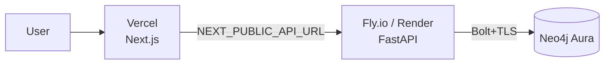

# Deployment

A production deploy is three managed pieces: **Neo4j Aura** (database),
**Fly.io or Render** (backend), and **Vercel** (frontend). Each has a free tier.



> **Heads up:** the steps below need *your* accounts and API keys, so they can't
> be automated for you. Everything you have to supply is called out as **[you]**.

---

## 1. Database — Neo4j Aura

1. Create a free instance at **[console.neo4j.io](https://console.neo4j.io/)** **[you]**.
2. Save the generated password and the connection URI (`neo4j+s://<id>.databases.neo4j.io`) **[you]**.
3. Aura includes APOC and vector indexes — no extra setup. Synapse creates its
   indexes automatically on first boot.

---

## 2. Backend — Fly.io *(or Render)*

**Fly.io** (config in [`backend/fly.toml`](./backend/fly.toml)):

```bash
cd backend
fly launch --no-deploy                    # creates the app
fly secrets set \
  LLM_PROVIDER=gemini \
  GOOGLE_API_KEY=…            `# [you]` \
  NEO4J_URI=neo4j+s://….databases.neo4j.io \
  NEO4J_USER=neo4j \
  NEO4J_PASSWORD=…            `# [you]` \
  CORS_ORIGINS=https://your-app.vercel.app
fly deploy
```

**Render** — push the repo, then **New → Blueprint** and point it at
[`render.yaml`](./render.yaml); fill the `sync: false` secrets in the dashboard.

Verify: `curl https://synapse-backend.fly.dev/health/ready` → `{"neo4j":"up"}`.

---

## 3. Frontend — Vercel

1. **New Project** → import the repo, set **Root Directory = `frontend`** **[you]**.
2. Add env var `NEXT_PUBLIC_API_URL = https://synapse-backend.fly.dev` **[you]**.
3. Deploy. Then set the backend's `CORS_ORIGINS` to the Vercel URL and redeploy
   the backend so the browser is allowed to call it.

---

## Environment checklist

| Variable | Backend | Frontend | Notes |
| --- | :--: | :--: | --- |
| `LLM_PROVIDER` | ✅ | | `gemini` \| `claude` \| `ollama` |
| `GOOGLE_API_KEY` / `ANTHROPIC_API_KEY` | ✅ | | for the chosen cloud provider |
| `EMBEDDING_PROVIDER` / `EMBEDDING_DIM` | ✅ | | must match (fastembed = 384) |
| `NEO4J_URI` / `NEO4J_USER` / `NEO4J_PASSWORD` | ✅ | | Aura connection |
| `CORS_ORIGINS` | ✅ | | the frontend's public origin |
| `NEXT_PUBLIC_API_URL` | | ✅ | the backend's public URL (build-time) |

> **Note on Ollama:** it can't run on Vercel/Fly's free tier — use a cloud
> provider (`gemini`/`claude`) for a hosted demo, and keep `ollama` for local.
