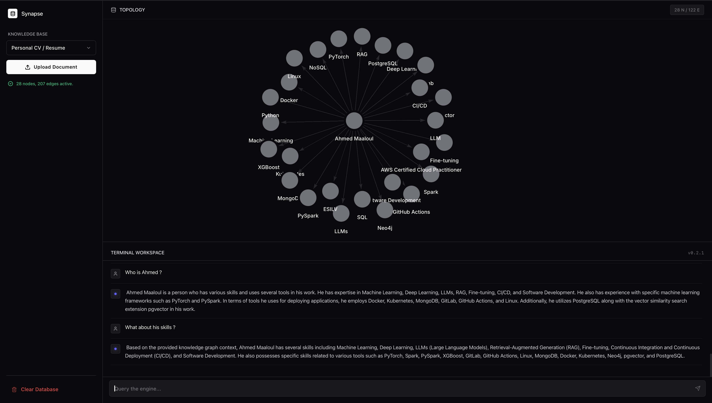

# Project Synapse 🧠

**Synapse** is an AI-powered Knowledge Graph extraction and GraphRAG exploration platform. 
It ingests unstructured documents (like PDFs, CVs, and technical docs), processes them through Large Language Models (LLMs), and automatically builds a queryable Neo4j property graph of entities and relationships.



Featuring a highly utilitarian, Vercel/Linear-inspired SaaS UI, Synapse allows you to chat directly with your entire connected knowledge base.

---

## ⚡ Features

- **Automated Graph Ingestion:** Upload PDFs and watch Synapse extract canonical nodes (Persons, Organizations, Skills, etc.) and semantic relationships in real-time.
- **GraphRAG Chat Engine:** Query your entire knowledge base. The AI retrieves subgraphs from Neo4j and streams completely context-grounded responses.
- **High-Density SaaS Architecture:** A robust 3-pane topology visualization and inspector built in Next.js 15, matching industry standards.
- **Pluggable AI Backend:** Seamlessly hot-swap between cloud models (Google Gemini) and local, private hardware AI via **Ollama**.

---

## 🛠️ Tech Stack

- **Frontend:** Next.js 15, React 19, TailwindCSS 4 (Zinc SaaS Palette), React-Force-Graph
- **Backend:** FastAPI, LangChain, PyPDF, Uvicorn
- **AI Integration:** Langchain-Ollama (`ChatOllama`) / Google GenAI
- **Database:** Neo4j Community (Bolt Protocol + APOC)
- **Infrastructure:** Docker Compose (Hot-Reloading Enabled)

---

## 🚀 Getting Started

### Prerequisites
1. [Docker Desktop](https://www.docker.com/products/docker-desktop/) installed and running.
2. [Ollama](https://ollama.com/) installed on your host machine (if using local models).
3. Ensure you have pulled the model you want to test in Ollama:
   ```bash
   ollama pull mistral 
   # or llama3.2, etc.
   ```

### Installation

1. Clone the repository.
2. Rename `.env.example` to `.env` and fill in any required variables.
   *(Note: Local Ollama does not require an API key).*

3. Boot the environment using Docker Compose:
   ```bash
   docker compose up -d --build
   ```
   *This single command spins up Neo4j, the FastAPI backend, and the Next.js frontend.*

4. Access the application:
   - **Frontend UI:** `http://localhost:3000`
   - **Backend API:** `http://localhost:8000/docs`
   - **Neo4j Browser:** `http://localhost:7474` (Default user/pass: `neo4j` / `synapse_secret`)

---

## 🔁 Changing AI Models (Hot-Reloading)

The FastAPI backend directory is volume-mounted into the Docker container with **hot-reloading enabled**. 

To swap AI models, simply open `backend/app/services/graph_builder.py` or `chat_engine.py` in your favorite IDE and change the `model` string, for example:

```python
    llm = ChatOllama(
        model="llama3.2", # Change this string
        base_url="http://host.docker.internal:11434",
        temperature=0.1,
        format="json",
    )
```

As soon as you save the file, the Docker container API will instantly restart itself in under a second. No need to run `docker compose` commands!

---

## 🏗️ Project Structure

```text
project_synapse/
├── docker-compose.yml 
├── .env
├── backend/
│   ├── app/
│   │   ├── main.py                # FastAPI entry
│   │   ├── neo4j_driver.py        # Database connection pool
│   │   ├── routers/               # HTTP Endpoints (Upload/Chat)
│   │   └── services/              # AI Brain (Graph Builder & Chat Engine)
│   ├── Dockerfile
│   └── requirements.txt
└── frontend/
    ├── src/
    │   └── app/
    │       ├── globals.css        # Tailwind Zinc SaaS styling
    │       ├── page.tsx           # 3-Pane Dashboard Layout
    │       └── components/        # Topology, FileUpload, ChatPanels
    ├── Dockerfile
    └── package.json
```
