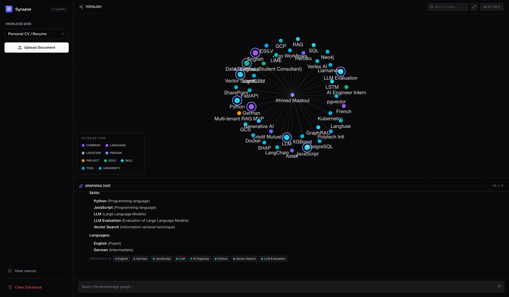
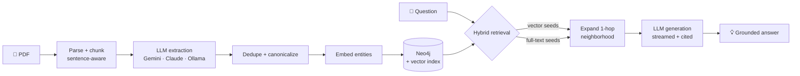

<div align="center">

# Project Synapse 🧠

**Turn any document into a queryable knowledge graph — then chat with it using vector-grounded GraphRAG.**

[](https://github.com/ahmedmaaloul/synapse/actions/workflows/ci.yml)
[](./LICENSE)


Upload a PDF → Synapse extracts entities & relationships with an LLM, embeds them, and writes a **Neo4j property graph**. Ask a question → it runs **hybrid (vector + full-text) retrieval**, expands the subgraph, and streams a grounded answer with **clickable citations** back to the exact nodes it used.



</div>

---

## ✨ Why it's interesting

- **Real GraphRAG, not keyword lookup.** Retrieval seeds from a **Neo4j vector index** over entity embeddings *and* a full-text index, then expands each seed to its 1-hop neighborhood so the model reasons over *relationships*, not isolated facts.
- **Measured, not vibes.** A [retrieval eval harness](#-retrieval-evaluation) scores the pipeline — **Hit@1 88% · Recall@8 100% · MRR 0.92** on paraphrased queries that keyword search would miss.
- **Genuinely pluggable AI.** One interface, three backends — **Google Gemini**, **Anthropic Claude**, or fully-local **Ollama** — chosen by a single env var. Embeddings are equally swappable (local `fastembed` needs no API key).
- **Streamed everything.** Ingestion progress and chat answers both stream over **Server-Sent Events**; answers arrive token-by-token with the grounding entities highlighted live in the graph.
- **Tested & CI'd.** 55 hermetic unit tests + integration tests against a **real Neo4j service container** in GitHub Actions, plus frontend typecheck/lint/build.

---

## 🧠 How it works


```mermaid
flowchart LR
    PDF[📄 PDF] --> P[Parse + chunk<br/>sentence-aware]
    P --> LLM[LLM extraction<br/>Gemini · Claude · Ollama]
    LLM --> D[Dedupe + canonicalize]
    D --> E[Embed entities]
    E --> W[(Neo4j<br/>+ vector index)]

    Q[💬 Question] --> H{Hybrid retrieval}
    W --> H
    H -->|vector seeds| X[Expand 1-hop<br/>neighborhood]
    H -->|full-text seeds| X
    X --> G[LLM generation<br/>streamed + cited]
    G --> A[💡 Grounded answer]
```

Ingestion runs as a background job that streams progress; retrieval interleaves semantic and lexical seeds, preserves the vector ranking, and returns the entities that grounded the answer as citations. See **[ARCHITECTURE.md](./ARCHITECTURE.md)** for the full design.

---

## 🚀 Quickstart

**Prerequisites:** [Docker Desktop](https://www.docker.com/products/docker-desktop/). That's it — everything else runs in containers.

```bash
git clone https://github.com/ahmedmaaloul/synapse.git
cd project_synapse
cp .env.example .env          # then set your provider (see below)
docker compose up -d --build
```

| Service | URL |
| --- | --- |
| Frontend UI | http://localhost:3000 |
| Backend API (Swagger) | http://localhost:8000/docs |
| Neo4j Browser | http://localhost:7474 · `neo4j` / `synapse_secret` |

### Choose your AI backend (edit `.env`)

<table>
<tr><th>Provider</th><th>Config</th><th>Notes</th></tr>
<tr><td><b>Gemini</b> (recommended)</td><td><code>LLM_PROVIDER=gemini</code><br/><code>GOOGLE_API_KEY=…</code></td><td>Free tier at <a href="https://aistudio.google.com/apikey">aistudio.google.com</a></td></tr>
<tr><td><b>Claude</b></td><td><code>LLM_PROVIDER=claude</code><br/><code>ANTHROPIC_API_KEY=…</code></td><td><a href="https://console.anthropic.com/">console.anthropic.com</a></td></tr>
<tr><td><b>Ollama</b> (local)</td><td><code>LLM_PROVIDER=ollama</code><br/><code>OLLAMA_CHAT_MODEL=mistral</code></td><td>Run <code>ollama pull mistral</code> on the host first</td></tr>
</table>

Embeddings default to **`fastembed`** (local, no key, 384-dim `bge-small`). Set `EMBEDDING_PROVIDER=gemini` (and `EMBEDDING_DIM=768`) to use cloud embeddings instead.

---

## 📊 Retrieval evaluation

Shipping RAG without measuring retrieval is flying blind. `backend/eval/` seeds a fixture graph and scores how well retrieval surfaces the *right* entities for **paraphrased** questions (deliberately no lexical overlap, so keyword-only search fails).

```bash
docker compose up -d neo4j
make eval        # writes backend/eval/results.md
```

| Metric | Score |
| --- | --- |
| **Hit@1** | 88% |
| **Recall@8** | 100% |
| **Precision@8** | 17%* |
| **MRR** | 0.917 |

<sub>*Precision@8 is low by construction — most queries have only 1–2 relevant entities, so returning 8 candidates for graph highlighting caps precision. Hit@1 / MRR are the quality signal.</sub>

---

## 🧪 Testing & CI

```bash
make test        # 55 hermetic unit tests (no DB / network / LLM)
make test-int    # integration tests against a live Neo4j
make lint        # ruff + eslint + tsc
```

Every push runs [CI](./.github/workflows/ci.yml): backend lint + unit tests, **integration tests against a real Neo4j 5 service container**, frontend eslint/typecheck/build, and both Docker image builds.

---

## 🛠️ Tech stack

| Layer | Tech |
| --- | --- |
| **Frontend** | Next.js 16, React 19, TailwindCSS 4, `react-force-graph`, `react-markdown` |
| **Backend** | FastAPI, LangChain, async Neo4j driver, `pypdf`, SSE |
| **AI** | Gemini / Claude / Ollama (pluggable) · `fastembed` embeddings |
| **Database** | Neo4j 5 (Bolt + APOC + native vector & full-text indexes) |
| **Infra** | Docker Compose, GitHub Actions |

---

## 📁 Project structure

```text
project_synapse/
├── backend/
│   ├── app/
│   │   ├── main.py                 # FastAPI app: CORS, lifespan, health/readiness
│   │   ├── config.py               # typed settings (pluggable providers)
│   │   ├── neo4j_driver.py         # async driver + connectivity check
│   │   ├── routers/                # upload (SSE jobs) · chat (SSE) · graph
│   │   └── services/
│   │       ├── llm_provider.py     # Gemini/Claude/Ollama + embeddings factory
│   │       ├── graph_builder.py    # extract → dedupe → embed → write
│   │       ├── graph_schema.py     # vector + full-text index bootstrap
│   │       ├── chat_engine.py      # hybrid GraphRAG retrieval + streaming
│   │       ├── pdf_parser.py       # sentence-aware chunking
│   │       └── jobs.py             # in-memory SSE job bus
│   ├── tests/                      # 55 unit + integration tests
│   └── eval/                       # retrieval eval harness + results
├── frontend/
│   └── src/app/
│       ├── lib/                    # typed API client, types, constants
│       └── components/             # GraphPanel · ChatPanel · FileUpload · Inspector
├── .github/workflows/ci.yml
├── docker-compose.yml
└── ARCHITECTURE.md · DEPLOYMENT.md
```

---

## 🗺️ Roadmap

- [ ] Per-document management (list / delete individual sources)
- [ ] Multi-hop retrieval (2+ hop reasoning paths)
- [ ] Entity resolution with embedding-similarity merging
- [ ] Ingest `.docx` / `.md` / raw text and URLs
- [ ] Hosted live demo

---

## 📄 License

MIT © [Ahmed Maaloul](https://github.com/ahmedmaaloul) — see [LICENSE](./LICENSE).
