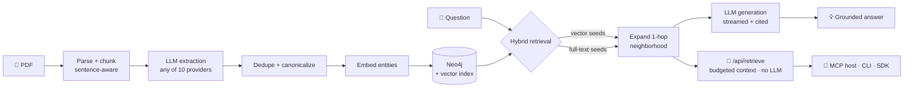

<div align="center">

# Synapse 🧠

**Turn any document into a queryable knowledge graph — then chat with it using vector-grounded GraphRAG.**

*Ten AI providers. One env var. Zero API keys to try it.*

[](https://github.com/ahmedmaaloul/synapse/actions/workflows/ci.yml)
[](https://github.com/ahmedmaaloul/synapse/releases)
<!-- Enable after the first PyPI publish (vars.PYPI_PUBLISH=true on the release workflow):
[](https://pypi.org/project/synapse-graphrag/)
-->
[](./LICENSE)
[](./CONTRIBUTING.md)
[](https://github.com/ahmedmaaloul/synapse/stargazers)
[](https://github.com/ahmedmaaloul/synapse/network/members)


[](https://codespaces.new/ahmedmaaloul/synapse)

Upload a PDF → Synapse extracts entities & relationships with an LLM, embeds them, and writes a **Neo4j property graph**. Ask a question → it runs **hybrid (vector + full-text) retrieval**, expands the subgraph, and streams a grounded answer with **clickable citations** back to the exact nodes it used.


</div>

---

## ⚡ Try it in 60 seconds — no API key

A fresh clone ships a **hand-curated demo knowledge graph** (53 entities, 106 relationships: a brief history of AI, from Babbage's Analytical Engine to GraphRAG). Seeding it skips the only step that needs an LLM — extraction — while still running the project's *real* schema, embedding and write pipeline.

**Prerequisite:** [Docker Desktop](https://www.docker.com/products/docker-desktop/). Nothing else.

```bash
git clone https://github.com/ahmedmaaloul/synapse.git
cd synapse
cp .env.example .env      # no edits needed for the demo
make up                   # neo4j + backend + frontend
make demo                 # seed the graph — zero keys, zero signups
```

Open **<http://localhost:3000>** and you have a live, explorable knowledge graph.

| Service | URL |
| --- | --- |
| Frontend UI | <http://localhost:3000> |
| Backend API (Swagger) | <http://localhost:8000/docs> |
| Neo4j Browser | <http://localhost:7474> · `neo4j` / `synapse_secret` |

> **What works with no key:** the graph view, node inspector, hybrid vector + full-text retrieval, embeddings (local `fastembed`), and the whole test suite.
> **What needs a key:** *generating* chat answers and ingesting your own PDFs — both call an LLM. Grab a **free** [Google AI Studio](https://aistudio.google.com/apikey) or [Groq](https://console.groq.com/keys) key, drop it in `.env`, restart, and you're done. Or run fully offline with [Ollama](#-provider-matrix).

<details>
<summary>Prefer not to install Docker Desktop? Other ways to run it</summary>

```bash
make demo-local            # seed from a local venv (needs: docker compose up -d neo4j)
python -m scripts.seed_demo --validate-only   # from backend/ — checks the fixture, touches nothing
EMBEDDING_PROVIDER=fake python -m scripts.seed_demo --clear   # 100% offline, no model download
```

Or click **[Open in GitHub Codespaces](https://codespaces.new/ahmedmaaloul/synapse)** — the
[devcontainer](./.devcontainer/devcontainer.json) installs Python 3.12, Node 20 and every backend
dependency, and forwards ports 3000/8000/8765/7474/7687 for you.

</details>

---

## 🤖 Use it from Claude, Cursor & any MCP client

Synapse ships an **[MCP](https://modelcontextprotocol.io) server** — the `synapse-graphrag` package, published to PyPI by the release workflow — so the graph you just built is a tool any agent host can call. It is a thin client over the same HTTP API the UI uses: keep the stack running (`make up`, `make demo`) and register it.

**Claude Code** — one line:

```bash
claude mcp add synapse -e SYNAPSE_URL=http://localhost:8000 -- uvx synapse-graphrag mcp
```

> Until the first PyPI release is out, run it straight from the repo instead of `uvx synapse-graphrag mcp`:
> `uvx --from "git+https://github.com/ahmedmaaloul/synapse#subdirectory=packages/synapse-graphrag" synapse-graphrag mcp`
> — or `pip install ./packages/synapse-graphrag` from a checkout and use `synapse-mcp` as the command.

**Claude Desktop / Cursor** — add to `claude_desktop_config.json` or `.cursor/mcp.json`:

```json
{
  "mcpServers": {
    "synapse": {
      "command": "uvx",
      "args": ["synapse-graphrag", "mcp"],
      "env": { "SYNAPSE_URL": "http://localhost:8000" }
    }
  }
}
```

Then ask your assistant *"What does the Synapse graph say about the Analytical Engine?"* — it calls `synapse_retrieve`, reads the subgraph and answers with entity citations. `synapse-graphrag install-config --client cursor` (or `claude-code`, `claude-desktop`, `vscode`, `windsurf`) prints the exact snippet for each client.

| Tool | What it does | Writes? |
| --- | --- | :--: |
| `synapse_retrieve` | Budgeted GraphRAG context — subgraph, reasoning paths, source chunks — with **no LLM call** on the Synapse side | |
| `synapse_ask` | A full answer generated by *Synapse's* LLM (a second LLM bill — prefer `synapse_retrieve`) | |
| `synapse_ingest_pdf` | Ingest a local PDF into the graph, following the job to completion | ✅ |
| `synapse_communities` | Corpus-level themes: Louvain communities with their LLM summaries | |
| `synapse_find_entities` | Case-insensitive substring search over entity labels and types | |
| `synapse_graph_stats` | Node/edge counts, by entity type and relationship type | |
| `synapse_status` | Health, readiness, version and the active providers | |
| `synapse_clear_graph` | Wipe the graph — refuses unless called with `confirm=true` | ⚠️ |

### 💸 FinOps: budgeted context, not a second LLM bill

A tool that *answers* the question makes the host model pay to read an answer another model already paid to write. Synapse's default tool is **retrieval-only**: `synapse_retrieve` returns the ranked subgraph, reasoning paths and source excerpts and lets the host model do the one generation it was going to do anyway. Every call is budgeted — `max_context_chars` (default `SYNAPSE_MAX_CONTEXT_CHARS=6000`) truncates at the last line boundary within the budget (a hard cut only if that boundary would waste more than 40 % of it) and marks the cut — and every response carries a `usage` block (`context_chars`, `context_tokens_est`, `truncated`, `cached`, …) so an agent, or a bill, can see exactly what was consumed. Repeated queries are served from a TTL cache (`SYNAPSE_CACHE_TTL`, 300 s by default) without touching the backend. The same knob is on the CLI: `synapse-graphrag retrieve "…" --budget 2000 --json`.

**Over HTTP instead of stdio** (shared servers, Docker, remote hosts):

```bash
docker compose --profile mcp up -d      # → http://localhost:8765/mcp  (streamable HTTP)
```

Full guide — per-client setup, transports, tool reference, cost model, troubleshooting and security: **[docs/mcp.md](./docs/mcp.md)**.

Working on AI safety? Ingest with `--theme "AI Safety"` (risks, failure modes, mitigations, evaluations, incidents, policies — each risk labelled *demonstrated* or *hypothesised*) and use the `safety_brief` prompt: **[docs/ai-safety.md](./docs/ai-safety.md)**. The full cost model behind the budget knobs: **[docs/finops.md](./docs/finops.md)**.

---

## ✨ Why it's interesting

- **Real GraphRAG, not keyword lookup.** Retrieval seeds from a **Neo4j vector index** over entity embeddings *and* a full-text index, then expands each seed to its 1-hop neighborhood so the model reasons over *relationships*, not isolated facts.
- **Measured, not vibes.** A [retrieval eval harness](#-retrieval-evaluation) scores the pipeline — **Hit@1 88% · Recall@8 100% · MRR 0.92** on paraphrased queries that keyword search would miss.
- **Genuinely pluggable AI.** **Ten chat providers and nine embedding providers** behind one small factory, chosen by a single env var — from OpenAI and Bedrock to a laptop running Ollama. No code change, no rebuild.
- **Streamed everything.** Ingestion progress and chat answers both stream over **Server-Sent Events**; answers arrive token-by-token with the grounding entities highlighted live in the graph.
- **Callable from any agent.** An MCP server, CLI and Python client ([`synapse-graphrag`](./docs/mcp.md)) expose the graph to Claude, Cursor, VS Code and friends — and the retrieval-only `synapse_retrieve` tool returns **budgeted** context with `usage` metadata, so a host that already has an LLM never pays for a second generation.
- **Tested & CI'd.** 800+ hermetic unit tests plus integration tests against a **real Neo4j service container** in GitHub Actions, and frontend typecheck/lint/build on every push.

---

## 🧠 How it works


```mermaid
flowchart LR
    PDF[📄 PDF] --> P[Parse + chunk<br/>sentence-aware]
    P --> LLM[LLM extraction<br/>any of 10 providers]
    LLM --> D[Dedupe + canonicalize]
    D --> E[Embed entities]
    E --> W[(Neo4j<br/>+ vector index)]

    Q[💬 Question] --> H{Hybrid retrieval}
    W --> H
    H -->|vector seeds| X[Expand 1-hop<br/>neighborhood]
    H -->|full-text seeds| X
    X --> G[LLM generation<br/>streamed + cited]
    G --> A[💡 Grounded answer]
    X --> R["🔌 /api/retrieve<br/>budgeted context · no LLM"]
    R --> M[🤖 MCP host · CLI · SDK]
```

Ingestion runs as a background job that streams progress; retrieval interleaves semantic and lexical seeds, preserves the vector ranking, and returns the entities that grounded the answer as citations. The retrieval step is also exposed on its own as **`POST /api/retrieve`** — context, citations, reasoning paths and source chunks under a `max_context_chars` budget, with `usage` metadata and no LLM call — which is what the MCP server and CLI build on. See **[ARCHITECTURE.md](./ARCHITECTURE.md)** for the full design.

---

## 🔌 Provider matrix

Set **one** env var. Everything else has a working default — see [`.env.example`](./.env.example) for the per-provider details, and [`backend/app/services/llm_provider.py`](./backend/app/services/llm_provider.py) for the factory itself.

| Provider | `LLM_PROVIDER=` | Credential needed | Free tier? | Install |
| --- | --- | --- | :--: | --- |
| **Google Gemini** *(easiest)* | `gemini` | `GOOGLE_API_KEY` — [AI Studio](https://aistudio.google.com/apikey) | ✅ | included |
| **Anthropic Claude** | `claude` | `ANTHROPIC_API_KEY` — [console](https://console.anthropic.com/) | ❌ paid credits | included |
| **OpenAI** | `openai` | `OPENAI_API_KEY` — [platform](https://platform.openai.com/api-keys) | ❌ paid credits | included |
| **Azure OpenAI** | `azure_openai` | `AZURE_OPENAI_API_KEY` + `_ENDPOINT` + `_CHAT_DEPLOYMENT` | ❌ Azure subscription | included |
| **Google Vertex AI** | `vertex` | `VERTEX_PROJECT` + [ADC](https://cloud.google.com/docs/authentication/application-default-credentials) (no key) | ⚠️ GCP trial credits | `make providers` |
| **AWS Bedrock** | `bedrock` | `BEDROCK_REGION` + the standard AWS credential chain | ❌ pay per token | `make providers` |
| **Groq** *(fastest)* | `groq` | `GROQ_API_KEY` — [console](https://console.groq.com/keys) | ✅ rate-limited | `make providers` |
| **Mistral AI** | `mistral` | `MISTRAL_API_KEY` — [console](https://console.mistral.ai/api-keys/) | ⚠️ free experiment tier | `make providers` |
| **Ollama** *(local & private)* | `ollama` | none — `ollama pull mistral` on the host | ✅ free forever | included |
| **Any OpenAI-compatible API** | `openai_compatible` | `OPENAI_COMPATIBLE_BASE_URL` (+ key for hosted gateways) | depends | included |

> **`openai_compatible` is the escape hatch.** It is `ChatOpenAI` pointed at a custom `base_url`, so it already covers **OpenRouter**, **Together**, **DeepSeek**, **Fireworks**, **vLLM**, **LM Studio** and **llama.cpp's server** — with *zero* extra dependencies. If your provider speaks `/v1/chat/completions`, it works today.

`make providers` runs `pip install -r backend/requirements-providers.txt` — the heavier first-party cloud SDKs (`langchain-google-vertexai`, `langchain-aws`, `langchain-groq`, `langchain-mistralai`, `langchain-cohere`) that are kept out of the default image so it stays small.

### Embedding providers

Embeddings are chosen independently of the chat model. The default needs **no API key and no GPU**.

| `EMBEDDING_PROVIDER=` | Default model | Dims → `EMBEDDING_DIM` | Credential | Install |
| --- | --- | :--: | --- | --- |
| `fastembed` *(default)* | `BAAI/bge-small-en-v1.5` | **384** | none — runs locally | included |
| `gemini` | `models/text-embedding-004` | 768 | `GOOGLE_API_KEY` | included |
| `ollama` | `nomic-embed-text` | 768 | none — local | included |
| `openai` | `text-embedding-3-small` | 1536 | `OPENAI_API_KEY` | included |
| `azure_openai` | your deployment | match your model | `AZURE_OPENAI_*` + `_EMBEDDING_DEPLOYMENT` | included |
| `vertex` | `text-embedding-005` | 768 | `VERTEX_PROJECT` + ADC | `make providers` |
| `bedrock` | `amazon.titan-embed-text-v2:0` | 1024 | `BEDROCK_REGION` + AWS chain | `make providers` |
| `cohere` | `embed-english-v3.0` | 1024 | `COHERE_API_KEY` | `make providers` |
| `fake` | deterministic hash | `EMBEDDING_DIM` | none — offline dev & tests | included |

> ⚠️ **`EMBEDDING_DIM` must match the model** — it sizes the Neo4j vector index. Switching embedding providers means re-ingesting (or re-running `make demo`) so all vectors share one space.

---

## 📊 Retrieval evaluation

Shipping RAG without measuring retrieval is flying blind. `backend/eval/` seeds a fixture graph and scores how well retrieval surfaces the *right* entities for **paraphrased** questions (deliberately no lexical overlap, so keyword-only search fails).

```bash
docker compose up -d neo4j
make eval        # writes backend/eval/results.md
```

| Metric | Score |
| --- | --- |
| **Hit@1** | 88% |
| **Recall@8** | 100% |
| **Precision@8** | 17%* |
| **MRR** | 0.917 |

<sub>*Precision@8 is low by construction — most queries have only 1–2 relevant entities, so returning 8 candidates for graph highlighting caps precision. Hit@1 / MRR are the quality signal.</sub>

---

## 🍴 Why fork this?

Because most GraphRAG repos are notebooks. This one is a running product with the boring parts already solved.

- **Swap the whole AI layer with one env var.** Ten chat backends and nine embedding backends behind [one small factory](./backend/app/services/llm_provider.py). Benchmark Gemini vs. Groq vs. your own vLLM box without touching application code.
- **A real vector GraphRAG reference implementation.** Neo4j native vector *and* full-text indexes, interleaved seeding, 1-hop expansion, streamed citations that map back to graph nodes. Not a `similarity_search()` wrapper.
- **A test suite and CI you can build on.** 800+ hermetic backend tests (no network, no DB, no LLM), integration tests against a live Neo4j service container, ruff + eslint + tsc, and all three Docker image builds — all green on every push.
- **Docs that respect your time.** [ARCHITECTURE.md](./ARCHITECTURE.md) explains *why*, [DEPLOYMENT.md](./DEPLOYMENT.md) gets it online, [CONTRIBUTING.md](./CONTRIBUTING.md) walks you through your first PR, and every env var is documented in [`.env.example`](./.env.example).
- **A clean seam to extend.** Provider branches are lazily imported and validate credentials *before* touching an SDK — which is why a new provider is a self-contained ~20-line change plus a test.

### Add a provider — the best first PR

Adding an AI provider is small, self-contained, and immediately useful to someone else. There's a
**[step-by-step walkthrough with real function names](./CONTRIBUTING.md#add-a-new-ai-provider-in-20-lines)**
in CONTRIBUTING.md.

👉 **[Open a provider request](https://github.com/ahmedmaaloul/synapse/issues/new?template=provider_request.yml)** — whether you want to build it or just want it to exist. Together AI, Nvidia NIM, Hugging Face TGI, Cerebras, xAI, Perplexity, watsonx… all fair game.

Other good entry points: the [roadmap](#-roadmap) below, anything labelled [`good first issue`](https://github.com/ahmedmaaloul/synapse/labels/good%20first%20issue), and [bug reports](https://github.com/ahmedmaaloul/synapse/issues/new?template=bug_report.yml).

---

## 🧪 Testing & CI

```bash
make test        # backend unit tests — hermetic (no DB / network / LLM)
make test-int    # integration tests against a live Neo4j
make eval        # retrieval quality harness
make lint        # ruff + eslint + tsc
make fmt         # ruff --fix + ruff format
make mcp-test    # synapse-graphrag package: ruff + pytest
```

Every push runs [CI](./.github/workflows/ci.yml): backend lint + unit tests, **integration tests against a real Neo4j 5 service container**, frontend eslint/typecheck/build, lint/tests/build of the `synapse-graphrag` package, and all three Docker image builds. Pushing a `v*` tag runs the [release workflow](./.github/workflows/release.yml): version and changelog checks, GHCR images, a GitHub Release and (opt-in) PyPI publishing — see [CONTRIBUTING.md](./CONTRIBUTING.md#cutting-a-release).

---

## 🛠️ Tech stack

| Layer | Tech |
| --- | --- |
| **Frontend** | Next.js 16, React 19, TailwindCSS 4, `react-force-graph`, `react-markdown` |
| **Backend** | FastAPI, LangChain, async Neo4j driver, `pypdf`, SSE |
| **AI** | 10 pluggable chat providers · 9 pluggable embedding providers · local `fastembed` default |
| **Database** | Neo4j 5 (Bolt + APOC + native vector & full-text indexes) |
| **Agents** | MCP server (stdio + streamable HTTP), CLI and async Python client — `synapse-graphrag` |
| **Infra** | Docker Compose, GitHub Actions (CI + tag-driven releases to GHCR / PyPI), Codespaces devcontainer |

---

## 📁 Project structure

```text
synapse/
├── backend/
│   ├── app/
│   │   ├── main.py                 # FastAPI app: CORS, lifespan, health/readiness, /api/about
│   │   ├── config.py               # typed settings (every provider, one Literal)
│   │   ├── neo4j_driver.py         # async driver + connectivity check
│   │   ├── routers/                # upload (SSE jobs) · chat (SSE) + retrieve (JSON) · graph + communities
│   │   └── services/
│   │       ├── llm_provider.py     # ⭐ the pluggable chat + embeddings factory
│   │       ├── graph_builder.py    # extract → dedupe → embed → write
│   │       ├── graph_schema.py     # vector + full-text index bootstrap
│   │       ├── chat_engine.py      # hybrid GraphRAG retrieval, multi-hop paths, budgeting, streaming
│   │       ├── entity_resolution.py# embedding + fuzzy-name duplicate merging
│   │       ├── communities.py      # Louvain communities + LLM summaries (global search)
│   │       ├── chunk_store.py      # source chunks (text units) linked to entities
│   │       ├── pdf_parser.py       # sentence-aware chunking
│   │       └── jobs.py             # in-memory SSE job bus
│   ├── scripts/seed_demo.py        # zero-API-key demo graph seeder (`make demo`)
│   ├── tests/                      # hermetic unit tests + integration tests
│   ├── eval/                       # retrieval eval harness + results
│   ├── benchmarks/                 # GraphRAG vs vector RAG harness · public/ HotpotQA & 2Wiki loaders
│   ├── requirements.txt            # batteries-included providers
│   └── requirements-providers.txt  # opt-in cloud SDKs (`make providers`)
├── frontend/
│   └── src/app/
│       ├── lib/                    # typed API client, types, constants
│       └── components/             # GraphPanel · ChatPanel · FileUpload · Inspector · ThemesPanel
├── packages/
│   └── synapse-graphrag/           # 🤖 MCP server · CLI · async Python client (PyPI: synapse-graphrag)
├── scripts/                        # release checks (versions, changelog) + branch-protection ruleset
├── docs/mcp.md                     # MCP / CLI / SDK guide
├── docs/finops.md                  # cost model: where a GraphRAG dollar goes, and the knob for each
├── docs/ai-safety.md               # the `AI Safety` theme and `safety_brief` prompt
├── .devcontainer/                  # one-click Codespaces environment
├── .github/
│   └── workflows/                  # ci.yml · release.yml (tag → GHCR images, GitHub Release, PyPI)
├── docker-compose.yml              # neo4j + backend + frontend (+ `--profile mcp`)
└── ARCHITECTURE.md · DEPLOYMENT.md · CONTRIBUTING.md · CHANGELOG.md
```

---

## 🤝 Contributing

PRs are genuinely welcome — and the project is structured so a first contribution is easy to land.

```bash
make providers   # optional: the extra provider SDKs
make test        # what CI runs
make lint
```

Start with **[CONTRIBUTING.md](./CONTRIBUTING.md)** (dev setup, conventions, and the
[add-a-provider walkthrough](./CONTRIBUTING.md#add-a-new-ai-provider-in-20-lines)), and read the
[Code of Conduct](./CODE_OF_CONDUCT.md). Security issues go to [SECURITY.md](./SECURITY.md).

**Zero-setup contributing:** [](https://codespaces.new/ahmedmaaloul/synapse) — Python 3.12, Node 20, all dependencies, ports forwarded, `.env` pre-created. Nothing to install locally.

---

## 🗺️ Roadmap

- [x] Multi-hop retrieval (2+ hop reasoning paths)
- [x] Entity resolution with embedding-similarity merging
- [x] MCP server, CLI & Python client (`synapse-graphrag`)
- [x] `AI Safety` extraction theme + `safety_brief` MCP prompt
- [ ] Publish to the MCP Registry & PyPI (trusted publishing)
- [ ] Per-answer cost accounting across providers (FinOps)
- [ ] Per-document management (list / delete individual sources)
- [ ] Ingest `.docx` / `.md` / raw text and URLs
- [ ] Hosted live demo
- [ ] More providers — [request one](https://github.com/ahmedmaaloul/synapse/issues/new?template=provider_request.yml)

---

## 📄 Licensing

Synapse is **dual-licensed**, and almost everyone only ever needs the free side.

### ✅ Free under [AGPL-3.0-or-later](./LICENSE) — no permission, no cost, no registration

Use it, **fork it**, study it, modify it, self-host it (including at work and including to make
money), sell hosting for it, and contribute back. The AGPL does **not** ban commercial use.

What it asks in return is reciprocity: keep the license and the attribution
(see [`NOTICE`](./NOTICE)), and — under **AGPL section 13** — if you run a *modified* Synapse as a
network service, offer your users the corresponding source of your modified version.

### 💼 A commercial license is needed only if…

…you want to ship Synapse (or a derivative) inside a **closed-source product**, run a **proprietary
SaaS** on a modified version without offering its source, **relicense** it under other terms, or your
legal team **prohibits AGPL** dependencies. A commercial license waives the copyleft obligations
(attribution is still required either way).

**Only Ahmed Maaloul can grant one.** Email **<ahmed.maaloul@proton.me>** with the subject
`[Commercial License] <your company>`. Startups, academic spin-outs and nonprofits: say so, pricing
is flexible. Full details and FAQ: **[COMMERCIAL-LICENSE.md](./COMMERCIAL-LICENSE.md)**.

<sub>Plain-English summary, not legal advice. [`LICENSE`](./LICENSE) is the binding document.</sub>

---

<div align="center">

**Synapse** — created and maintained by **[Ahmed Maaloul](https://github.com/ahmedmaaloul)**
&lt;ahmed.maaloul@proton.me&gt;

Copyright © 2026 Ahmed Maaloul · SPDX-License-Identifier: `AGPL-3.0-or-later`
· <https://github.com/ahmedmaaloul/synapse>

If this saved you time, a ⭐ helps other people find it.

</div>
