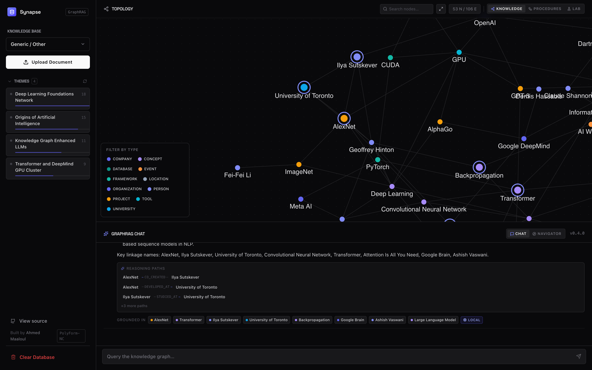
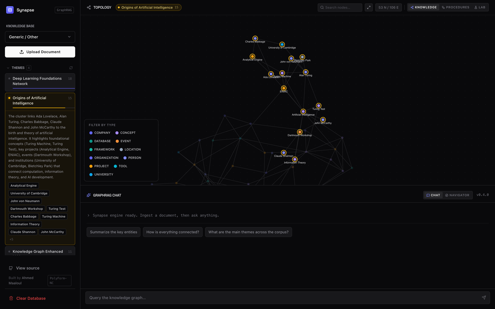
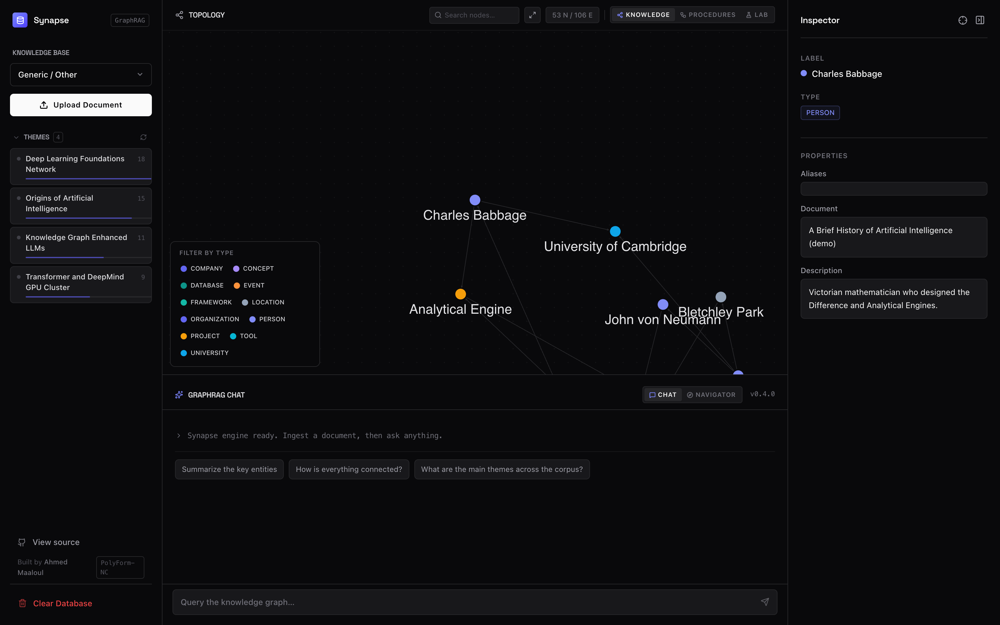
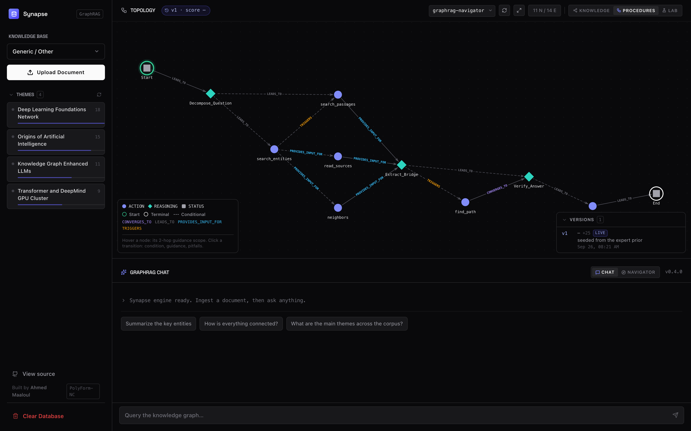
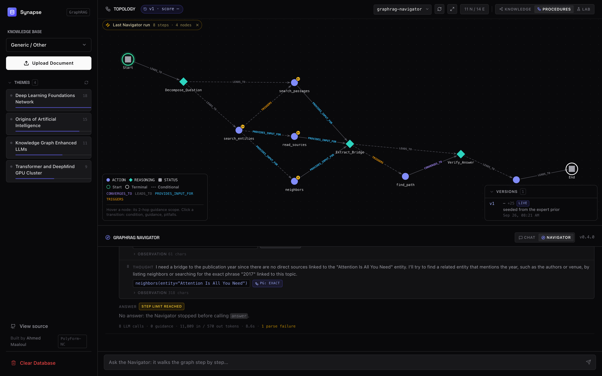
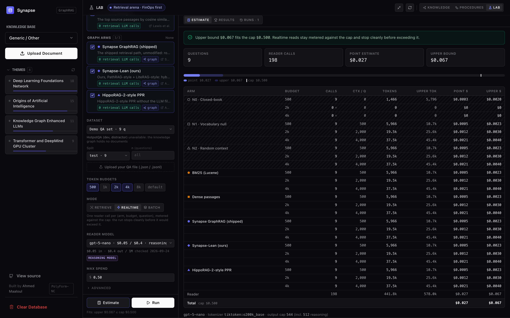
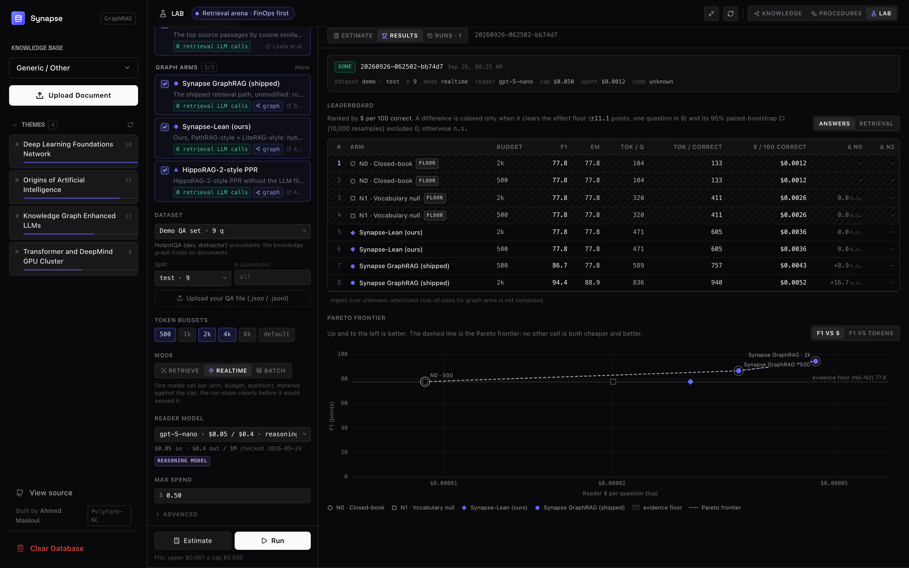
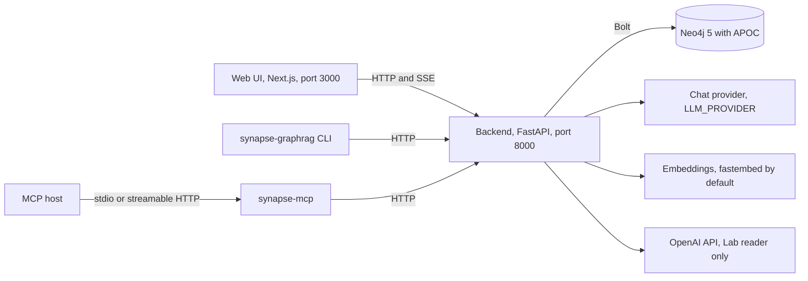

# Synapse

Synapse builds a Neo4j knowledge graph from text-based PDFs and answers questions over it with
graph retrieval and a chat model you configure. It also includes a graph-walking agent guided by
versioned procedural graphs (the GraphRAG Navigator), and the Synapse Lab, which compares
retrieval approaches on your own questions under a spend cap.

[](https://github.com/ahmedmaaloul/synapse/actions/workflows/ci.yml)
[](https://github.com/ahmedmaaloul/synapse/releases)
[](./LICENSE)
[](./packages/synapse-graphrag/LICENSE)



*Figure 1. Knowledge view and Chat mode on the bundled demo graph. Question: "How does AlexNet
connect to the Transformer?" Under the answer: the reasoning paths, the seed entities that retrieval
put into the prompt ("Grounded in") and the retrieval mode (LOCAL). Those entities are ringed in
the graph. Chat model: OpenAI gpt-5-nano.*

| Item | Value |
| --- | --- |
| Version | 0.4.0 (tag `v0.4.0`, released 2026-09-10). `main` carries the changes listed under `[Unreleased]` in [CHANGELOG.md](./CHANGELOG.md): relicensing, Procedural Graphs, the Synapse Lab and vector-index candidates for entity resolution. |
| Licence | Core: PolyForm Noncommercial 1.0.0, source-available; commercial use needs a commercial licence. Client package: Apache-2.0. See [10. Licence](#10-licence). |
| Maturity | Pre-1.0, one maintainer. Single-node stack without authentication; background jobs run in one process. Read [7. Known limitations](#7-known-limitations) before exposing it on a network. |
| Stack | Python 3.12, FastAPI, Next.js 16, Neo4j 5 Community with APOC |
| Author | [Ahmed Maaloul](https://github.com/ahmedmaaloul) |

## Contents

1. [Overview](#1-overview)
2. [Quick start](#2-quick-start)
3. [User interface](#3-user-interface)
4. [MCP server, CLI and HTTP API](#4-mcp-server-cli-and-http-api)
5. [Architecture](#5-architecture)
6. [Development and quality](#6-development-and-quality)
7. [Known limitations](#7-known-limitations)
8. [Documentation](#8-documentation)
9. [Contributing](#9-contributing)
10. [Licence](#10-licence)
11. [Author and contact](#11-author-and-contact)

## 1. Overview

### 1.1 Capabilities

| Capability | What it does |
| --- | --- |
| Ingestion | Reads a text-based PDF, extracts entities and relationships per chunk with a theme-specific prompt, embeds the entities, merges duplicates, and writes the graph to Neo4j together with the source passages and their embeddings. |
| Themes | Groups the entity graph into communities (Louvain) and writes a title and a summary for each. |
| Retrieval | Seeds from a vector index and a full-text index, adds each seed's 1-hop relationships, reasoning paths between the seeds and source excerpts. Corpus-level questions are answered from theme summaries. Available on its own as `POST /api/retrieve` and the MCP tool `synapse_retrieve`. |
| Chat | Streams an answer generated from the retrieved context. |
| GraphRAG Navigator | A ReAct agent that answers by walking the graph with six deterministic tools, guided by a procedural graph. Implements Procedural Graphs (Lu, Chen, Wu, Arık, [arXiv:2609.09153](https://arxiv.org/abs/2609.09153)). |
| Procedural evolution | Refines a procedural graph from question and answer pairs: Navigator runs on them are scored by F1 or EM, and a candidate is kept only when its validation score does not drop. API and CLI only. |
| Synapse Lab | Runs up to 8 retrieval arms over the same questions and token budgets, reads every context with one OpenAI reader model and one prompt, and ranks the arms by $ per 100 correct answers. |
| Client package | MCP server (13 tools), CLI and async Python client over the HTTP API. |

### 1.2 Model calls per operation

API cost depends on the number of calls to a chat model or to the Lab's reader model.

| Operation | Model calls | API key needed |
| --- | --- | --- |
| Seed the demo graph (`make demo`) | 0 | no |
| Knowledge view, search, Inspector, Procedures view | 0 | no |
| Retrieval (`POST /api/retrieve`, CLI `retrieve`, MCP `synapse_retrieve`) | 0 | no |
| Theme rebuild | 1 per theme; derived titles when no provider is configured | no (model-written summaries need one) |
| PDF ingestion | 1 per chunk (at most 40 chunks per document by default), then 1 per theme for the rebuild | yes |
| Chat answer | 1 streamed call per question | yes |
| Navigator question | 1 per step, at most `AGENT_MAX_STEPS` (8) or the request's `max_steps` (1 to 20); twice that with generative guidance | yes |
| Procedural evolution | bounded by the request's `max_llm_calls` (default `EVOLUTION_MAX_LLM_CALLS`, 400; the CLI sends `--max-llm-calls` or its printed upper bound); refused before any call if the cap cannot pay for the baseline evaluation and one full round | yes |
| Lab estimate, Lab run in `retrieve` mode | 0 | no |
| Lab run in `realtime` or `batch` mode | at most 1 reader call per arm, budget and question (identical requests are sent once), within the `max_usd` cap | `OPENAI_API_KEY` |

Embeddings run locally by default (fastembed, `BAAI/bge-small-en-v1.5`, 384 dimensions) and need
no API key. The full cost model is in [docs/finops.md](./docs/finops.md).

## 2. Quick start

### 2.1 Requirements

| Requirement | Detail |
| --- | --- |
| Docker Engine or Docker Desktop | with Docker Compose v2 (`docker compose`) |
| git, make | any version; each `make` target is a short command in the [Makefile](./Makefile) |
| Network access on the first run | pulls `neo4j:5-community`, `python:3.12-slim` and `node:20-alpine`, the APOC plugin, the pip and npm packages, and the fastembed model |

| Port | Service | Override |
| --- | --- | --- |
| 3000 | Web UI | `FRONTEND_PORT` (also add the new origin, for example `http://localhost:3001`, to `CORS_ORIGINS` and recreate the backend) |
| 8000 | Backend API, OpenAPI UI at `/docs` | `BACKEND_PORT` (also set `NEXT_PUBLIC_API_URL` and rebuild the frontend) |
| 7474, 7687 | Neo4j Browser, Neo4j Bolt | none |
| 8765 | MCP server over streamable HTTP at `/mcp` (opt-in profile `mcp`) | `MCP_PORT` |

### 2.2 First run without an API key

The repository ships a pre-extracted demo graph, "A Brief History of Artificial Intelligence
(demo)": 53 entities of 11 types and 106 relationships
([backend/scripts/demo_graph.json](./backend/scripts/demo_graph.json)). The seeder writes it with
the same schema, embedding and write code that a live ingest uses. It skips LLM extraction,
entity resolution, source passages and themes.

1. Clone the repository and create the environment file. No edits are needed for this step.

   ```bash
   git clone https://github.com/ahmedmaaloul/synapse.git
   cd synapse
   cp .env.example .env
   ```

   To use a Neo4j password other than `synapse_secret`, set `NEO4J_PASSWORD` in `.env` before the
   first start: Neo4j applies it only when it initialises the empty data volume.

2. Build and start Neo4j, the backend and the frontend.

   ```bash
   make up        # docker compose up -d --build
   ```

3. Seed the demo graph. This deletes every `:Entity`, `:Community` and `:Chunk` node in the
   stack's Neo4j before writing; procedural graphs are kept. If it prints `Cannot reach Neo4j`,
   wait until `docker compose ps` reports `neo4j` and `backend` as healthy and run it again.

   ```bash
   make demo      # docker compose exec -T backend python -m scripts.seed_demo --clear
   ```

4. Open the web UI at <http://localhost:3000> and the OpenAPI UI at <http://localhost:8000/docs>.
   The Neo4j Browser is at <http://localhost:7474> (user `neo4j`, password from `NEO4J_PASSWORD`).

5. Query the graph without a model. Retrieval makes no LLM call:

   ```bash
   curl -s -X POST http://localhost:8000/api/retrieve \
     -H 'Content-Type: application/json' \
     -d '{"query": "How is Ada Lovelace connected to the Analytical Engine?", "k": 8, "max_context_chars": 2000}'
   ```

Stop the stack with `make down`; the graph stays in the `neo4j_data` volume.

### 2.3 What works without a key

With `.env` as copied (`LLM_PROVIDER=gemini`, `GOOGLE_API_KEY` empty):

| Feature | Without a key | Notes |
| --- | --- | --- |
| Knowledge view, search, type filter, Inspector | works | The counter reads `53 N / 106 E`. |
| Themes | works, with derived titles | Empty after seeding. The refresh icon in the Themes panel ("Rebuild themes") builds 4 themes whose titles join three member names. |
| Procedures view | works | Both bundled procedural graphs are seeded when the backend starts. |
| Retrieval (`POST /api/retrieve`, CLI `retrieve`, MCP `synapse_retrieve`) | works | No source excerpts on the demo graph, which has no passages. |
| Chat | partial | Citations and reasoning paths appear; the answer text reads "Generation failed: ...". |
| Navigator, PDF upload | no | Both need a chat model. |
| Lab estimate, Lab run in `retrieve` mode | works | No model call. On the demo graph only the Lab arms N1 (vocabulary null), Synapse GraphRAG and Synapse-Lean produce context ([3.6](#36-lab)). |
| Lab run in `realtime` or `batch` mode | no | Needs `OPENAI_API_KEY`. |

### 2.4 Connecting a model

1. Set the provider and its key in `.env`. The screenshots in this README used:

   ```bash
   LLM_PROVIDER=openai
   OPENAI_API_KEY=<your key>
   OPENAI_CHAT_MODEL=gpt-5-nano
   OPENAI_REASONING_EFFORT=minimal
   ```

2. Recreate the backend container. Compose reads `.env` only when it creates a container, so
   `docker compose restart` keeps the old values.

   ```bash
   docker compose up -d --force-recreate backend
   curl -s http://localhost:8000/api/about      # reports llm_provider and embedding_provider
   ```

| Provider | `LLM_PROVIDER` | Credentials | In the default image |
| --- | --- | --- | --- |
| Google Gemini | `gemini` | `GOOGLE_API_KEY` | yes |
| Anthropic | `claude` | `ANTHROPIC_API_KEY` | yes |
| OpenAI | `openai` | `OPENAI_API_KEY` | yes |
| Azure OpenAI | `azure_openai` | `AZURE_OPENAI_API_KEY`, `AZURE_OPENAI_ENDPOINT`, `AZURE_OPENAI_CHAT_DEPLOYMENT` | yes |
| Google Vertex AI | `vertex` | `VERTEX_PROJECT` and Application Default Credentials | no |
| AWS Bedrock | `bedrock` | `BEDROCK_REGION` and the AWS credential chain | no |
| Groq | `groq` | `GROQ_API_KEY` | no |
| Mistral AI | `mistral` | `MISTRAL_API_KEY` | no |
| Ollama | `ollama` | a reachable Ollama server (`OLLAMA_BASE_URL`) | yes |
| OpenAI-compatible endpoint | `openai_compatible` | `OPENAI_COMPATIBLE_BASE_URL`, and an API key for hosted gateways | yes |

Providers marked "no" need the SDKs in
[backend/requirements-providers.txt](./backend/requirements-providers.txt). Default models,
the embedding providers (`EMBEDDING_PROVIDER`), the main backend settings (every setting is listed
in `.env.example`) and the pinned versions are documented in
[docs/configuration.md](./docs/configuration.md).

## 3. User interface

The web UI has four areas: the left sidebar (document upload, Themes, Clear Database), the graph
panel with its view switch **Knowledge | Procedures | Lab**, the chat panel with its mode switch
**Chat | Navigator**, and the Inspector, which opens on the right when a node is selected.

All screenshots were taken on 2026-09-26 on an isolated local stack seeded with the demo graph
only. Chat model: OpenAI gpt-5-nano with `OPENAI_REASONING_EFFORT=minimal`. Embeddings: fastembed.

### 3.1 Knowledge view and document upload

Figure 1 shows the Knowledge view: the entity graph with node search, a type filter and a
node and edge counter. To ingest a PDF (a chat model is required), choose an extraction theme in
the **Knowledge Base** drop-down of the sidebar (not the Themes panel; the drop-down preselects
Personal CV / Resume), click **Upload Document** and follow the progress bar. The theme selects
the extraction schema: Personal CV / Resume, Technology (Wiki / Docs), Generic / Other,
Medical / Scientific, Business / Legal, or AI Safety / Evals
([docs/ai-safety.md](./docs/ai-safety.md)). The same ingest over HTTP:

```bash
curl -F file=@paper.pdf -F theme=Generic http://localhost:8000/api/upload   # returns a job_id
curl -N http://localhost:8000/api/upload/<job_id>/events                    # progress as SSE
```

**Clear Database** deletes the whole knowledge graph at once, without a confirmation dialog.
Procedural graphs are kept.

### 3.2 Themes



*Figure 2. The theme "Origins of Artificial Intelligence" (15 members) expanded: its
model-written summary and member chips. Its members are ringed in amber in the graph. The demo
graph yields 4 themes of 18, 15, 11 and 9 members.*

Themes are Louvain communities computed with networkx; communities with fewer than 3 members are
dropped. Each theme gets one LLM call that writes a title and a summary of 2 to 3 sentences.
Themes are rebuilt after every upload and on demand. Chat questions about the corpus as a whole
are answered from these summaries.

### 3.3 Inspector



*Figure 3. The entity Charles Babbage selected. The Inspector shows the label, the type PERSON
and the stored properties: aliases, source document and description.*

### 3.4 Chat

A chat question passes through three stages:

1. **Routing.** English regular-expression cues send the question to *local* search or, for
   corpus-level questions, to *global* search over the theme summaries. No LLM call.
2. **Retrieval.** Local search takes up to 8 seed entities from the vector and full-text indexes,
   each with its 1-hop relationships, adds reasoning paths between the top seeds within a 2-hop
   neighbourhood, and appends source excerpts (up to 4,000 characters).
3. **Streaming.** The browser receives, over Server-Sent Events, the citations, the reasoning
   paths and the sources, then the answer token by token.

In local mode, the chips under "Grounded in" are the seed entities (up to 8) that retrieval placed
in the prompt; their neighbours and the entities on the reasoning paths are in the prompt too,
without a chip. For a corpus-level question the chips are the themes used. The chips show what
retrieval selected, not what the answer used.

### 3.5 Procedures and the Navigator

A procedural graph is a small directed graph of steps. Each transition carries an optional
condition, a guidance text and pitfalls. The graphs are stored in the same Neo4j database, and
every save creates a new version. Two graphs are bundled and seeded at backend startup:
`graphrag-navigator` (11 nodes, 14 edges) for the Navigator, and `mcp-host` (11 nodes, 18 edges)
for MCP hosts.



*Figure 4. The Procedures view with `graphrag-navigator`. Node shape and colour give the type
(ACTION, REASONING, STATUS); edge colour gives the relation (LEADS_TO, TRIGGERS,
PROVIDES_INPUT_FOR, CONVERGES_TO); dashed edges are conditional. The Versions panel lists v1,
"seeded from the expert prior".*

The **Navigator** mode of the chat panel runs a ReAct loop: each step is one LLM call that writes
a thought and one action. Before each step the agent's last action is located on the procedural
graph with the methods `start`, `exact`, `normalized` and `semantic`, tried in that order, and the
transitions up to 2 hops ahead of the matched node are added to its prompt; if no method matches,
the full graph is used. The tools make no LLM call:

| Tool | Returns |
| --- | --- |
| `search_entities(query)` | Top 5 entities from hybrid vector and full-text search |
| `neighbors(entity)` | Direct relations of an entity with their direction |
| `read_sources(entity)` | Up to 3 source passages the entity was extracted from |
| `search_passages(query)` | Top 3 source passages by semantic search |
| `find_path(source, target)` | Shortest relation chain between two entities |
| `answer(text)` | Submits the final answer and ends the run |



*Figure 5. The same graph with the last Navigator run overlaid ("8 steps, 4 nodes"). Each visited
node carries the number of the step that first reached it, with "+" when a later step reached it
again. Below, the end of the trace: step 8 calls `neighbors(entity="Attention Is All You Need")`;
its guidance came from an exact match of the step 7 action on the procedural graph ("PG: EXACT").
The run stopped at the 8-step limit without an answer: 8 LLM calls, 11,809 input and 570 output
tokens, 8.6 s. See [7. Known limitations](#7-known-limitations).*

Procedural evolution has no UI. The CLI (`synapse-graphrag evolve`) prints an upper bound on its
LLM calls and starts only after confirmation; `POST /api/procedures/{name}/evolve` starts at
once, capped by `max_llm_calls`. The data model, the localisation cascade, the guidance modes and
the evolution algorithm are described in [docs/procedural-graphs.md](./docs/procedural-graphs.md).

### 3.6 Lab

The Lab runs several retrieval approaches ("arms") over the same questions and the same graph,
packs each arm's evidence into the same token budgets with one packer, and has one reader model
answer from every context with one prompt. It measures, on your own questions, whether a graph
context is worth its tokens compared with passage retrieval.

| Family | Arm | Evidence | Reference |
| --- | --- | --- | --- |
| Evidence floors | `null_closed_book` (N0) | none; the reader answers from its own knowledge | Synapse control |
| | `null_vocabulary` (N1) | every entity name in the graph, question ignored | Synapse control |
| | `null_random` (N2) | seeded random passages at the same budget | Synapse control |
| Passage baselines | `bm25` | Neo4j full-text index over passages | [Robertson and Zaragoza](https://doi.org/10.1561/1500000019) |
| | `dense` | vector index over passages | [Lewis et al.](https://arxiv.org/abs/2005.11401) |
| Graph arms | `synapse_d` (Synapse GraphRAG) | the shipped retrieval path of [3.4](#34-chat), split into units | [Edge et al.](https://arxiv.org/abs/2404.16130) |
| | `synapse_lean` (Synapse-Lean) | PathRAG-style flow-pruned paths with a LiteRAG-style hub penalty | [PathRAG](https://arxiv.org/abs/2502.14902), [LiteRAG](https://arxiv.org/abs/2609.10239) |
| | `ppr` | passages ranked by Personalized PageRank over an entity and passage graph, without HippoRAG 2's LLM triple filter | [HippoRAG 2](https://arxiv.org/abs/2502.14802) |

No arm calls an LLM while retrieving. `synapse_lean` and `ppr` re-implement the methods of the
cited papers on Synapse's graph; they do not use the authors' code.



*Figure 6. Estimate tab. Realtime mode, reader gpt-5-nano, the 9 questions of the demo test
split, all 8 arms at budgets 500, 2k and 4k: 198 reader calls (N0 sends the same prompt at every
budget, so it is read once per question, not three times), point estimate $0.027, upper bound
$0.067 against a cap of $0.50. The estimate calls no model.*

A run is configured in three steps: pick arms, a dataset (the bundled demo set, an uploaded JSON
or JSONL file, or HotpotQA once its dev set is in the local cache, fetched with
`python -m benchmarks.public.hotpotqa` in `backend/`, and its paragraphs are ingested) and
budgets; click **Estimate**; then **Run**, which stays disabled until a current estimate fits the
cap.

| Mode | Reader calls | Cost |
| --- | --- | --- |
| `retrieve` (default) | none | $0 with the local embedder; reports context tokens and whether the gold answer reached the context |
| `realtime` | at most one per arm, budget and question; identical requests, such as N0 at every budget, are sent once | each request's worst case is reserved against the cap before it is sent; the run stops before exceeding it |
| `batch` | through the OpenAI Batch API | half the listed price; collected later with **Check batch** in the Lab or `lab resume` |



*Figure 7. Results of a realtime run on the demo test split (n = 9), reader gpt-5-nano, spent
$0.0012 of a $0.05 cap. Arms: N0, N1, Synapse-Lean and Synapse GraphRAG at budgets 500 and 2k;
the arms that read passages (N2, `bm25`, `dense` and `ppr`) were left out because the demo graph
has no passages. N0 (closed-book) scores 77.8 F1 because the demo questions ask about well-known
facts. Every difference from N0 is marked "n.s.": none both exceeds the effect floor (11.1 points
with 9 questions) and has a 95% paired-bootstrap confidence interval that excludes zero. The
figure demonstrates the UI; it is not a result.*

Paid runs are ranked by $ per 100 correct answers (cost-of-pass,
[Erol et al.](https://arxiv.org/abs/2504.13359)). Each row is compared, whatever the sign of the
difference, with N0, with N2 at the same budget and, for a graph arm, with the better of `bm25`
and `dense` at the same budget. A comparison needs the compared arm in the run: otherwise the
cell shows a dash, as in the Δ N2 column of Figure 7, and the graph premium column is left out
when no row has one. A difference is marked as an effect only when it exceeds a one-question
effect floor and its paired-bootstrap 95% confidence interval excludes zero, and as "n.s."
otherwise. Every run is written to `backend/lab_runs/<run_id>/` and can be re-scored without
Neo4j or a model. Details: [docs/lab.md](./docs/lab.md).

## 4. MCP server, CLI and HTTP API

### 4.1 Installing the client package

`packages/synapse-graphrag` contains an MCP server, a CLI and an async Python client. All three
talk to the backend over HTTP. The package needs Python 3.11 or later, installs the commands
`synapse-graphrag` and `synapse-mcp`, and is not published on PyPI. Install it from the
repository:

```bash
pip install ./packages/synapse-graphrag                    # from a checkout
pip install "git+https://github.com/ahmedmaaloul/synapse.git#subdirectory=packages/synapse-graphrag"
```

### 4.2 Registering the MCP server

The server needs a running backend (`make up`) and reads its address from `SYNAPSE_URL`.

Claude Code:

```bash
claude mcp add synapse -e SYNAPSE_URL=http://localhost:8000 -- \
  uvx --from "git+https://github.com/ahmedmaaloul/synapse.git#subdirectory=packages/synapse-graphrag" synapse-graphrag mcp
```

Claude Desktop or Cursor (`claude_desktop_config.json` or `.cursor/mcp.json`):

```json
{
  "mcpServers": {
    "synapse": {
      "command": "uvx",
      "args": [
        "--from",
        "git+https://github.com/ahmedmaaloul/synapse.git#subdirectory=packages/synapse-graphrag",
        "synapse-graphrag",
        "mcp"
      ],
      "env": { "SYNAPSE_URL": "http://localhost:8000" }
    }
  }
}
```

Over streamable HTTP instead of stdio, `docker compose --profile mcp up -d` serves
<http://localhost:8765/mcp>. Neither this transport nor the backend has authentication; see
[DEPLOYMENT.md](./DEPLOYMENT.md) before exposing either. Per-host setup:
[docs/mcp.md](./docs/mcp.md#install-per-client). Its snippets use the PyPI form
`uvx synapse-graphrag mcp`; until the package is on PyPI, replace it with the `uvx --from`
command above.

### 4.3 MCP tools

| Tool | Purpose | Backend LLM calls |
| --- | --- | --- |
| `synapse_retrieve` | Context, citations, reasoning paths, source excerpts and a usage block, cut to `max_context_chars` (default 6000) | 0 |
| `synapse_ask` | An answer generated by the backend's model | 1 |
| `synapse_ingest_pdf` | Ingests a PDF from the MCP server's file system | 1 per chunk, plus themes |
| `synapse_communities`, `synapse_find_entities`, `synapse_graph_stats`, `synapse_status` | Themes, entity search, graph statistics, health and active providers | 0 |
| `synapse_clear_graph` | Deletes the knowledge graph; refuses unless `confirm=true` | 0 |
| `synapse_procedures`, `synapse_procedure_guidance`, `synapse_record_trajectory` | Procedural graphs: list, guidance for the next step, store a finished run | 0 (guidance in `generative` mode: 1) |
| `synapse_agent_ask` | Runs the Navigator | 1 per step (2 with `guidance="generative"`) |
| `synapse_lab_runs` | Lists Lab runs or returns one run's report; never starts a run | 0 |

Prompts: `answer_with_graph`, `safety_brief` and `follow_procedure`. Resource: `synapse://about`.

### 4.4 CLI and Python client

```bash
synapse-graphrag status
synapse-graphrag retrieve "How is Ada Lovelace connected to the Analytical Engine?" --budget 2000 --json
synapse-graphrag procedures show graphrag-navigator --text
synapse-graphrag lab estimate --mode realtime --budgets 500,2k,4k --max-usd 0.10
```

`evolve` and `lab run` print their estimate first and start only with `--yes` or an interactive
`y`; `lab resume` asks the same way when resuming would spend. `ask`, `agent` and `ingest` call
the backend's model without asking. The async client:

```python
import asyncio

from synapse_graphrag import SynapseClient


async def main() -> None:
    async with SynapseClient("http://localhost:8000") as client:
        r = await client.retrieve("Who designed the Analytical Engine?", k=8, max_context_chars=2000)
        print(r.mode, r.usage)
        print(r.context)


asyncio.run(main())
```

### 4.5 HTTP API

The backend serves an OpenAPI UI at `/docs`. Routes are mounted under `/api`, except the health
checks.

| Method and path | Purpose |
| --- | --- |
| `POST /api/upload`, `GET /api/upload/{job_id}/events` | PDF ingest; progress as SSE |
| `GET /api/graph-data`, `DELETE /api/graph` | The entity graph; delete everything except the procedural graphs |
| `GET /api/communities`, `POST /api/communities/rebuild` | Themes |
| `POST /api/chat` | Retrieval and a streamed answer (SSE) |
| `POST /api/retrieve` | Retrieval only: `{query, k, max_context_chars}` returns `{mode, context, citations, paths, sources, usage}` |
| `POST /api/agent/ask` | Navigator run |
| `/api/procedures/...` | Procedural graphs: read, write, versions, rollback, guidance, trajectories, evolution |
| `/api/lab/...` | Arms, models, datasets, QA upload, estimate, runs, run events, resume |
| `GET /health`, `GET /health/ready`, `GET /api/about` | Liveness, readiness, version, licence and active providers |

## 5. Architecture


```mermaid
flowchart LR
    UI["Web UI, Next.js, port 3000"] -->|"HTTP and SSE"| API["Backend, FastAPI, port 8000"]
    CLI["synapse-graphrag CLI"] -->|HTTP| API
    HOST["MCP host"] -->|"stdio or streamable HTTP"| MCP["synapse-mcp"]
    MCP -->|HTTP| API
    API -->|Bolt| DB[("Neo4j 5 with APOC")]
    API --> LLM["Chat provider, LLM_PROVIDER"]
    API --> EMB["Embeddings, fastembed by default"]
    API --> OAI["OpenAI API, Lab reader only"]
```

Ingestion: the upload request runs step 1, and a background job runs steps 2 to 6:

1. Extract text with pypdf (no OCR) and split it into windows of up to 1,000 characters, ending on
   a sentence boundary where possible, with 200 characters of overlap, keeping the first
   `MAX_CHUNKS`.
2. Extract entities and relationships with one LLM call per chunk, using the theme's schema. A
   chunk that fails yields an empty extraction and does not fail the document.
3. Deduplicate, embed the entities, and merge near-duplicates within the document.
4. Write entities and relationships, and store the source passages as `:Chunk` nodes linked to
   the entities extracted from them.
5. Merge near-duplicates across documents, with candidates from the vector index. Resolution uses
   no LLM: both the embedding cosine (0.93) and the name similarity (0.87) must pass, and the
   types must match.
6. Rebuild the themes.

The same retrieval function serves `/api/chat`, `/api/retrieve`, the MCP server and the Lab arm
`synapse_d`. [ARCHITECTURE.md](./ARCHITECTURE.md) explains the design decisions.

```text
backend/app/         FastAPI app: routers, services (ingestion, retrieval, themes, procedural memory), lab/
backend/scripts/     demo seed and demo graph
backend/tests/       unit tests and tests/integration
frontend/src/app/    Next.js UI
packages/synapse-graphrag/   MCP server, CLI, Python client (Apache-2.0)
docs/                reference documentation and screenshots
```

## 6. Development and quality

| Suite | Command | Size | External dependencies |
| --- | --- | --- | --- |
| Backend unit | `make test` | 2,149 tests collected, including the 108 in `tests/integration`; those that need Neo4j or the fastembed model are skipped unless `SYNAPSE_IT=1` | none: fake embedder, no database, no network, no LLM |
| Backend integration | `make test-int` | 108 tests | a Neo4j at `localhost:7687` that the suite wipes, and the fastembed model |
| Client package | `make mcp-test` | 218 tests, plus ruff | none |
| Lint | `make lint` | ruff (backend), ESLint and `tsc --noEmit` (frontend); there are no frontend tests | none |

Sizes were measured at commit `def7fab`. CI ([ci.yml](./.github/workflows/ci.yml)) runs five jobs
on every push to `main` and every pull request: backend lint and unit tests; backend integration
tests against a Neo4j service container; frontend lint, typecheck and build; client package lint,
tests and build; Docker image builds. A pushed `v*` tag builds the release: images on GHCR and a
GitHub Release with the client wheel and sdist.

These operations delete data without asking. Run them only against a Neo4j instance you can lose:

| Operation | Deletes |
| --- | --- |
| `make demo`, `make demo-local` | All `:Entity`, `:Community` and `:Chunk` nodes |
| `make benchmark` | All `:Entity`, `:Community` and `:Chunk` nodes at `localhost:7687` |
| `make eval`, `make test-int` | Every node at `localhost:7687`, procedural graphs included |
| **Clear Database** in the UI, `DELETE /api/graph` | Every node except the procedural graphs |
| `docker compose down -v` | The Neo4j data and log volumes |

**Evaluation status.** A retrieval smoke test ([backend/eval](./backend/eval/)) and a small
retrieval benchmark ([backend/benchmarks](./backend/benchmarks/results.md), 14 multi-hop
questions over 34 passages) are in the repository. In that benchmark, a plain passage baseline matches the shipped
graph path on every metric while reading less text. The repository contains no result that
shows graph retrieval ahead of passage retrieval at a matched context budget; the Lab exists to
measure that trade-off on your own data.

Local development, the Codespaces devcontainer, per-subsystem test counts, the release procedure
and the full evaluation table: [docs/development.md](./docs/development.md).

## 7. Known limitations

This section lists the most important limitations. The complete list is in
[docs/known-limitations.md](./docs/known-limitations.md).

- **No authentication.** The backend and the MCP HTTP transport have no authentication and no
  rate limiting. Anyone who can reach port 8000 can upload documents, delete the graph and spend
  the configured API keys: chat, ingestion and the Navigator call the chat model, and a Lab run
  spends `OPENAI_API_KEY` up to a `max_usd` cap that the caller chooses (at most 100,000 USD).
  Docker Compose publishes ports 3000, 8000, 7474 and 7687 on all host interfaces, and Neo4j
  keeps the password `synapse_secret` unless `NEO4J_PASSWORD` is changed before the first start.
- **Single process.** Ingest jobs, theme rebuilds and Lab job state live in one process. Jobs are
  lost on restart, and the stack is not built for more than one backend replica.
- **Ingestion.** PDF only, no OCR. Text beyond `MAX_CHUNKS` (40 chunks, at most 32,200
  characters) is dropped, and the UI does not report the cut. The upload form preselects the
  theme Personal CV / Resume; choose the theme that fits the document before uploading. Themes are
  rebuilt from scratch after every upload, so the cost of an ingest grows with the corpus.
  Individual documents cannot be listed or deleted.
- **Identity by name.** An entity is identified by its exact name; two same-named entities of
  different types become one node.
- **Embedding model fixed at the first start.** The Neo4j vector indexes are created once with
  `EMBEDDING_DIM` dimensions and never resized. Switching `EMBEDDING_PROVIDER` or `EMBEDDING_DIM`
  later means `docker compose down -v`, which deletes all data including evolved procedural graph
  versions, and re-ingesting ([docs/configuration.md](./docs/configuration.md#2-embedding-model)).
  The Gemini embedding default `models/text-embedding-004` is listed by Google as shut down; with
  `EMBEDDING_PROVIDER=gemini`, set `GEMINI_EMBEDDING_MODEL` and `EMBEDDING_DIM`.
- **Retrieval.** Query routing uses English regular expressions. Seeds have no relevance floor, and
  retrieval uses only the current question, not earlier turns. `/api/chat` applies no overall
  context budget.
- **Navigator with small models.** When the screenshots were taken (2026-09-26), gpt-5-nano at
  minimal reasoning effort stopped at the 8-step limit without an answer in 3 of 3 runs on 2-hop
  and 3-hop demo questions (an observation, not a benchmark). Raise `AGENT_MAX_STEPS` (or
  `max_steps`, 1 to 20, per request) or use a stronger model; every step is one LLM call.
- **Procedural Graphs.** The results of the Procedural Graphs paper have not been reproduced, and
  no procedural benchmark results are published.
- **Lab.** The reader and Batch mode use the OpenAI API only. Prices come from a hand-recorded
  table and are never fetched. Answers are scored by Exact Match and F1 only. The ranking column,
  $ per 100 correct, counts reader dollars only; the extraction cost of the graph that N1 and the
  graph arms read enters only an amortized cost-of-pass, and only when it is passed with
  `--ingest-usd` (CLI or API).
- **Demo graph.** It has no source passages, so the arms that read passages (N2, `bm25`, `dense`,
  `ppr`) and the tools `read_sources` and `search_passages` return nothing on it.
- **Distribution.** The client package is not on PyPI. The published `v0.4.0` artefacts (GitHub
  Release, GHCR images) predate the current licences, Procedural Graphs and the Lab, which exist
  only on `main`.

## 8. Documentation

| Document | Content |
| --- | --- |
| [docs/configuration.md](./docs/configuration.md) | Chat and embedding providers, backend settings, pinned versions |
| [docs/mcp.md](./docs/mcp.md) | MCP server, CLI and Python client: per-host setup, transports, tools |
| [docs/procedural-graphs.md](./docs/procedural-graphs.md) | Procedural memory, the Navigator and evolution |
| [docs/lab.md](./docs/lab.md) | Synapse Lab: arms, packer, reader, metrics, spend controls, run directories |
| [docs/finops.md](./docs/finops.md) | Cost model: where LLM and embedding calls happen and the setting for each |
| [docs/ai-safety.md](./docs/ai-safety.md) | The "AI Safety" extraction theme and the `safety_brief` prompt |
| [docs/development.md](./docs/development.md) | Local development, tests, CI, releases, evaluation status |
| [docs/known-limitations.md](./docs/known-limitations.md) | All known limitations by area |
| [ARCHITECTURE.md](./ARCHITECTURE.md), [DEPLOYMENT.md](./DEPLOYMENT.md) | Design decisions; hosted deployment and the MCP server behind a proxy |
| [CHANGELOG.md](./CHANGELOG.md) | Changes per version, including `[Unreleased]` |

## 9. Contributing

- Read [CONTRIBUTING.md](./CONTRIBUTING.md) and the [Code of Conduct](./CODE_OF_CONDUCT.md).
  Before a pull request, run `make test`, `make lint` and, for package changes, `make mcp-test`.
- Report bugs and request providers through the
  [issue forms](https://github.com/ahmedmaaloul/synapse/issues/new/choose).
- Every pull request asks you to accept the [Contributor License Agreement](./CLA.md). You keep
  your copyright and allow the maintainer to distribute the contribution under the PolyForm
  Noncommercial licence, the commercial licence and, for the client package, Apache-2.0.

## 10. Licence

The Synapse core is source-available, not open source. The client package is licensed separately
under Apache-2.0.

| Part | Licence |
| --- | --- |
| Core: backend, frontend, scripts, documentation | [PolyForm Noncommercial 1.0.0](./LICENSE), see also [NOTICE](./NOTICE) |
| Client package `packages/synapse-graphrag` (MCP server, CLI, Python client) | [Apache-2.0](./packages/synapse-graphrag/LICENSE) |
| Commit `91ee2f2` (version 0.2.0) and the commits before it | MIT |
| The commits after `91ee2f2` up to and including tag `v0.4.0` (versions 0.3.0 and 0.4.0) | AGPL-3.0-or-later |

**Noncommercial use needs no commercial licence.** [LICENSE](./LICENSE) permits personal use for
research, experiment and testing for the benefit of public knowledge, personal study, private
entertainment, hobby projects, amateur pursuits or religious observance, without any anticipated
commercial application, and use by charitable organisations, educational institutions, public
research organisations, public safety or health organisations, environmental protection
organisations and government institutions. Anyone who
receives a copy from you must also receive the licence terms (or their URL) and the
`Required Notice:` line at the top of `LICENSE`; keeping `LICENSE` and `NOTICE` intact does both.

**Commercial use needs a commercial licence**, which only Ahmed Maaloul can grant.
[COMMERCIAL-LICENSE.md](./COMMERCIAL-LICENSE.md) explains the licensor's reading: use at or for a
for-profit business, including purely internal use, is commercial. Where that page and `LICENSE`
differ, `LICENSE` applies. The Apache-2.0 client package can be embedded in any software,
commercial or not, with no obligations beyond Apache-2.0's; the Synapse backend it talks to stays
under the core licence, so commercial use of that backend still needs a commercial licence.

This section is a summary, not legal advice. The licence files are binding.

## 11. Author and contact

Synapse is written and maintained by Ahmed Maaloul
([github.com/ahmedmaaloul](https://github.com/ahmedmaaloul)).

| Purpose | Contact |
| --- | --- |
| Bugs and feature requests | [GitHub issues](https://github.com/ahmedmaaloul/synapse/issues) |
| Security reports | <ahmed.maaloul@proton.me>, subject `[SECURITY] Synapse: <short summary>`, or a private GitHub security advisory; see [SECURITY.md](./SECURITY.md) |
| Commercial licensing | <ahmed.maaloul@proton.me>, subject `[Commercial License] <your company>` |

Copyright (c) 2026 Ahmed Maaloul. SPDX: `PolyForm-Noncommercial-1.0.0` (core), `Apache-2.0`
(client package).
