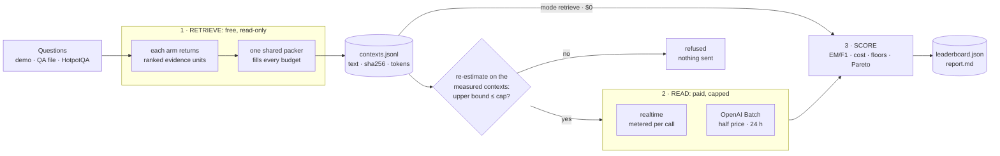

# Synapse Lab: compare retrieval approaches on your own data

Which retrieval approach should you ship, and does it actually save tokens? The Synapse Lab runs
several retrieval approaches, called **arms**, over the same questions and the same knowledge
graph. It packs every arm's evidence into the same token budgets with one shared packer, has one
reader model answer from it with one prompt, and ranks the arms by what a correct answer costs.
Every row is shown next to three **evidence floors** (no evidence, a list of names, random
passages), so a gain is only called a gain once it clears them.

The Lab is FinOps-first. Its leaderboard is ranked by **$ per 100 correct answers**, and every
number carries its token count, its dollar figure, and whether it clears the floors.

> **Status.** Implemented and covered by hermetic tests (a fake graph, a fake OpenAI client and a
> fake Batch backend: no database, no model, no network). **No Lab results are committed.** The
> numbers on this page are defaults and constants from the code, not measurements. Runs are
> written to `backend/lab_runs/`, which is gitignored.

**Contents**

- [In one minute](#in-one-minute)
- [How a run works](#how-a-run-works)
- [The arms](#the-arms)
- [One packer, one reader](#one-packer-one-reader)
- [Budgets, modes and datasets](#budgets-modes-and-datasets)
- [The leaderboard](#the-leaderboard)
- [Spend controls](#spend-controls)
- [Run directories, resume and reproducibility](#run-directories-resume-and-reproducibility)
- [Batch mode](#batch-mode)
- [Ingesting a corpus through the Batch API](#ingesting-a-corpus-through-the-batch-api)
- [Reference: API, CLI, SDK, MCP, UI, settings](#reference-api-cli-sdk-mcp-ui-settings)
- [Adding an arm](#adding-an-arm)
- [Honest limitations](#honest-limitations)

---

## In one minute

```bash
# Free: the default mode is retrieve-only. No model is called and nothing is spent.
synapse-graphrag lab arms                                   # the eight arms, grouped by family
synapse-graphrag lab run --budgets 500,2k,4k --yes          # demo questions, every arm, three budgets
synapse-graphrag lab show RUN_ID                            # leaderboard (retrieval-level columns)

# Paid: the estimate is printed first, --max-usd is a hard cap, and nothing starts without consent.
synapse-graphrag lab models                                 # reader models with $/1M tokens
synapse-graphrag lab estimate --mode realtime --budgets 500,2k,4k --max-usd 0.10
synapse-graphrag lab run      --mode realtime --budgets 500,2k,4k --max-usd 0.10
```

In the UI, pick **Lab** next to *Knowledge | Procedures* above the graph. The Lab opens in
retrieve-only mode.

The demo graph ships without source passages (`:Chunk` nodes), so on it the passage arms, the
random-context floor and `ppr` retrieve nothing. The demo exercises the plumbing, N1, `synapse_d`
and `synapse_lean`. For a real comparison, ingest your own documents and [upload questions about
them](#datasets), or use [HotpotQA](#datasets).

---

## How a run works



1. **Retrieve.** Every arm retrieves once per question and the packer packs that evidence at every
   budget of the run. This phase calls no model and costs nothing. It only reads Neo4j, and it
   stores every packed context with its sha256 and its token count.
2. **Read.** Skipped in `retrieve` mode. Otherwise the run is re-priced on the contexts it actually
   packed, refused if the upper bound breaks the cap, and each (arm, budget, question) is read
   either in realtime (metered call by call) or through the OpenAI Batch API (half price, collected
   later with `lab resume`).
3. **Score.** Exact match and F1, the cost columns, gains above the floors, graph premium, paired
   bootstrap confidence intervals and two Pareto frontiers. Scoring reads only the run directory,
   so a finished run can be re-scored without Neo4j and without a model.

**The Lab never writes to the knowledge graph.** Every arm is read-only. The one Lab module that
writes is the opt-in [Batch ingest](#ingesting-a-corpus-through-the-batch-api), and only when you
call its apply step.

---

## The arms

Every arm answers one call, `await arm.retrieve(question, k=..., seed=...)`, with a list of
**ranked evidence units**: a fact, a relation, a path, a source passage, a list of names. No arm
renders a prompt and no arm cuts to a budget. The only truncation an arm does is its own `k`,
which bounds either seed entities or passages (the `k bounds` column).

**Passage counts fill the budget.** A budget is a fair comparison only if every arm can fill it.
So for the passage-ranking arms (`null_random`, `bm25`, `dense`, `ppr`) the runner asks for as
many passages as the largest capped budget of the run holds: it starts from a pool sized for
64-token passages (never fewer than `k`) and doubles it while the packed context still has room
and the corpus may hold more, up to 256 passages. Smaller budgets pack the best-ranked prefix of
the same list. At the **default** (uncapped) context these arms keep `k` passages. Passing
`passage_k` switches this off: exactly that many passages at every budget. The manifest records
the policy (`packer.passages`).

| Arm | Family | Hands the reader | `k` bounds | Retrieval LLM calls | Source |
| --- | --- | --- | --- | :--: | --- |
| `null_closed_book` (N0) | Evidence floor | nothing: the reader answers from its own knowledge | — | 0 | Synapse null controls |
| `null_vocabulary` (N1) | Evidence floor | every entity name in the graph, alphabetical, the same for every question | — | 0 | Synapse null controls |
| `null_random` (N2) | Evidence floor | random passages from the same corpus, seeded by (run seed, question), enough to fill the budget (`k` at the default context) | passages | 0 | Synapse null controls |
| `bm25` | Passage baseline | the top passages by Lucene BM25 over the `:Chunk` full-text index, as many as the budget holds (`k` at the default context) | passages | 0 | Robertson & Zaragoza, [*The Probabilistic Relevance Framework: BM25 and Beyond*](https://doi.org/10.1561/1500000019), FnTIR 2009 |
| `dense` | Passage baseline | the top passages by cosine similarity over the `:Chunk` vector index, as many as the budget holds (`k` at the default context) | passages | 0 | Lewis et al., [*Retrieval-Augmented Generation for Knowledge-Intensive NLP Tasks*](https://arxiv.org/abs/2005.11401), NeurIPS 2020 |
| `synapse_d` | Graph arm | Synapse's shipped retrieval path, unmodified, split into units | seeds | 0 | this repository; local search after Edge et al., [*From Local to Global: A Graph RAG Approach*](https://arxiv.org/abs/2404.16130) |
| `synapse_lean` | Graph arm | PathRAG-style flow-pruned paths between the seeds, LiteRAG-style hub penalty | seeds | 0 | after Chen et al., [*PathRAG*](https://arxiv.org/abs/2502.14902), and Coll Tejeda et al., [*LiteRAG*](https://arxiv.org/abs/2609.10239) |
| `ppr` | Graph arm | HippoRAG-2-style Personalized PageRank over entities and passages, **without the LLM filter** | passages | 0 | after Jiménez Gutiérrez et al., [*From RAG to Memory* (HippoRAG 2)](https://arxiv.org/abs/2502.14802), ICML 2025 |

**Which arms are re-implementations.** `synapse_lean` and `ppr` are **"-style" arms**. They are
re-implementations over Synapse's own graph, written from the papers, not the authors' code, and
each leaves out parts of the method it cites (listed under each arm below). `bm25` and `dense` are
the standard techniques as Neo4j's full-text and vector indexes provide them. `synapse_d` is
Synapse's own shipped path. The three floors are Synapse's own controls.

**Zero retrieval-time LLM calls.** No arm calls a model while retrieving, so every arm's query cost
is the reader call alone. The estimator still has a *retrieval-LLM* phase, which is 0 today, so an
arm that does call a model (an LLM re-ranker, a query rewriter) will be priced like everything
else.

### Evidence floors

A retrieval arm's score means little on its own. The floors are what it has to beat.

- **N0, closed-book.** No evidence. The reader's prompt says to answer from its own knowledge when
  the evidence is empty, so N0 measures what the reader knows without retrieval. Its context is
  identical at every budget, so it is read once per question.
- **N1, vocabulary null.** Every `:Entity` name in the graph, sorted, as one unit. It ignores the
  question entirely. A context like that "contains" many answers without carrying any evidence
  for them, so it is the control for containment-style measures: an arm's containment score only
  means something above N1's. Under a budget the packer keeps an alphabetical prefix, cut at a
  whole-name line, instead of dropping the list, so N1 never collapses into N0 at small budgets.
- **N2, random context.** Passages drawn from every `:Chunk` in the graph, with a random
  generator seeded by the run seed and the question text, as many as each budget holds (see
  *Passage counts fill the budget* above; `k` at the default context). It is packed to the same
  budget as the other arms, so it answers the question "what is *some* context from this corpus
  worth, without retrieval?" at every budget. Only a corpus smaller than the budget leaves it
  short, and then its context-token column shows it.

The floors are shipped in the public Lab on purpose: a leaderboard without them rewards arms for
the reader's own knowledge and for context volume.

### Passage baselines

- **`bm25`** runs the chat engine's own keyword query against the `chunk_fulltext` index: the
  question lowercased, Lucene's special characters removed, words of three or more characters that
  are not stopwords, OR-joined. Neo4j's full-text index scores it with Lucene BM25. Ties are broken
  by chunk id, so the order is deterministic.
- **`dense`** embeds the question with the configured `EMBEDDING_PROVIDER` and takes the top-`k`
  passages from the `chunk_embedding` vector index. This is plain vector RAG over the same
  passages the graph was built from.

### Graph arms

**`synapse_d`: the shipped path.** It calls `chat_engine.retrieve_subgraph`, the function behind
`/api/chat` and `/api/retrieve`, and splits its context into units without changing its content:

- the routed local or global search, as shipped;
- entity blocks (with their relationship lines) and community blocks, kept verbatim;
- each reasoning path, as one `path` unit;
- each source excerpt the engine included, as one `prose` unit, without its `[Sn]` provenance
  header.

Scores fall with position, so packing by score keeps the engine's own priority: seeds, then paths,
then excerpts. At the `default` budget the units carry exactly the shipped context's content (the
packer's section headers replace the engine's). The settings
that shape it (`RETRIEVAL_MAX_HOPS`, `MAX_REASONING_PATHS`, `CHUNK_TOP_K`,
`CHUNK_CONTEXT_MAX_CHARS`, chunk retrieval and query routing on or off) are hashed into the run
manifest. Note that the engine applies its own excerpt character cap before the Lab's budget does.

**`synapse_lean`: flow-pruned paths.** Synapse's own lean graph arm. It is deterministic and makes
no LLM call:

1. **Seeds.** The top-`k` entities from the shipped hybrid ranker (vector and full-text seeds,
   interleaved).
2. **Candidates.** The relations within two hops of the seeds, when there are at least two seeds.
   Parallel relations between the same two entities collapse to one edge.
3. **Flow.** From each seed, best-ranked first, a resource of 1.0 flows along simple paths.
   Stepping from `u` to `v` passes `α · S(u) / |N(u)|` with **α = 0.7**, PathRAG's decay. A branch
   whose resource falls below **θ = 0.02** is pruned. A path that reaches a worse-ranked seed
   within four edges is a candidate, so each seed pair is scored once.
4. **Score.** `reliability × hub`. Reliability is the mean resource over the path's nodes after its
   start (PathRAG). The hub factor is the geometric mean of `1 / (1 + ln(1 + degree))` over the
   path's intermediate nodes, using their full-graph degree: a path through a hub is
   down-weighted.
5. **Keep** the top **10** paths (ties: the shorter path, then the path text).
6. **Units.** The seeds' descriptions (weighted `1 / (1 + rank)`), the kept paths (score relative
   to the best path, times the better endpoint's seed weight), and up to `k` source excerpts of
   the seeds and the entities on the kept paths (0.9 times the relevance of the best-ranked of
   those entities that the excerpt mentions). The packer does the budgeting.

What it borrows and what it does not: from PathRAG, the flow-based pruning and its reliability
score. PathRAG's reliability-ascending placement in the prompt is available to *every* arm as the
packer's `order=ascending` option, and is not the default. From LiteRAG it borrows only the idea of
down-weighting hub nodes by their degree; it is not LiteRAG's retrieval. Enumeration stops at
20,000 candidate paths whatever the graph.

**`ppr`: HippoRAG-2-style Personalized PageRank.** No LLM call:

1. **Graph.** An undirected `networkx` graph of `:Entity` and `:Chunk` nodes, with entity-entity
   relations (parallel relations add weight) and entity-passage `MENTIONED_IN` edges. It is built
   once per graph fingerprint (the entity, chunk, relation and mention counts) and cached, so a run
   builds it once.
2. **Reset distribution.** The question's top-8 seed entities from the shipped hybrid ranker,
   weighted `1 / (1 + rank)`.
3. **PageRank.** `nx.pagerank(personalization=…, alpha=0.5)`, where `alpha` is the probability of
   following an edge. It runs on the seeds' connected components only: nothing outside them can
   receive mass, so the ranking is the same at a fraction of the cost. Without SciPy it falls back
   to networkx's pure-Python power iteration.
4. **Rank** passages by PPR mass and keep the top `k`.

What it does not do: call an LLM to filter triples (the paper's recognition-memory step). It seeds
from Synapse's hybrid entity ranker, and only those seed entities carry reset probability. Its
catalog description says so: "HippoRAG-2-style PPR without the LLM filter".

---

## One packer, one reader

The arms differ in **what** they retrieve. Everything after that is shared, so a difference on the
leaderboard is a difference in evidence and nothing else.

### The packer

`app/lab/packer.py` is the only thing that turns units into context text. Its policy is recorded
verbatim in every run manifest:

- **Selection** is greedy by rank: score descending, ties in the arm's own order. A unit that does
  not fit the remaining budget is **skipped**, and a later, smaller one may still fit. Half a unit
  is never packed. The one exception is N1's name list, which is cut at a whole-name line.
- **The budget is never exceeded.** It is measured with the reader's own tokenizer on the rendered
  text, headers and separators included. Selection uses per-piece counts, then the exact count of
  the final text is checked and the lowest-ranked unit is dropped until it fits.
- **Rendering** groups units into one section per kind, each under a header line: `Facts:`,
  `Relations:`, `Paths:`, `Communities:`, `Excerpts:`, `Names:`. Units and sections are separated
  by a blank line. Unit text is emitted verbatim.
- **Order.** `score` (the default) puts the best section and the best unit first. `ascending` is
  PathRAG's reliability-ascending placement: the exact mirror, with the best unit last, nearest
  the question. Order changes placement only; the same units are selected either way.
- Identical `(kind, text)` units are packed once. A `default` budget means no cap.

**Tokens.** Counts use `tiktoken`: `o200k_base` for the gpt-4o, gpt-4.1, gpt-5 and o-series
models, `cl100k_base` for everything else. When the tokenizer or its encoding file is unavailable,
the count falls back to `ceil(characters / 4)` and is flagged `tokens_estimated` everywhere it is
used. `tiktoken` downloads an encoding once and caches it; `SYNAPSE_TOKENIZER_OFFLINE=1` (and any
pytest run) restricts it to cached encodings, so nothing hangs on the network.

### The reader

One prompt for every arm (`app/lab/reader.py`). The system message:

> You answer questions from the evidence provided, and from that evidence only. Reply with the
> answer alone, in as few words as possible (a name, a date, a number, or yes/no), with no
> explanation and no full sentence. If the evidence is empty, answer from your own knowledge.

The user message is `Evidence:\n{context}\n\nQuestion: {question}\nAnswer:`, with `(none)` as the
evidence when the context is empty. That last clause of the system message is what makes N0 a
closed-book baseline rather than a column of "I don't know". The prompt's hash is recorded in the
manifest as `prompt_version`.

The request is an OpenAI `chat.completions` body:

| Reader | Sampling | Output cap |
| --- | --- | --- |
| Reasoning model (`gpt-5*`, `o1`, `o3`, …) | no temperature (these models reject one); `reasoning_effort` from `OPENAI_REASONING_EFFORT` | `max_completion_tokens` = 32 + the reasoning allowance (512 by default, `--reasoning-allowance`) |
| Any other model | `temperature 0`, the run `seed` | `max_tokens` = 32 |

The cap covers the hidden reasoning tokens too, which is what makes the estimator's upper bound a
real bound. The same body goes to the realtime reader and to the Batch API, so both modes read
identical prompts. Identical bodies are sent once and shared: N0 at every budget, and any arm whose
context comes out the same at two budgets.

The reader talks to the OpenAI API directly, through the official `openai` client and
`OPENAI_API_KEY`, whatever `LLM_PROVIDER` is set to. Retrieval still uses the configured
embedding provider.

---

## Budgets, modes and datasets

### Budgets

A budget is a number of **reader tokens of context**, counted with the reader's tokenizer. The
prompt adds the system message, the question and the chat framing on top. `default` means each
arm's own, uncapped context. The UI offers 500, 1k, 2k, 4k, 8k and `default`, and selects 500, 2k
and 4k by default. The API accepts up to 1,000,000.

A run is the grid of its arms × its budgets. `--extra-cell ARM@BUDGET` (API: `extra_cells`) adds
single cells beyond the grid, for example one arm at `default` next to a budgeted grid, without
running every arm uncapped.

### Modes

| Mode | What is called | Cost | Needs |
| --- | --- | --- | --- |
| `retrieve` (default) | nothing: phase 1 only | **$0** | a graph |
| `realtime` | the reader, now, up to 4 requests in flight (`--concurrency`) | reader tokens at the realtime price | `--max-usd`, `OPENAI_API_KEY` |
| `batch` | the reader, through the OpenAI Batch API | reader tokens at **half** price, within 24 h | `--max-usd`, `OPENAI_API_KEY`, then `lab resume` |

### Datasets

| Dataset | Questions | Notes |
| --- | --- | --- |
| `demo` | 30 self-authored QA pairs over the demo graph (`backend/benchmarks/procedural/demo_qa.json`): train 12, val 9, test 9 | split `test` by default, `all` for every split. The demo graph has no source passages, so only N1, `synapse_d` and `synapse_lean` retrieve anything, and those two without excerpts. |
| `qa-file:<name>` | your own questions, uploaded with `lab upload` or `POST /api/lab/qa-files` | a JSON array (or `{"items": [...]}`) or JSONL of `{"question", "answer"[, "id"][, "split"]}`. `answer` is a string or a list (the first is canonical, the rest are aliases). Ids must be unique. 20 MB at most. |
| `hotpotqa` | the seeded HotpotQA dev-distractor sample from `backend/benchmarks/public` (default n = 20) | **refused unless every paragraph of the sample is ingested**, one document per paragraph. Adds gold-paragraph recall. `--offset` skips the first sampled questions, so two runs with the same seed can be disjoint. |

**Your own questions** must be about documents in the graph. Uploads are validated in full, then
stored under `backend/lab_runs/datasets/`. A different file under an existing name is refused
unless you pass `--replace`: past runs record each file's sha256 and question ids, and a run whose
file has changed since is never resumed or re-scored against the new content (409). Restore the
original file to continue it, or start a new run.

**HotpotQA** needs two things first:

1. **The dataset, cached locally.** The API never downloads it. From `backend/`, run
   `python -m benchmarks.public.hotpotqa` once. It downloads and caches the dev set and calls no
   model. HotpotQA is CC BY-SA 4.0 (Yang et al., EMNLP 2018).
2. **The sample's paragraphs, ingested.** Each run checks, read-only, that every paragraph title of
   its own sample is a document in the graph, and refuses otherwise: scoring a different graph
   would report numbers about a different corpus. There are two ways to ingest it:
   - **Realtime**, with the public HotpotQA harness:
     `python -m benchmarks.public.run_hotpotqa --questions N --dry-run`, then without `--dry-run`.
     With the same `--questions` and `--seed` as the Lab's `--n` and `--sample-seed` (and no
     offset), it ingests the same paragraphs. It **replaces** the graph's
     `:Entity` / `:Community` / `:Chunk` data, uses the configured `LLM_PROVIDER`, and then runs its
     own retrieval benchmark.
   - **Through the Batch API** at half price, with `app.lab.ingest`: see
     [below](#ingesting-a-corpus-through-the-batch-api).

---

## The leaderboard

`app/lab/metrics.py` is pure: it reads stored per-question rows, so a run can be re-scored as
often as you like.

### Quality

Exact match (EM) and token F1 with HotpotQA's official normalisation (`app/services/qa_metrics`:
SQuAD normalisation plus the yes/no rule), the best score over the gold aliases, reported in
**points** (0 to 100). A request that failed or that the spend cap never sent is a **read error**:
it is counted in `read_errors` and left out of the averages, never scored as a 0. Paired
comparisons use only the questions both sides answered.

### Cost (per arm × budget cell)

| Column | Definition |
| --- | --- |
| tokens per query | (prompt + completion tokens) ÷ answered questions. Completion includes a reasoning model's hidden reasoning tokens. |
| tokens per correct | total tokens ÷ the number of EM-correct answers |
| tokens per F1 | total tokens ÷ ΣF1 (F1-weighted) |
| $ per query | reader dollars ÷ answered questions |
| **$ per 100 correct** | reader dollars ÷ EM-correct answers × 100: cost-of-pass (Erol et al., [*Cost-of-Pass*](https://arxiv.org/abs/2504.13359)) |
| amortized cost-of-pass(Q) | `(C_ingest / Q + C_query) ÷ accuracy` for Q = 100, 1,000 and 10,000 queries per corpus. `C_query` is $ per query, accuracy is the EM rate. |

`C_ingest` is the corpus's **measured** extraction spend, passed with `--ingest-usd` (the Batch
ingest reports it). It is charged only to arms whose index needs the LLM-extracted graph (N1,
`synapse_d`, `synapse_lean`, `ppr`). The passage arms need stored passages, which the ingest
writes without an LLM call. When the ingest cost is unknown, the amortized figures are left empty
rather than computed as if ingest were free.

### Floors and comparisons

| Comparison | Definition | Rows |
| --- | --- | --- |
| gain above N0 | F1 − F1(N0) | every arm except N0, when N0 ran |
| gain above N2 | F1 − F1(N2 at the same budget) | every arm except N2, when N2 ran at that budget |
| graph premium at B | F1(graph arm, B) − F1(the better of `bm25` and `dense` at B) | graph arms, when a passage baseline ran at B |

Each comparison is a **paired bootstrap** over the same questions: 10,000 resamples, a fixed seed,
a 95% percentile interval. The resample indices depend only on the seed and the number of
questions, so every comparison over the same questions uses the same resamples. The **effect
floor** is one question: `100 / n` points. A difference is reported as *above* or *below* only
when it exceeds the effect floor **and** its interval excludes 0. Otherwise it is *too close to
call* (`n.s.` in `report.md`).

### Ranking and frontiers

Rows are ranked by **$ per 100 correct**, cheapest first. Cells with no price or no correct answer
come last and are unranked. Every row carries `is_null`, and the UI and `report.md` style the floor
rows distinctly.

Two **Pareto frontiers** are computed over the (arm, budget) points, floors included: F1 against $
per query, and F1 against tokens per query. A point is on a frontier when no other point is both
at least as cheap and at least as good, and strictly better on one of the two. In the UI both are
drawn on a log axis, with the N0 to N2 floor band shaded behind them.

### Retrieve-only columns (the $0 tier)

A `retrieve` run has no answers, so its leaderboard shows what reached the reader instead:

| Column | Definition |
| --- | --- |
| context tokens | mean and max packed tokens, and how often the budget truncated the evidence |
| units by kind | mean facts, relations, paths, communities, excerpts and names packed |
| containment % | contexts that contain a gold answer: the normalised answer as a whole-word match in the normalised context. yes/no answers never count, since every context holds the word. |
| gold-paragraph recall (HotpotQA) | *strict*: the gold paragraph's own text was packed. *permissive*: evidence traceable to it was packed (its text, or an entity or relation extracted from it). Also the both-gold rates. |

Rows are ordered by budget (`default` last) with the floors first at each budget. **Read them
against the floors.** Containment and permissive recall have no lower bound: a context can score
on both without carrying question-specific evidence, which is exactly what N1 is there to show.

The HotpotQA crediting is the public harness's own (`benchmarks/public/run_hotpotqa`), applied to
the packed units, with the same precedence prose → entity → edge:

- **prose**: the paragraphs whose text was packed as an excerpt;
- **entity**: names found in entity blocks (relationship lines removed), in N1's list and in
  community blocks, credited to the paragraphs they were extracted from;
- **edge**: names found only in relationship lines, relations and paths.

Strict recall counts the prose channel only; permissive counts all three.

---

## Spend controls

### The estimate (free)

`lab estimate`, `POST /api/lab/estimate` and the UI's **Estimate** button price a run without
calling a model and without reading Neo4j. The only network access is `tiktoken` fetching an
encoding it has not cached yet, once.

- **Per phase:** ingest (only when you plan one), retrieval LLM calls (0 for every arm today) and
  the reader.
- **Per (arm, budget) cell:** calls, prompt and completion tokens, and two dollar figures.
  - The **point estimate** tokenises the real reader prompt for every question, assumes the context
    fills its budget (or uses measured contexts, see below), and assumes 8 answer tokens (plus 64
    reasoning tokens on a reasoning model).
  - The **upper bound** assumes output at the request's own cap (32, plus the reasoning allowance),
    0% cache hits and a +10% tokenizer margin on every prompt.
- An uncapped (`default`) cell has no bound before retrieval. The estimate assumes 4,000 context
  tokens (point) and 16,000 (upper) per question and says so; the run re-checks on the measured
  contexts before reading.
- N0 is charged once, not once per budget.
- `refuse` is set when the upper bound exceeds `--max-usd`, or when a model has **no price on file**:
  a cap that cannot be checked is not a cap.
- A planned ingest (`--ingest` for HotpotQA, or `--ingest-paragraphs N`) uses tokens per paragraph
  measured on 500 HotpotQA paragraphs with `gpt-4o-mini` (434 prompt, 464 completion). Its upper
  bound adds +10% on the prompt and +25% on the completion, since extraction has no output cap.
- `retrieve` mode is always $0.

Prices come from the hand-recorded, dated table in
[`backend/benchmarks/public/cost.py`](../backend/benchmarks/public/cost.py). They are not fetched
live; `lab models` prints each model's price and the date it was checked. Batch prices are the same
row × 0.5.

### Three checks, not one

1. **Before anything starts.** The API, CLI and UI refuse a paid run whose estimated upper bound
   exceeds `max_usd`. The API answers 422 with the estimate in `detail.estimate`. A paid mode
   without `max_usd` is refused too.
2. **After the free retrieve phase.** The run is re-priced on the contexts it actually packed and
   on the de-duplicated requests. If the upper bound of the pending reads exceeds what is left of
   the cap, the run stops as `refused` and nothing is sent.
3. **During a realtime read.** Before each request, a spend guard reserves that request's worst
   case: its prompt tokens + 10%, and its output cap. With several requests in flight, spent plus
   reserved never passes the cap, so the run stops cleanly *before* it, as `aborted`. A request
   that errors is counted at its reservation, since it may have been billed. Resume with a higher
   `--max-usd` to continue.

A Batch run is submitted only after check 2. Every request carries its own output cap, so the
batch's bill cannot exceed the upper bound that passed.

### Pricing on measured contexts

The point estimate assumes every capped context fills its budget, which overstates small arms.
To price a paid run tightly, run the same configuration in `retrieve` mode first (free), then pass
its id: `lab estimate --mode batch --measured-from RUN_ID` (API: `measured_run_id`). The earlier
run must have used the same questions, `k`, `passage_k` (and passage-count policy), packing order,
seed, tokenizer and arm configurations, or it is refused.

### Calibration

`backend/lab_runs/calibration.json`, when present, replaces the assumed per-call output and the
ingest tokens per paragraph with measured ones:

```json
{"ingest": {"model": "gpt-4o-mini", "prompt_tokens_per_paragraph": 430.2,
            "completion_tokens_per_paragraph": 455.9, "measured_on": "YYYY-MM-DD"},
 "reader": {"gpt-5-nano": {"answer_tokens": 6.1, "reasoning_tokens": 12.4}}}
```

The values above illustrate the shape only. Every finished run records its estimate next to its
actual spend (`estimate_vs_actual` in the manifest), which is where calibrated values come from.

---

## Run directories, resume and reproducibility

A run is a directory, by default `backend/lab_runs/<run_id>/` (the id is a UTC timestamp plus the
config hash, or `--run-id`):

| File | Holds |
| --- | --- |
| `manifest.json` | the config and its hash; git SHA and dirty flag (see the note below); Synapse version; every arm's config and config hash; the packer policy; the dataset (name, split, sha256, question ids, seed); embedding, extraction and reader models; the tokenizer; price dates; the cap; phase statuses and timestamps; estimate vs actual per phase |
| `contexts.jsonl` | one line per (arm, budget, question): the packed text and its sha256, tokens, units by kind with their text spans, containment and (HotpotQA) credited gold paragraphs. Identical texts are stored once. |
| `requests.jsonl` | the reader requests, one per distinct body, already in the OpenAI Batch input format |
| `responses.jsonl` | one line per answered request: answer, usage (prompt, completion, reasoning, cached tokens) and its $ |
| `rows.jsonl` | the scored per-question rows |
| `leaderboard.json` · `report.md` | the scored leaderboard, and a human-readable summary |
| `batches.json` · `batches/` | Batch mode only: the Batch state and the uploaded, output and error files |

Request ids are `<run>|<arm>|<budget>|<question id>`.

**The commit.** The SHA comes from `git` in the checkout. The Docker image has no `.git` directory
and no git binary, so a run started from the containerised API cannot see its commit: set
`SYNAPSE_GIT_SHA` (and optionally `SYNAPSE_GIT_DIRTY=true`) in the backend's environment, e.g. in
`.env`, to record it. Without either, the manifest records the SHA as unknown together with the
reason (`code.git_unavailable`), and the report and the CLI print "unknown".

**Resumable.** Re-running the same run directory skips every completed phase, every stored context
and every answered request, and repairs a line torn by a crash. A directory that holds a
*different* configuration is refused. `lab resume RUN_ID` (or `POST /api/lab/runs/{id}/resume`)
continues from the manifest:

| Status | What resume does | Spends? |
| --- | --- | --- |
| `batch_submitted` | polls the batch; once it is done, collects the answers and scores | no new spend |
| `aborted` / `refused` | reads what is left, under `--max-usd` if given, else the stored cap | **yes** |
| `done` | re-scores (with `--retry-failed`: re-reads the requests that came back with an error) | only with `--retry-failed` |

A request that already has an answer is never sent again. The CLI asks for consent before a resume
that spends.

**Re-scoring** needs neither Neo4j nor a model: the contexts and answers are on disk, with their
hashes.

---

## Batch mode

`--mode batch` sends the reader requests through the OpenAI Batch API (`app/lab/batch.py`): half
the realtime price, results within a 24-hour window.

- The run retrieves (free), passes the measured-context check, submits, and **parks** as
  `batch_submitted`. `lab resume RUN_ID` polls; once the batch is done it collects the answers and
  scores them. `lab runs` shows where each run stands.
- Requests are split into **parts** of at most 50,000 requests and 200 MB each (the limits the
  installed `openai` SDK documents), one model per part.
- `batches.json` is written before and after every network step, so a crash anywhere is
  recoverable. Submitting the same lines again while their part is open **reuses** it (matched by
  the sha256 of the part's bytes), so a crash between creating a batch and recording it cannot
  bill twice. A request already in flight in another open part is refused.
- A request that never ran (the batch expired, was cancelled or failed validation) comes back as an
  error record: nothing silently disappears. `lab resume RUN_ID --retry-failed` sends exactly the
  failed ones as a new batch.
- **Enqueued-token limit.** OpenAI caps the input tokens an organisation may have queued per model,
  by usage tier. Set `SYNAPSE_LAB_BATCH_MAX_ENQUEUED_TOKENS` and parts are sized under it and
  submitted one wave at a time; each poll sends the next part when the earlier ones finish. Unset
  means no gating.
- From Python, `app.lab.batch` also offers `status(run_dir)` (usage and spend at batch prices,
  without the network), `failed_requests`, `resubmit_failed` and `cancel`.

---

## Ingesting a corpus through the Batch API

Extraction is the expensive half of building a graph: one LLM call per document chunk.
`app/lab/ingest.py` sends those calls through the Batch API at half price, then writes the replies
with the product's own pipeline. It is a **Python API** (there is no CLI or HTTP endpoint for it),
and its apply step **writes to Neo4j**.

```python
# From backend/, with OPENAI_API_KEY set and Neo4j running.
import asyncio
from app.lab import ingest

corpus = ingest.load_hotpotqa_corpus({"n": 20})   # the same sample the Lab's hotpotqa dataset scores
plan = ingest.plan_ingest(corpus)                  # free: every request rendered, tokenised and priced
print(plan.point_usd, plan.upper_usd)

run_dir = "lab_runs/ingest-hotpotqa-20"
asyncio.run(ingest.submit_ingest_batch(corpus, run_dir=run_dir, max_usd=0.50))  # refused over the cap
# … within the 24 h window …
print(asyncio.run(ingest.poll_ingest(run_dir)))
manifest = asyncio.run(ingest.apply_ingest_batch(run_dir))   # WRITES the graph, one document per paragraph
print(ingest.ingest_usd(run_dir))                  # the measured spend, for --ingest-usd
```

- **Same prompt, same parser, same writes.** `graph_builder` is split so extraction and writing are
  separable without changing `build_knowledge_graph`'s behaviour:
  `render_extraction_request(chunk, document_name, theme)` renders the exact messages the realtime
  pipeline sends, `parse_extraction` is its parser, and
  `build_knowledge_graph_from_extractions(chunks, extractions, filename, theme)` runs everything
  after extraction (parsing, de-duplication, embeddings, entity resolution, writes, the passage
  store) and returns the same dict. The requests use JSON mode and
  `temperature = EXTRACTION_TEMPERATURE` (`reasoning_effort` on a reasoning model), with
  `gpt-4o-mini` by default.
- **Order.** Documents are written one at a time, in corpus order, as the realtime HotpotQA harness
  does, so entity resolution sees the same sequence. Apply verifies, read-only, that every document
  reached the graph, which is what the Lab's HotpotQA check needs.
- **Community summaries are off by default** (`community_summaries=False`). They are one realtime
  LLM call per community on the configured chat provider, neither batched nor half price.
  Communities are still detected (Louvain, free) and written with the product's own no-LLM title
  and summary. No Lab arm reads communities except `synapse_d`'s global route, which only fires on
  broad, corpus-level questions and otherwise falls back to local search. Turn summaries on to
  measure that route as shipped.
- **Failures are never dropped silently.** Apply refuses while any extraction has no successful
  reply. Resend them with `resubmit_failed_ingest(run_dir)`, or pass `allow_failed=True` to store
  those documents with no entities, as the realtime pipeline does when a call fails.
- **Resumable.** State lives under `<run_dir>/ingest/`: the config and estimate, the documents,
  the batch files, and one `applied.jsonl` line per document already written, so an interrupted
  apply resumes where it stopped. `clear_graph=True` wipes the graph's entities, communities and
  passages first. `max_output_tokens` adds an output cap the realtime pipeline does not have, which
  turns the estimate's upper bound into a hard one.
- `STORE_SOURCE_CHUNKS` must be on (the default): without `:Chunk` nodes, neither the passage arms
  nor the HotpotQA check can work.

---

## Reference: API, CLI, SDK, MCP, UI, settings

### HTTP API (tag *Lab*, see `/docs` on the backend)

| Method and path | Purpose |
| --- | --- |
| `GET /api/lab/arms` | the arms (name, family, title, description, source, retrieval LLM calls, `needs_graph`, `is_null`), plus the modes, the suggested budgets and `batch_available` |
| `GET /api/lab/models` | reader models with realtime and Batch $/1M tokens, the reasoning flag, the output cap and the price date |
| `GET /api/lab/datasets` | usable datasets (demo, uploaded QA files, HotpotQA when its graph is present) and unusable ones with the reason |
| `POST /api/lab/qa-files` | upload a QA file (multipart `file`, optional `name`, `replace`) |
| `POST /api/lab/estimate` | the free estimate |
| `POST /api/lab/runs` | start a run as a background job: `{job_id, run_id, status, estimate, events}` |
| `GET /api/lab/runs` | every run, newest first |
| `GET /api/lab/runs/{id}` | manifest, leaderboard, frontiers, floors, `report.md` and a page of per-question rows (`offset`, `limit`, `arm`, `budget`) |
| `GET /api/lab/runs/{id}/events` | the run's progress over SSE: `phase`, `progress`, `refused`, `aborted`, `batch_submitted`, `batch_status`, then `done` (with the run's status) or `error` |
| `POST /api/lab/runs/{id}/resume` | continue a run (`max_usd`, `retry_failed`) |

The estimate and run bodies take `dataset` (`demo`, `hotpotqa` or `qa-file:<name>`), `split`, `n`,
`offset` and `sample_seed` (HotpotQA), `arms` (default: all), `budgets` (default: `[null]`, each
arm's default context), `extra_cells`, `k` (8), `passage_k`, `seed`, `reader_model`
(`gpt-5-nano`), `mode` (`retrieve`), `max_usd`, `order` (`score`), `reasoning_allowance`,
`max_concurrency` (4), `ingest`, `ingest_usd`, `measured_run_id` and `run_id`.

`POST /api/lab/runs` refuses, before anything starts: an invalid request, or a paid mode without
`max_usd` (422); batch mode when the Batch module is unavailable (501); a paid mode without
`OPENAI_API_KEY` (503); an upper bound above `max_usd` (422, with `detail.estimate`); a `run_id`
that holds another configuration or already has a job in flight (409); a graph that does not hold
the dataset's corpus (409). Every run, batch included, starts as a background job, because the
retrieve phase can take minutes. One job per run at a time in a backend process. QA files and
runs are addressed by bare names under `backend/lab_runs/`, never by arbitrary paths.

### CLI (`synapse-graphrag lab …`)

| Command | What it does |
| --- | --- |
| `lab` / `lab arms` | the arms, grouped: evidence floors, passage baselines, graph arms |
| `lab models` | reader models with their $/1M tokens (realtime and Batch) |
| `lab datasets` | datasets a run can use now, and why others cannot |
| `lab upload FILE [--name] [--replace]` | store a QA file |
| `lab estimate [...]` | the free estimate, per arm × budget; exits 1 when it is a refusal |
| `lab run [...] [--yes]` | prints the estimate, asks for consent (`--yes`, or an interactive y; never a piped stdin), then follows the run |
| `lab runs` | every run, newest first |
| `lab show RUN_ID [--rows N] [--arm] [--budget] [--json]` | the leaderboard, and per-question rows |
| `lab resume RUN_ID [--max-usd] [--retry-failed] [--yes]` | collect a batch, or finish an aborted or refused run (asks first when that spends) |

`estimate` and `run` share their options: `--dataset`, `--split`, `--n`, `--offset`,
`--sample-seed`, `--arms a,b,c`, `--budgets 500,2k,default`, `--extra-cell ARM@BUDGET`, `--k`,
`--passage-k`, `--seed`, `--reader-model`, `--mode`, `--max-usd`, `--order`,
`--reasoning-allowance`, `--concurrency`, `--ingest`, `--ingest-paragraphs`, `--ingest-model`,
`--ingest-realtime`, `--ingest-usd`, `--measured-from` and `--json`. `run` adds `--run-id` and
`--yes`. Ctrl-C stops listening, not the run.

### Python client

```python
import asyncio

from synapse_graphrag.client import SynapseClient, lab_request


async def main() -> None:
    async with SynapseClient(base_url="http://localhost:8000") as client:
        body = lab_request(dataset="demo", budgets=[500, "2k", 4000])   # retrieve mode: free
        print((await client.lab_estimate(body))["total_upper_usd"])     # 0.0
        done = await client.lab_run(body)                               # start, then follow the SSE
        board = (await client.lab_show(done["run_id"]))["leaderboard"]
        for row in board["rows"]:
            print(row["arm"], row["budget_label"], row["context_tokens_mean"], row["containment"])


asyncio.run(main())
```

`lab_request()` checks a body before it is sent (modes, budgets such as `"2k"` or `"default"`,
`max_usd`). The other methods are `lab_arms`, `lab_models`, `lab_datasets`,
`lab_upload_qa_file`, `lab_start_run`, `lab_events`, `lab_runs` and `lab_resume`. A refused run
raises `SynapseError` with status 422, and its `payload["estimate"]` holds the estimate.

### MCP

`synapse_lab_runs` is **read-only**: without `run_id` it lists the runs, with one it returns that
run's status and report. There is deliberately **no MCP tool that starts or resumes a run**. A
paid run belongs behind a printed estimate and a human's consent, not a model's initiative in the
middle of a task.

### UI

**Lab** is the third view next to *Knowledge | Procedures*. It stays mounted once opened, so a
configuration, an estimate or a live run survives switching views, and an expand button gives it
the chat panel's height. It offers:

- an arm picker grouped by family, with each arm's source link and its retrieval-LLM cost;
- the dataset, split and n, the budgets, the reader model (with $/1M in and out, and a badge for
  reasoning models), the mode (`retrieve` by default) and the max $;
- **Estimate**: a table per arm × budget with a total, and a refusal banner when the upper bound
  breaks the cap. **Run** is enabled only after an estimate that fits.
- live progress over SSE, and a runs list with resume;
- the leaderboard, floor rows styled apart, with a per-question drill-down;
- a Pareto plot: F1 against $ or against tokens on a log axis, with the floor band shaded and the
  frontier connected. A retrieve-only run plots containment (or HotpotQA permissive recall)
  against context tokens instead.

### Settings

| Variable | Used for |
| --- | --- |
| `OPENAI_API_KEY` | the reader and the Batch API (paid modes only) |
| `OPENAI_REASONING_EFFORT` | `reasoning_effort` on a reasoning reader (`minimal` by default) |
| `EMBEDDING_PROVIDER` | the `dense` arm and the hybrid seeds of the graph arms |
| `SYNAPSE_TOKENIZER_OFFLINE` | `1` = use only cached tokenizer encodings |
| `SYNAPSE_LAB_BATCH_MAX_ENQUEUED_TOKENS` | the optional enqueued-token gate for Batch parts |
| `STORE_SOURCE_CHUNKS` | must stay on for the passage arms and the Batch ingest |

---

## Adding an arm

An arm is a small class in `backend/app/lab/arms.py`: subclass `BaseArm`, set `name`, `family`
(`null`, `passage` or `graph`), `title`, a one-line `description`, `source` (a citation and a URL),
`retrieval_llm_calls`, `needs_graph` and `k_role`, and implement
`async retrieve(question, *, k, seed) -> Evidence`. Return **ranked** units and let the packer
budget them. Put every knob that shapes the output in `config()`, which is hashed into the
manifest, and bump `version` when the behaviour changes, so an old run cannot be mistaken for a new
one. Register it in `ARMS`. An arm that re-implements a paper says "-style" in its title and says
what it leaves out in its description.

---

## Honest limitations

- **"-style" arms are approximations.** `synapse_lean` and `ppr` are written from the papers over
  Synapse's graph. They omit parts of the originals (above) and run on Synapse's extraction, not the
  authors' indexing, so they do not reproduce the papers' numbers and are not presented as doing
  so.
- **The reader is OpenAI-only.** Paid modes and the Batch ingest use the OpenAI API directly, and
  the tokenizer covers OpenAI encodings. Retrieval and the rest of Synapse stay provider-agnostic.
- **Prices are hand-recorded.** Every dollar figure is an estimate from a dated table; check it
  against the invoice. Cached input tokens are priced at the full input rate, because the table has
  no cached rate.
- **A reasoning reader samples at its own temperature.** Two runs of the same configuration can
  differ. The effect floor and the paired bootstrap are there so a one-question difference is not
  read as a result.
- **Small n resolves little.** The effect floor is `100 / n` points: on the demo's 9 test questions,
  one question is 11 points, and most differences will be too close to call.
- **The demo graph has no passages.** The passage arms, N2 and `ppr` retrieve nothing on it.
- **Answers are scored by EM and F1 only.** No LLM judge. That suits short factual answers and
  does not suit open-ended questions.
- **Retrieval runs in the backend process.** A large run's retrieve phase shares the backend's
  event loop, and scoring's bootstrap can hold it for a few seconds. Job state is per process, like
  every other Synapse job.
- **The Lab never ingests.** The HotpotQA dataset is refused until its corpus is in the graph, and a
  QA file is only meaningful about documents you ingested.
