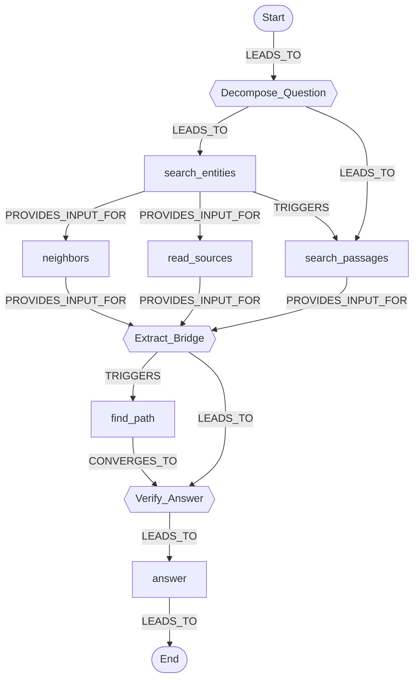

# Procedural memory: Procedural Graphs in Synapse

Synapse's knowledge graph records *what* your documents say. This page is about the other half:
*how* an agent should use that graph. Synapse implements **Procedural Graphs** from Lu, Chen, Wu,
Arık, *"Procedural Graphs: Self-Evolving Execution Structures for LLM Agents"* (Google, Sep 2026,
[arXiv:2609.09153](https://arxiv.org/abs/2609.09153)). A procedural graph is a small directed graph of
steps. Each of its transitions says when it applies, what to do, and what to avoid. Synapse keeps
these graphs in the same Neo4j as the entities, turns them into step-by-step guidance for agents,
and can refine them from scored question/answer pairs.

What comes from the paper is attributed to it. What Synapse added is labelled **Synapse
addition**. Each addition is a hypothesis to measure, not a result.

> **Status.** Implemented and covered by hermetic tests (fake models, no database). **The paper's
> numbers have not been reproduced on Synapse**, and no benchmark results are committed. The
> [benchmark harness](../backend/benchmarks/procedural/README.md) compares systems on Synapse's own
> Navigator (no graph, raw and generative guidance, evolved graphs); it is not a reproduction of
> the paper's tables.

**Contents**

- [Why procedural memory](#why-procedural-memory)
- [The paper in brief](#the-paper-in-brief)
- [What Synapse adds](#what-synapse-adds)
- [Data model](#data-model)
- [Online guidance](#online-guidance)
- [The GraphRAG Navigator](#the-graphrag-navigator)
- [Offline self-evolution](#offline-self-evolution)
- [Reference: API, MCP, CLI, SDK, settings, UI](#reference-api-mcp-cli-sdk-settings-ui)
- [FinOps](#finops)
- [Honest limitations](#honest-limitations)
- [Quick start](#quick-start)

---

## Why procedural memory

The CoALA framework (Sumers et al., 2023) sorts an agent's memory into *working* (the current
context), *episodic* (past experiences), *semantic* (facts) and *procedural* (how to act) memory.
The paper places itself in that taxonomy (its Appendix A.1): retrieval augmentation, GraphRAG
included, works on **semantic** memory. Procedural memory is the quadrant with the least explicit
treatment. It usually lives implicitly in model weights, or is spread across prompt templates and
workflow scripts.

Synapse's retrieval is a clean example of the gap. `POST /api/retrieve` returns the right
entities, paths and passages, but nothing about strategy: which lookup to make first, when a
bridge entity has been found, when the evidence is enough to answer. An agent works that out
again on every question, and pays for it in wasted tool calls and wrong turns.

| Memory | Holds | In Synapse |
| --- | --- | --- |
| Semantic | facts about the corpus | `:Entity`, `:Chunk`, `:Community` — hybrid retrieval, `/api/retrieve`, `/api/chat` |
| Procedural | how to work through a task | `:Procedure*` — guidance, the Navigator agent, self-evolution (this page) |

A procedural graph turns that "how" into an explicit artifact you can inspect, edit and version,
stored next to the facts it helps navigate.

---

## The paper in brief

**The structure.** A Procedural Graph is G = (V, R, E, Φ), a small directed attributed graph:

- **Nodes** abstract a tool `ACTION`, a `REASONING` step or a `STATUS`. The node `Start`
  initialises localization (a₀ = Start).
- **Edges** are triplets (u, r, v) over four relations: `LEADS_TO`, `TRIGGERS`,
  `PROVIDES_INPUT_FOR` and `CONVERGES_TO`.
- **Edge attributes** Φ(e) are a natural-language `condition` (or null for an unconditional
  transition), `guidance` and `pitfalls`.

The graphs are compact. Outside BFCL v3, whose 131 nodes mirror its function catalog, every graph
in the paper has 7–17 nodes and 7–27 triplets.

**Online use (the graph is frozen).** At step *t*:

1. **Localize**: u_t = Match(a_{t−1}, V), an exact match of the most recent action to a node.
2. **Scope**: G_t = N_h(u_t), the node plus the **outgoing** transitions reached in up to h = 2
   directed hops. If no node matched, the scope is the full graph.
3. **Guide**: a guidance LLM Ψ turns (G_t, the query, the last w = 3 trajectory steps) into
   situational guidance g_t, which is appended to the solver's prompt.

This is soft steering. The solver still chooses its own action.

**Offline self-evolution (Algorithm 1).** Evaluate G₀ on a validation set. Then, each round: roll
the agent out on a training batch, show the (tail-truncated) traces and scores to a *refiner* LLM,
which proposes JSON edits, and apply them to a copy with *PrepareCandidate*. A structurally invalid
candidate goes to a rejection memory with no validation rollout. A valid one is kept iff its
validation score is ≥ the retained graph's. Details, as implemented, are in
[Offline self-evolution](#offline-self-evolution).

**Construction modes.** The paper compares five ways to build a graph: (1) a hand-crafted expert
graph, (2) expert + a one-time static update, (3) expert + online (incremental) evolution,
(4) scratch + a one-time build, (5) scratch + online evolution. Synapse implements mode 1 (the
bundled prior), mode 3 (`--mode static`) and mode 5 (`--mode scratch`). The one-time modes 2 and 4
are not implemented.

**What it reports that matters here.**

- **Accuracy, at a price.** In the HotpotQA construction study (Table 9: Gemini 3.5 Flash, greedy
  decoding), the unguided ReAct baseline scores 71.21 answer F1 at 4,003 tokens per question. The
  hand-crafted expert graph scores 76.61 at 9,046 tokens. The best mode, scratch + online
  evolution, scores 78.79 at 10,116 tokens.
- **Evolving the expert prior did not help on HotpotQA.** Mode 3, expert + online evolution,
  scored **76.34 F1 at 10,658 tokens**: below the unevolved expert graph it started from (76.61
  at 9,046), and at more tokens. Mode 3 is exactly what `evolve --mode static` runs. Of the modes
  Synapse implements, only scratch + online evolution (mode 5, `--mode scratch`) beat the prior.
  Mode 2, a one-time static update that Synapse does not implement, scored 77.16 at 8,943. The
  order depends on the task: on MultiChallenge (Table 10) the expert prior was a poor fit
  (58.93 % success), and mode 3 repaired it to 92.86 %, the best result in that table.
- **Guidance costs tokens.** In the guidance ablation (Table 3), localized generative guidance
  raises total tokens by 33.4 % (GDPval) and 55.4 % (ALFWorld) over the no-graph baseline.
  Full-graph guidance is both worse and costlier than localized guidance.
- **Future work.** The paper suggests reusing guidance across steps, or generating it selectively.

---

## What Synapse adds

These are the four additions from the design. Each one is a hypothesis that the harness's system
matrix can test.

| Synapse addition | The paper | Synapse | How to test it |
| --- | --- | --- | --- |
| **Raw local guidance** (the default) | Ψ always rewrites the subgraph into prose: one extra LLM call per step | `mode="raw"` hands the serialized 2-hop subgraph directly to the solver (or to the MCP host): **zero** extra LLM calls. This is the "localized subgraph × raw injection" cell that is missing from the paper's Table 3, and it matches Synapse's retrieve-only [FinOps](./finops.md) stance. | harness: `pg_raw_local` vs `pg_gen_local` vs `no_pg` |
| **Localization cascade** | exact match, otherwise the full graph | `start` → `exact` → `normalized` → `semantic` → `none` (full graph). Details below. | `localization` counts in the harness report |
| **Guidance cache** | — (listed as future work) | generative guidance is cached in-process, keyed by (graph, version, active node, scope, sha1 of the rendered prompt); a hit reports `usage.cached: true` | `usage.cached`, `guidance_llm_calls` |
| **A built-in environment** | HotpotQA, GDPval, ALFWorld, … with the authors' agents | the **GraphRAG Navigator**, a ReAct agent over Synapse's own graph with six deterministic tools. Semantic memory (entities) and procedural memory (its strategy) live in the same Neo4j. | `--dataset demo` / `--dataset hotpotqa` in the harness |

Smaller departures, each commented where it happens in the code:

- **The serializer prints the relation label.** The paper's serializer does not. Printing it costs
  a few tokens and tells the reader whether a transition is a sequence step, a fallback or a data
  dependency.
- **`add_nodes` is an upsert.** An existing id updates that node's type and description.
- **PrepareCandidate is strict.** When any edit fails, no partial candidate is returned, so a
  broken graph can never be evaluated or saved by mistake. Every diagnostic is still collected, so
  the refiner sees them all in one round.
- **A candidate identical to G_{k−1} is not validated.** It would tie and be "accepted" unchanged
  after |val| paid rollouts. The round ends with reason `no_change`, and the refiner is told.
- **A hard LLM-call budget** covers rollouts, guidance and refiner calls. A cap that cannot pay
  for the baseline plus one whole round is refused before any call. Every round starts only when
  its worst case fits, and the loop stops cleanly, never in the middle of a save.
- **Scratch mode never overwrites a better graph.** On a name that already holds a graph it is
  refused unless `replace` is set, and then the stored graph's validation score joins the
  acceptance floor.
- **Rejection memory is bounded.** The refiner sees the 8 most recent rejections. Each shows the
  candidate's structure (nodes and transitions, without the guidance and pitfall texts of the
  edges it did not change) and its edits clipped to 2,500 characters. The paper does not say how
  it serializes a candidate graph.
- **History is durable.** Every accepted candidate becomes a version you can roll back to, and
  every round that ends without one is stored as a `ProcedureRejection` row. The paper's rejection
  memory is kept for audit, not only in memory. A row stores the edits, not the candidate graph.
- **Procedural memory survives `DELETE /api/graph`.** Clearing the corpus does not erase a
  strategy that took paid evolution rounds to learn.

---

## Data model

Procedural memory lives in the **same Neo4j** as the knowledge graph, under its own labels:

```text
(:ProcedureGraph {name, version, score, description, cycle_policy, tools,
                  node_count, edge_count, created_at, updated_at})
(:Procedure {uid, graph, id, type, description, ord})              uid = "<graph>::<id>"
(:Procedure)-[:TRANSITION {relation, condition, guidance, pitfalls, ord}]->(:Procedure)
(:ProcedureVersion {uid, graph, version, score, accepted, created_at, note,
                    graph_json, edits_json, diff_json})          uid = "<graph>::v<version>"
(:ProcedureRejection {graph, round, reason, score, diagnostics_json, edits_json, created_at})
(:ProcedureTrajectory {graph, version, query, steps_json, score, source, created_at})
```

- **Constraints**: `procedure_uid_unique`, `procedure_graph_name_unique` and
  `procedure_version_uid_unique`, plus lookup indexes on `graph`. They are created at startup by
  `graph_schema.ensure_procedural_schema()`. Neo4j 5 Community only supports single-property
  uniqueness, so identity is carried by the synthetic `uid`s.
- **One transaction per save.** `procedural_store.save_graph` validates first, then runs five
  statements in one `execute_write_batch`: bump the version, wipe the live nodes, write the nodes,
  write the transitions, write the snapshot. Either all of it commits or none of it does. The
  version number is computed inside that transaction, and `ProcedureVersion.uid` is unique, so two
  racing saves cannot both write "v3".
- **Live graph + immutable snapshots.** The `Procedure` nodes are the current graph. Each
  `ProcedureVersion` holds the full graph JSON, the edits that produced it and the diff from its
  predecessor. Versions start at 1 and history is append-only.
- **Kept by `DELETE /api/graph`.** The "clear graph" endpoint (and `synapse_clear_graph`) deletes
  every node *except* those with a label in `graph_schema.PROCEDURAL_LABELS`. `make demo`'s
  `seed_demo --clear` only deletes `Entity`, `Community` and `Chunk`, so it keeps them too. To
  remove a procedural graph, call `DELETE /api/procedures/{name}`. That deletes all five kinds of
  record for that graph.
- **Seeded at startup.** When `PROCEDURAL_ENABLED=true` (the default), the app's lifespan saves
  every bundled prior in `backend/app/data/procedural/*.json` whose name is not stored yet. Today
  there are two: `graphrag-navigator`, the backend Navigator's own strategy, and `mcp-host`, the
  strategy for an MCP host answering with the `synapse_*` tools (see
  [Which graph for which agent](#which-graph-for-which-agent)). This is best-effort: a cold
  database is logged and skipped, and an existing graph (evolved or hand-edited) is never
  overwritten. The backend image copies `backend/` wholesale, so the priors ship with it.

### The graph JSON

This is the format `GET /api/procedures/{name}` returns (plus `version` and `score`) and
`PUT /api/procedures/{name}` accepts:

```json
{
  "name": "my-procedure",
  "description": "What the procedure is for.",
  "cycle_policy": "forbid",
  "tools": ["search", "answer"],
  "nodes": [
    { "id": "Start",  "type": "STATUS", "description": "Nothing done yet." },
    { "id": "search", "type": "ACTION", "description": "Look the subject up." },
    { "id": "answer", "type": "ACTION", "description": "Submit the answer." },
    { "id": "End",    "type": "STATUS", "description": "Done." }
  ],
  "edges": [
    { "source": "Start",  "target": "search", "relation": "LEADS_TO", "condition": null,
      "guidance": "Search for the most specific name in the task.", "pitfalls": "Do not paste the whole task." },
    { "source": "search", "target": "answer", "relation": "LEADS_TO", "condition": "When a result states the fact",
      "guidance": "Answer with the shortest exact form.", "pitfalls": "Do not answer from the name alone." },
    { "source": "answer", "target": "End", "relation": "LEADS_TO", "condition": null,
      "guidance": "Stop.", "pitfalls": "" }
  ]
}
```

**Structural checks** (`procedural_graph.validate`). A failure is a 422 that lists every
diagnostic at once:

- the name matches `^[A-Za-z0-9][A-Za-z0-9._-]{0,63}$` (it travels in URLs and uids);
- `cycle_policy` is `forbid` or `allow`, and a `Start` node exists;
- node types and relations come from the vocabularies above, and every edge endpoint exists;
- there is at least one terminal node (out-degree 0), and every node has a directed path to one;
- with `cycle_policy: "forbid"`, there is no cycle.

**Warnings** (`procedural_graph.warnings`) never block a save:

- an `ACTION` node whose id is not in `tools`. Localization matches on action names, so such a
  node can never become the active node.
- a node that is unreachable from `Start`;
- a transition with empty guidance.

---

## Online guidance

`procedural_guidance.guide()` answers one question: given the agent's last action, what does the
graph say about the next step? It backs `POST /api/procedures/{name}/guidance`, the
`synapse_procedure_guidance` MCP tool, `synapse-graphrag procedures guide`, and every step of the
Navigator.

### Modes

| Mode | `context` | `guidance` | Extra LLM calls per step |
| --- | --- | --- | --- |
| `none` | `""` | `null` | 0. Localization is still reported, from name matching only. |
| `raw` *(default, Synapse addition)* | the serialized local subgraph | `null` | **0** |
| `generative` *(the paper's mode)* | the serialized local subgraph | prose written by one LLM call (prompt adapted from the paper's Appendix B.5) | 1, or 0 on a cache hit |

The default comes from `PROCEDURAL_GUIDANCE_MODE`. Every caller can override it per request.

### Localization cascade (Synapse addition)

The first rule that matches wins. The examples are real outputs on the bundled
`graphrag-navigator` prior.

| Method | When | Example: last action → node |
| --- | --- | --- |
| `start` | the trajectory is empty (a₀ = Start) | *(none)* → `Start` |
| `exact` | the action equals a node id (the paper's Match) | `search_entities` → `search_entities` |
| `normalized` | equal after stripping arguments, an `Action:` prefix, case, CamelCase, punctuation and underscores | `Search_Entities(query="Ada")` → `search_entities`; `Action: neighbors(entity="X")` → `neighbors` |
| `semantic` | cosine similarity between an embedding of `"<last action> <first 500 chars of its observation>"` and each candidate node's `"<id> <description>"` is ≥ `PROCEDURAL_SEMANTIC_THRESHOLD` (0.72) | `entity_search` with observation `Ada Lovelace` → `search_entities` (0.76) |
| `none` | nothing matched, or the step has no action (a failed parse) | `lookup` → no node, so the **full graph** is used |

- **Semantic step details.** Node embeddings are computed once per graph content and cached
  in-process. Neither `Start` nor a terminal node (out-degree 0, such as `End`) is ever a
  semantic candidate: a terminal's context says "the procedure ends here", which a similarity
  score is not evidence enough for. On a scratch skeleton (`Start → End`) there is therefore no
  candidate, and the full graph is used. A step **without an action** (the Navigator's failed
  parse, whose observation is the parser's error listing every tool) skips the semantic step
  too: the paper's Match finds nothing there and uses the full graph, and so does Synapse. Any
  embedding failure skips the step and never fails the call. The step is also skipped in `none`
  mode and when the full graph is forced, because its answer could not change the context. With
  the default `fastembed` embeddings it runs locally and costs nothing.
- **Why a cascade.** Models write `Search_Entities` or include the arguments. An exact-only match
  would then fall back to the full graph, which the paper's own ablation found worse *and*
  costlier.

### Calibrating the semantic threshold

The threshold is calibrated for the default embedder, and the calibration is a script you can
rerun. fastembed's `BAAI/bge-small-en-v1.5` puts even unrelated text at a high cosine, so a floor
chosen for another model lets garbage steps localize.

`backend/scripts/calibrate_semantic_threshold.py` holds two fixed string sets:

- **48 unrelated steps**: shell commands, SQL, errands, text-game moves and filler words (`x`,
  `ls -la`, `SELECT * FROM users`, `done`, `order_pizza`, …). The right outcome for each is the
  full graph.
- **48 paraphrased tool calls**: the Navigator's six tools under names another model or MCP host
  might use, each with the node it means (`entity_search` → `search_entities`, `shortest_path` →
  `find_path`, `give_answer` → `answer`, …).

No string matches a node by name, so each one exercises the semantic step alone (the script
checks this). It scores every string exactly as `guide()` does, against the bundled prior, and
prints the distributions and the outcome at each threshold from 0.50 to 0.85. It needs no LLM
and no database:

```bash
docker compose exec -T backend python -m scripts.calibrate_semantic_threshold   # in the running stack
cd backend && python -m scripts.calibrate_semantic_threshold --details           # or locally; lists every string
```

What it measured in the backend container (fastembed 0.7.4):

- **Unrelated text peaks at 0.682** (`click_button` → `answer`). At the earlier default of 0.5,
  45 of the 48 unrelated steps localized, 34 of them onto `answer` (the `--details` listing
  shows each one).
- **At 0.72, the configured default**, every unrelated step falls back to the full graph. Of the
  48 paraphrases, 29 land on their intended node and 18 fall back to the full graph, which is the
  paper's behaviour: no gain, but no harm. **One lands on the wrong node**: `related_entities`
  (meant `neighbors`) scores 0.721 on `search_entities`.
- **0.72 is a trade-off, not an optimum.** 0.70 places 3 more paraphrases correctly with the
  same single wrong placement, 0.018 above the highest unrelated string. 0.75 removes the wrong
  placement and misses 3 more. The best raw accuracy on these sets (88.5 % at 0.65) lets 4
  unrelated steps and 5 wrong placements through, which is the failure the threshold exists to
  prevent.

<details>
<summary>The script's full output</summary>

```text
Semantic localization calibration
  embedder   fastembed · BAAI/bge-small-en-v1.5
  graph      graphrag-navigator (bundled prior): 9 candidate nodes (every node but Start and the terminals)
  strings    48 unrelated · 48 paraphrased tool calls
  configured PROCEDURAL_SEMANTIC_THRESHOLD = 0.72

Best cosine per string (what the semantic step compares with the threshold)
                            n    min    p25  median    p75    max
  unrelated                48  0.444  0.529  0.564  0.604  0.682
  paraphrases              48  0.546  0.695  0.758  0.798  0.916
    best node right        41  0.666  0.718  0.764  0.808  0.916
    best node wrong         7  0.546  0.651  0.683  0.691  0.721

Histogram of best cosines
  bin          unrelated  paraphrase:right  paraphrase:wrong
  0.40–0.45            1                 0                 0
  0.45–0.50            2                 0                 0
  0.50–0.55           17                 0                 1
  0.55–0.60           15                 0                 0
  0.60–0.65            9                 0                 1
  0.65–0.70            4                 9                 4
  0.70–0.75            0                 6                 1
  0.75–0.80            0                14                 0
  0.80–0.85            0                 8                 0
  0.85–0.90            0                 1                 0
  0.90–0.95            0                 3                 0

Outcome at each threshold (a step localizes iff its best cosine >= threshold)
  threshold  unrelated→full  paraphrase→right  paraphrase→wrong  paraphrase→full  accuracy
       0.50          3/48              41/48                  7                0    45.8%
       0.55         20/48              41/48                  6                1    63.5%
       0.60         35/48              41/48                  6                1    79.2%
       0.65         44/48              41/48                  5                2    88.5%
       0.70         48/48              32/48                  1               15    83.3%
       0.72         48/48              29/48                  1               18    80.2%  ◀ configured
       0.75         48/48              26/48                  0               22    77.1%
       0.80         48/48              12/48                  0               36    62.5%
       0.85         48/48               4/48                  0               44    54.2%

  accuracy = (unrelated → full graph + paraphrase → intended node) / all strings.
  paraphrase→wrong is the harmful case; paraphrase→full falls back to the paper's
  behaviour (the whole graph).

Highest-scoring unrelated strings
  0.682  click_button Submit clicked                   → answer
  0.681  done                                          → answer
  0.668  tweet Posted to your timeline.                → answer
  0.651  scroll_down                                   → answer
  0.648  lookup                                        → search_passages

Paraphrases whose best node is not the intended one
  0.721  related_entities                              → search_entities (meant neighbors)
  0.697  connect_entities                              → read_sources (meant find_path)
  0.684  search_documents                              → search_entities (meant search_passages)
  0.683  lookup_entity Charles Babbage                 → Extract_Bridge (meant search_entities)
  0.666  get_relationships                             → find_path (meant neighbors)
  0.636  show_provenance                               → Verify_Answer (meant read_sources)
  0.546  expand_node                                   → find_path (meant neighbors)
```

</details>

Rerun the script when you change `EMBEDDING_PROVIDER` or edit a prior's node descriptions, and
set `PROCEDURAL_SEMANTIC_THRESHOLD` from its table. The integration test
`SYNAPSE_IT=1 pytest tests/integration/test_semantic_localization.py` imports the same two sets
and pins the claims above through `guide()` itself: every unrelated step falls back to the full
graph, `guide()` places each paraphrase exactly where the script says, at least 90 % of the
placed paraphrases are right, and at least half are placed.

### Which graph for which agent

Localization matches the agent's last action against node ids, so an agent must be steered by a
graph whose `ACTION` nodes are the tools *it* calls. Two priors ship:

| Graph | Steers | Its `ACTION` nodes | Default for |
| --- | --- | --- | --- |
| `graphrag-navigator` | the backend's Navigator (`POST /api/agent/ask`, `synapse_agent_ask`, the UI's *Navigator* mode) | the Navigator's internal tools: `search_entities`, `neighbors`, `read_sources`, `search_passages`, `find_path`, `answer` | `PROCEDURAL_DEFAULT_GRAPH`, `synapse_agent_ask` |
| `mcp-host` | an MCP host (Claude, Cursor, …) answering from Synapse | the MCP tools' real names: `synapse_retrieve`, `synapse_find_entities`, `synapse_communities`, `synapse_graph_stats`, `synapse_status`, `synapse_ask` | `synapse_procedure_guidance`, `synapse_record_trajectory`, the `follow_procedure` prompt |

An MCP host calls its tools by those names, so on `mcp-host` its steps localize by name (`exact`,
or `normalized` when it passes the arguments too), with no embedding involved. The MCP server also strips the `mcp__<server>__` prefix that Claude
Code shows its model, so `mcp__synapse__synapse_retrieve` is localized as `synapse_retrieve`. On
`graphrag-navigator` a host's calls match no node (it has no `search_entities` tool), and every
step would get the full graph. `mcp-host` has 11 nodes and 18 transitions; its `REASONING` nodes
are `Plan_Question`, `Verify_Against_Sources` and `Answer_From_Context`.

### What the solver (or host) reads

In `raw` mode, the context is the paper's local serialization format, with the relation added.
Here is the start of the real context after a `search_entities` step on the prior (3,083
characters in full):

```text
Active Cognitive Node: [search_entities] (Type: ACTION)
Description: Search the knowledge graph for entities matching a name or keyword; returns names, types and short descriptions.
Immediate Transition Options (Hop 1):
- Transition: [search_entities]→[neighbors] (Relation: PROVIDES_INPUT_FOR; Condition: When a returned entity clearly matches the name in the question and the question asks about something connected to it)
  * Guidance: Call neighbors on the exact entity name returned by search_entities to list its relations; …
  * Pitfalls to Avoid: Use the entity name exactly as search_entities returned it; a paraphrased name finds nothing. …
- Transition: [search_entities]→[search_passages] (Relation: TRIGGERS; Condition: When no returned entity matches the question's entity, or several candidates are equally plausible)
  …
Subsequent Horizon (Hop 2):
- Transition: [neighbors]→[Extract_Bridge] (Relation: PROVIDES_INPUT_FOR; Condition: unconditional)
  …
```

The response to `POST /api/procedures/graphrag-navigator/guidance` with
`{"query": "…", "trajectory": [{"action": "search_entities", "observation": "…"}]}`:

```json
{
  "graph": "graphrag-navigator",
  "version": 1,
  "active_node": "search_entities",
  "localization": "exact",
  "localization_score": null,
  "scope": "local",
  "context": "Active Cognitive Node: [search_entities] (Type: ACTION)\n…",
  "guidance": null,
  "next_actions": ["neighbors", "read_sources", "search_passages"],
  "usage": {
    "context_chars": 3083, "context_tokens_est": 771, "llm_calls": 0, "cached": false,
    "input_tokens": 0, "output_tokens": 0, "estimated": false
  }
}
```

- `scope` is `local`, or `full` when nothing matched.
- `localization_score` is the cosine similarity for a `semantic` match, and null otherwise.
- `next_actions` are the hop-1 targets.
- `context_tokens_est` is ⌈chars / 4⌉, the same provider-agnostic heuristic as `/api/retrieve`.
- In `generative` mode, `input_tokens` / `output_tokens` are the provider's reported usage. When
  the provider reports none, they are estimated at chars / 4 and `estimated` is true.

Trajectory items are `{"action", "observation"?}`, oldest first. Extra keys such as `thought` and
`args` are accepted.

---

## The GraphRAG Navigator

`/api/chat` answers in one shot: retrieve, then generate. The **Navigator**
(`backend/app/services/graph_agent.py`) answers step by step instead. It is a ReAct agent
(Synapse addition: this is the environment where procedural memory becomes measurable). Each turn
is one LLM call that writes a `Thought` and exactly one `Action`. The action runs one of six
**deterministic** tools, which make no LLM call and are built from the chat engine's own retrieval
primitives and the chunk store:

| Tool | Returns |
| --- | --- |
| `search_entities(query)` | the top 5 entities from hybrid (vector + full-text) seeding: name, type, short description |
| `neighbors(entity)` | the entity's direct relations (one hop), with direction (up to 40) |
| `read_sources(entity)` | up to 3 source passages the entity was extracted from |
| `search_passages(query)` | the top 3 passages by semantic search over the source chunks |
| `find_path(source, target)` | the reasoning paths (relation chains) linking two entities within the retrieval hop limit, or a "no path" note |
| `answer(text)` | submits the final short answer and ends the episode |

**One step.**

1. Unless guidance is `none`, the Navigator calls `guide()` with the trajectory so far. The
   graph is loaded **once** per run, not once per step.
2. The result is placed in the solver prompt under a `Procedural Graph Guidance:` heading. Raw
   context gets a one-line preamble saying it is advice.
3. The model writes `Thought: …` / `Action: tool(arg="…")`. The prompt is adapted from the paper's
   ReAct template: one Thought and one Action per turn, never a simulated Observation.
4. The action runs, and its observation is truncated to `AGENT_OBSERVATION_MAX_CHARS` (1,500).

**Parsing and stopping.**

- The action parser is tolerant: quotes are optional, one positional argument is allowed, and
  stray markdown is ignored. A turn it still cannot execute gets the observation
  `Invalid action format. Use: Action: tool_name(arg="value")` and counts as a `parse_failure`,
  which is a column of the paper's Table 9.
- The run stops on `answer` (`stopped: "answer"`), at `AGENT_MAX_STEPS` (`"max_steps"`, 8 by
  default, 1–20 per request), or on a model error (`"error"`).
- A missing LLM key is a 503. A guidance failure never ends a run: the step is recorded with a
  `guidance_error` and the run continues without guidance.

**The result** (`POST /api/agent/ask`):

- `answer`
- `steps` — each step has `thought`, `action`, `args`, `observation`, `guidance_context_chars`,
  `localization` and `active_node`
- `stopped`, `parse_failures`
- `usage` — `llm_calls` (all calls, guidance included), `guidance_llm_calls`, `input_tokens`,
  `output_tokens`, `estimated` and `context_chars` (total guidance characters injected)
- `graph` — `{name, version}`, or null when no procedural graph was used
- `latency_s`, `error`, and `recorded` (true when `record=true` stored the run as an unscored
  `ProcedureTrajectory`)

### The expert prior: `graphrag-navigator`

The bundled prior (`backend/app/data/procedural/graphrag-navigator.json`) is G₀. It is a
hand-written strategy for multi-hop QA over a knowledge graph, with 11 nodes and 14 transitions.
Every transition carries a condition, guidance and pitfalls (for example, *"Do not answer from the
entity name alone: read its relations or its sources"*). Its `tools` are exactly the Navigator's
tool names, and a test pins that.



Rectangles are `ACTION` nodes, hexagons `REASONING` and stadiums `STATUS`. The Navigator's actions
are tool names, so it is localized on `Start` and the `ACTION` nodes (in practice never on
`answer`, which ends the run before the next guidance call). The `REASONING` nodes reach it
through the hop-1 and hop-2 horizons, as the step between two tools.

In the UI, the Chat panel's **Chat | Navigator** switch runs the Navigator (default graph, raw
guidance) and renders its trace. The graph panel's **Knowledge | Procedures** switch draws the
procedural graph, with the last run's steps overlaid on it.

---

## Offline self-evolution

`procedural_evolution.evolve()` implements the paper's Algorithm 1 over the Navigator. QA pairs
are scored by EM or F1 (`qa_metrics`), using SQuAD normalization and the official HotpotQA yes/no
rule:

```text
S0 ← Evaluate(G0, D_val);  H_rejected ← []
for k = 1..K:
    E_k   ← Rollout(G_{k-1}, B_k)                      training traces + scores
    C_k   ← Tail_Lmax(concat(E_k))                     keep the END of the text
    ΔG_k  ← Refiner(G_{k-1}, C_k, scores, SerializeRejections(H_rejected))
    G_cand, d_k ← PrepareCandidate(G_{k-1}, ΔG_k, cycle policy)
    if d_k ≠ ∅: H_rejected += (ΔG_k, E_k, d_k); continue    NO validation rollout
    S_cand ← Evaluate(G_cand, D_val)
    if S_cand ≥ S_{k-1}: accept (ties included) → a new stored version
    else:  H_rejected += (ΔG_k, G_cand, E_k, S_cand)
return G_K
```

How each piece is implemented:

- **Inputs.** `train` and `val` are lists of `{"question", "answer"}`. `answer` may be a list of
  acceptable answers, and the best match counts. `metric` is `f1` (default) or `em`. The
  `guidance` used during rollouts is `raw` (default) or `generative`.
- **Modes.**
  - `static` (the paper's `static_incremental`, mode 3) starts from the stored graph. On HotpotQA
    this mode ended **below** the expert prior it started from: 76.34 F1 at 10,658 tokens per
    question, against 76.61 at 9,046 unevolved (Table 9). Do not assume an accepted round
    improved anything; measure the result on a held-out split.
  - `scratch` (`scratch_incremental`, mode 5) starts from `Start → End` with the Navigator's tool
    list. The stored graph is **not touched** until a candidate is accepted, and the skeleton's own
    S₀ is measured first. It was the paper's best HotpotQA mode (78.79 at 10,116).
  - **Scratch mode on a name that already holds a graph is refused** (409, or the CLI's error)
    unless the request sets `replace` (`--replace`). With it, the stored graph is also scored
    once on `val`, and a candidate must reach max(S₀ of the skeleton, the stored graph's score)
    to be accepted, so a graph grown from scratch never overwrites a better one (Synapse
    addition: the paper's scratch runs have no stored graph to lose). To compare without any
    overwrite risk, evolve under a new name.
- **Batches.** B_k is the k-th sequential stride over `train` of `batch_size` items, wrapping
  around, so a small set can run many rounds. Every rollout is recorded as a
  `ProcedureTrajectory` (source `evolution` or `evolution-val`).
- **The refiner prompt** is adapted from the paper's Appendix B.5: the same slots, the same seven
  rules (including "generality and leak prevention") and the same four-array JSON output. It
  contains:
  - the task, the mode, the cycle policy and the available tools;
  - the batch scores;
  - the traces, high-scoring first and then low-scoring, **tail-truncated**: text is dropped
    from the *start* and the end of each trace group is kept. `EVOLUTION_TRAJECTORY_MAX_CHARS` is
    split between the two groups (half each, a group's unused half going to the other), so a
    long batch of failures cannot push every success out. The paper truncates the whole
    concatenation; the split is Synapse's.
  - the current graph JSON and the recent rejected candidates.

  Traces include the gold answer, because these are training items. Rule 5 forbids copying
  specific names or answers into the graph. The JSON is extracted from a fenced block or from bare
  JSON. Output that cannot be parsed is a structural rejection.
- **PrepareCandidate** (`procedural_graph.prepare_candidate`) applies the edits to a copy, in the
  paper's order:
  1. `delete_edges` removes **all** edges between that source and target, whatever the relation;
  2. `delete_nodes`;
  3. `add_nodes`, an upsert;
  4. `add_edges`.

  A malformed entry, an unknown type or relation, or a missing endpoint is a diagnostic. With
  `cycle_policy: "forbid"`, a deterministic DFS then removes the cycle-closing edges; they are
  listed in `notes`, not treated as failures. Finally, the structural checks run.
- **The gate.** A structural failure is rejected with **no validation rollout**. A candidate
  identical to G_{k−1} is skipped (`no_change`). Otherwise the candidate is scored on `val`, and it
  is **accepted iff S_cand ≥ S_{k−1}**, ties included. An accepted candidate is saved as a new
  version with note `evolution round k`, its edits and its diff. A lower score goes to the
  rejection memory.
- **Rejection memory.** The in-run list keeps each rejected round's edits, its training traces
  and, for a score rejection, the candidate graph (a structural failure has none: PrepareCandidate
  is strict). SerializeRejections puts the 8 most recent into the next refiner prompt, as the
  paper's Appendix B.6 describes: the candidate graph's structure (nodes and transitions) with its
  validation score, or the structural diagnostics, plus the edits. Every round that ends without
  an accepted candidate (`structural`, `score`, `no_change` or `refiner_error`) is also stored as
  a `ProcedureRejection` row with its reason, score, diagnostics and edits, available from
  `GET /api/procedures/{name}/rejections`.
- **Budget.** `max_llm_calls` (default `EVOLUTION_MAX_LLM_CALLS=400`) counts rollouts, guidance
  and refiner calls together. A rollout's worst case is `AGENT_MAX_STEPS` calls, doubled with
  generative guidance.
  - **A cap that cannot pay for one round is refused before any call.** A baseline alone decides
    nothing, so `max_llm_calls` must cover the worst case of the baseline and of one whole round:

    minimum = (|val| + |B₁| + |val|) × S + 1

    S is the per-rollout worst case (`AGENT_MAX_STEPS`, 8 by default, doubled with generative
    guidance), |B₁| = min(batch size, |train|), and the + 1 is the refiner call. With
    `replace` on a stored graph, add |val| × S for its evaluation. On the demo set (|val| = 9)
    with `--batch-size 6` and raw guidance that is (9 + 6 + 9) × 8 + 1 = **193**; with the
    default batch of 10 it is 225. Below it, the API answers 422 with
    `detail.minimum_max_llm_calls`, and the CLI refuses with the same number before asking for
    consent.
  - Every later round starts only when its whole worst case (|B_k| + |val| rollouts plus the
    refiner call) still fits. A round decides nothing until its validation ends, so one that
    could not finish would pay for work that is thrown away.
  - When it does not fit, the run stops with `stopped: "budget"`, never in the middle of a save.
    A caller's own spend cap refusing the refiner call (the harness's `--max-usd`) stops it the
    same way, and the refused call is not counted.
  - A candidate whose validation was interrupted anyway (a run that reported more calls than its
    bound) is neither accepted nor rejected.
- **One run per graph.** The API allows one evolution per graph per process; a second request is
  a 409.
- **Progress** streams as SSE events. Each event is
  `{"type": "progress", "stage": "baseline" | "stored" | "rollout" | "refine" | "validate" | "accepted" | "rejected", "round": k, …}`
  (`stored` is the stored graph's evaluation under `replace`).
  The stream ends with `done`, which carries the report, or `error`, which carries the message.
- **The report.** Its fields:
  - `graph`, `mode`, `metric`, `guidance`, `replace`
  - `rounds_requested`, `rounds_run`, `accepted_rounds`
  - `stopped`: `completed` or `budget`
  - `baseline_score`, `stored_score` and `stored_version` (the replaced graph's, under
    `replace`; otherwise null), `final_score`, `final_version`
  - `rounds`: one entry per round, with `round`, `train_mean`, `candidate_score`, `floor` (the
    score the candidate had to reach), `accepted`, `reason`, `diagnostics`, `notes`, `diff` and
    `version`. `reason` is one of `accepted`, `score`, `structural`, `no_change`,
    `refiner_error` or `budget`.
  - `llm_calls`, `max_llm_calls`, `min_llm_calls` (the minimum above), `usage`
  - `effect_floor` = 1 / |val|
  - `note`

> **Read the trail honestly.** The gate compares two means over the same small validation set, so
> its resolution is one question: `effect_floor = 1/|val|` (0.111 on the demo set's 9 validation
> questions). An accept or reject is **a step in a search, not a significance test**. The paper
> says the same of its own gate.

**Versions and rollback.** Every save (the seeded prior, a `PUT`, an accepted round, a rollback)
appends a version. `POST /api/procedures/{name}/rollback {"version": N}` re-saves version N as a
**new** version with note `rollback to vN`, carrying over the score measured on that exact graph.
The rollback is therefore itself undoable.

---

## Reference: API, MCP, CLI, SDK, settings, UI

### HTTP API (tag *Procedures*, see `/docs` on the backend)

| Route | Body / query | Returns |
| --- | --- | --- |
| `GET /api/procedures` | — | `{"graphs": [{name, version, score, nodes, edges, updated_at, description}]}` |
| `GET /api/procedures/{name}` | `?format=text` for the full serialization | the graph JSON + `version`, `score` · or `{"text": …}` |
| `GET /api/procedures/{name}/graph-data` | — | `{"nodes": [{id, label, type, description, is_start, is_terminal}], "links": [{source, target, relation, condition, guidance, pitfalls}], "version", "score"}` |
| `PUT /api/procedures/{name}` | graph JSON (its `name` must match the path or be absent) | `{"name", "version"}` · 422 `{"detail": {"message", "diagnostics": [...]}}` |
| `DELETE /api/procedures/{name}` | — | `{"status": "success", "deleted": bool}` — graph, versions, rejections, trajectories |
| `POST /api/procedures/{name}/guidance` | `{query, trajectory: [{action, observation?}], mode?, hops? (0–5), window? (0–20)}`; `action` / `observation` may be null (a Navigator trace replays as-is) | the `guide()` result above |
| `POST /api/procedures/{name}/trajectories` | `{query, steps, score (0–1), source? = "api"}` | `{"status": "recorded"}` |
| `GET /api/procedures/{name}/versions` | — | `{"versions": [{version, score, accepted, created_at, note, diff}]}`, newest first |
| `POST /api/procedures/{name}/rollback` | `{version}` | `{"name", "version"}` (the new version) |
| `GET /api/procedures/{name}/rejections` | `?limit=` (1–200, default 20) | `{"rejections": [{round, reason, score, diagnostics, edits, created_at}]}` |
| `POST /api/procedures/{name}/evolve` | `{train, val, rounds? (1–20), batch_size? (1–100), mode? = "static", metric? = "f1", guidance? = "raw", max_llm_calls?, replace? = false}`; every `answer` must hold a non-empty gold (blank alternatives in a list are dropped) | `{"job_id", "status": "processing"}` |
| `GET /api/procedures/evolve/{job_id}/events` | — | SSE: `progress` events, then `done` (the report) or `error` |
| `POST /api/agent/ask` | `{query, graph?, guidance?, max_steps? (1–20), record? = false}` | the Navigator result above |

For `POST /api/agent/ask`, omitting `graph` uses `PROCEDURAL_DEFAULT_GRAPH`, and `"graph": null`
runs without procedural memory.

**Errors.**

- An unknown graph or version is a **404**. For `…/rejections`, that means a name with neither a
  graph nor a stored rejection: a scratch run that accepted nothing still lists its rejections.
- An invalid graph is a **422** that lists every diagnostic.
- No LLM provider configured is a **503** carrying the provider's message: `agent/ask`, `evolve`
  and `generative` guidance need one.
- A second concurrent evolution of the same graph is a **409**, and so is `mode: "scratch"` on a
  name that already holds a graph without `replace: true`.
- An evolution whose `max_llm_calls` cannot pay for the baseline and one full round is a **422**
  before anything is spent; `detail.minimum_max_llm_calls` is the smallest cap that can.

### MCP (`synapse-graphrag`)

| Tool / prompt | What it does | Annotations |
| --- | --- | --- |
| `synapse_procedures()` | list the graphs with version, score and size | read-only, idempotent |
| `synapse_procedure_guidance(query, graph="mcp-host", last_action=None, last_observation=None, recent_steps=None, mode="raw")` | call before each step: the subgraph around your last action. `raw` makes no LLM call. The default graph's nodes are the `synapse_*` tools, so a host's calls localize it. | read-only, idempotent |
| `synapse_record_trajectory(query, steps, score, graph="mcp-host")` | record a finished run with an honest score in [0, 1] | write, not destructive |
| `synapse_agent_ask(query, graph="graphrag-navigator", guidance="raw", max_steps=8)` | the backend's Navigator answers and returns its trace. **Costs backend LLM calls.** | read-only |
| prompt `follow_procedure(task, graph="mcp-host")` | the loop: guidance → act → guidance with the last action and observation → … → record with an honest score | — |

There is deliberately **no evolve tool**. Evolution runs for a long time and spends hundreds of
backend LLM calls, so a model should not start it on its own initiative in the middle of a task.
It stays behind the CLI (which estimates the cost and asks first) and the API. See
[docs/mcp.md](./mcp.md#procedural-memory-tools).

### CLI (`synapse-graphrag`)

```text
procedures [list]                          graphs with version, score, size
procedures show NAME [--text]              nodes and transitions (--text: exactly what an LLM reads)
procedures export NAME [-o FILE]           the graph JSON (with version and score)
procedures import FILE [--name N]          store a graph JSON as a new version (validated by the backend)
procedures versions NAME                   history: score, note, structural diff
procedures rollback NAME VERSION           re-save an old version as the newest
procedures guide NAME --query Q [--last-action A] [--observation O] [--mode raw|generative] [--json]
agent QUERY [--graph NAME | --no-graph] [--guidance none|raw|generative] [--max-steps N] [--record] [--json]
evolve NAME --train FILE --val FILE [--train-split S] [--val-split S] [--rounds N] [--batch-size N]
            [--mode static|scratch] [--metric f1|em] [--guidance raw|generative] [--max-llm-calls N]
            [--replace] [--yes]
```

**Before `evolve` starts**, it:

1. reads JSON arrays or JSONL of `{question, answer}`, and refuses a file that mixes `split` values
   until `--train-split` / `--val-split` picks one;
2. refuses `--mode scratch` on a name that already holds a graph unless `--replace` is given;
3. refuses a `--max-llm-calls` below the minimum that runs one round, and names that minimum;
4. prints an upper bound on the backend LLM calls and the hard cap that applies. Without
   `--max-llm-calls`, that bound itself is sent as the cap, so a backend configured with a larger
   `AGENT_MAX_STEPS` or `EVOLUTION_MAX_LLM_CALLS` still cannot spend more than you agreed to;
5. requires `--yes`, or a `y` typed at an interactive prompt. A piped or closed stdin is never
   taken as consent.

Ctrl-C stops listening; the job keeps running until it finishes or reaches its budget.

### Python client (`SynapseClient`)

- `procedures()`, `procedure(name)`, `procedure_text(name)`, `procedure_graph_data(name)`
- `put_procedure(name, graph)`, `delete_procedure(name)`
- `procedure_guidance(name, query, trajectory=None, mode=None, hops=None, window=None)`
- `record_trajectory(name, query, steps, score, source="client")`
- `procedure_versions(name)`, `rollback_procedure(name, version)`,
  `procedure_rejections(name, limit=20)`
- `evolve_procedure(name, train, val, *, rounds=None, batch_size=None, mode="static", metric="f1", guidance="raw", max_llm_calls=None, on_progress=None, replace=False)`,
  which POSTs and then follows the SSE stream to the report
- `agent_ask(query, graph=..., guidance=None, max_steps=None, record=False)`. Here `...` means
  the backend's default graph, and `None` means no graph.

An invalid graph raises `SynapseError` with status 422, and `exc.payload["diagnostics"]` lists
the problems.

### Settings (`.env`)

| Variable | Default | Meaning |
| --- | --- | --- |
| `PROCEDURAL_ENABLED` | `true` | seed the bundled priors at startup, and let `agent/ask` without a `graph` use the default graph (`false`: no seeding, and such a run uses no graph) |
| `PROCEDURAL_DEFAULT_GRAPH` | `graphrag-navigator` | graph used when a caller names none |
| `PROCEDURAL_HOPS` | `2` | directed hops shown around the active node (the paper's h) |
| `PROCEDURAL_WINDOW` | `3` | recent steps given to the guidance LLM (the paper's w) |
| `PROCEDURAL_GUIDANCE_MODE` | `raw` | `none` · `raw` · `generative` |
| `PROCEDURAL_SEMANTIC_THRESHOLD` | `0.72` | cosine floor for semantic localization, calibrated for fastembed `bge-small-en-v1.5`; re-measure for another embedder with `python -m scripts.calibrate_semantic_threshold` ([how](#calibrating-the-semantic-threshold)) |
| `PROCEDURAL_GUIDANCE_CACHE_SIZE` | `256` | in-process LRU of generated guidance (`0` disables it) |
| `AGENT_MAX_STEPS` | `8` | Navigator turns per question (= LLM calls without generative guidance) |
| `AGENT_OBSERVATION_MAX_CHARS` | `1500` | tool output kept per step |
| `AGENT_TEMPERATURE` | `0.0` | solver temperature |
| `EVOLUTION_TRAJECTORY_MAX_CHARS` | `24000` | trace text shown to the refiner (the end is kept) |
| `EVOLUTION_MAX_LLM_CALLS` | `400` | default hard budget per evolution run |
| `EVOLUTION_DEFAULT_ROUNDS` | `3` | rounds when a request names none |
| `EVOLUTION_DEFAULT_BATCH_SIZE` | `10` | training questions per round when a request names none |

---

## FinOps

The paper is candid that guidance costs tokens: +33.4 % / +55.4 % total tokens for localized
generative guidance on GDPval / ALFWorld (Table 3), and 10,116 vs 4,003 tokens per HotpotQA
question for its most accurate construction mode (Table 9). Evolution is not free either: on
HotpotQA, evolving the expert prior (mode 3, `--mode static`) raised the bill from 9,046 to
10,658 tokens per question while F1 fell from 76.61 to 76.34. Synapse's defaults are chosen
around that:

| What | Extra LLM calls | Extra input |
| --- | --- | --- |
| `raw` guidance (default), via the API, MCP or CLI | **0** | the serialized subgraph. On `graphrag-navigator`, 1,153–3,083 characters (≈ 289–771 tokens) at the nodes the Navigator is localized on, 8,386 characters (≈ 2,097 tokens) for the full-graph fallback. On `mcp-host`, 687–7,878 characters (≈ 172–1,970 tokens), 11,486 (≈ 2,872) for the full graph |
| `generative` guidance | 1 per step, 0 on a cache hit | the guidance prompt (subgraph + query + last `w` steps), plus its output in the solver prompt |
| A Navigator question | up to `AGENT_MAX_STEPS` (8) solver calls, 2× that with generative guidance | the prompt grows with the trajectory; each observation is capped at 1,500 characters |
| An evolution run | ≤ (rounds × (batch + \|val\|) + \|val\|) × `AGENT_MAX_STEPS` (× 2 generative) + rounds, plus \|val\| rollouts with `replace` | hard-capped by `max_llm_calls`; the CLI prints this bound before asking. A cap below (\|val\| + batch + \|val\|) × S + 1, one round's worth, is refused before any call ([Budget](#offline-self-evolution)) |

- The character counts above are deterministic properties of the bundled priors, computed with
  the real serializer, not measurements of a run. For `graphrag-navigator` they span the nodes a
  Navigator step can stand on when it asks for guidance: `Start` (the first step) and the tool
  nodes other than `answer`, which ends the run. The per-node extremes of that graph are
  excluded on purpose: `End` (203 characters, a terminal) and `Decompose_Question` (3,336, a
  `REASONING` node) are never where the Navigator is localized, since its actions are tool names.
  For `mcp-host` they span all ten non-terminal nodes, because a host is told to report "the tool
  or node name" as its last action and can therefore stand on any of them: the six tool nodes
  (1,283–2,386), `Start` (3,976), `Answer_From_Context` and `Verify_Against_Sources` (687 and
  1,349) and, at the top, `Plan_Question` (7,878), the hub that fans out to all six tools.
  `usage.context_chars` / `context_tokens_est` report the real figure on every guidance response.
- A Navigator answer is **several** LLM calls, where `/api/chat` makes one. Prefer
  `synapse_retrieve` (or `/api/chat`) unless you want the step-by-step strategy.
- The generative cache only hits when the exact situation recurs: same graph version, active node,
  scope, query and last *w* steps. It is per process.
- **Measure instead of guessing.**
  `cd backend && python -m benchmarks.procedural.run_procedural --dry-run` prints an upper-bound
  bill without calling any model. `--max-usd` and `--max-llm-calls` are hard stops.

More on Synapse's cost model: [docs/finops.md](./finops.md#5-procedural-guidance-the-navigator-and-evolution).

---

## Honest limitations

- **Not reproduced.** We have **not** reproduced the paper's results. Its HotpotQA study ran its
  own agent with Gemini models on 1,000 test questions. Synapse's Navigator walks a knowledge graph
  built from your documents, with whatever model you configure. The
  [harness](../backend/benchmarks/procedural/README.md) compares systems with each other, not with
  the paper's tables. The raw-guidance default and the localization cascade are untested
  hypotheses until a run says otherwise.
- **Small validation sets make a noisy gate.** The resolution is one question (1/|val|), and the
  demo set has 9 validation questions. Accepted rounds are a search trail, not evidence of
  improvement. Evaluate on a held-out test split (the harness does) before believing a gain.
- **Localization is by tool name.** Several procedure steps that share one tool cannot be told
  apart. For the Navigator, whose parsed actions are always tool names, the cascade on the prior
  reduces to `start` / `exact`, plus `none` (the full graph) after a failed parse, which is the
  paper's Match. `semantic` can only fire on a graph that has no node for a tool (an evolved or
  scratch graph), and with the default embedder only on a close paraphrase. The same holds for an
  MCP host on `mcp-host`, whose nodes are its real tool names. The `normalized` and `semantic`
  steps matter for a host steered by a graph written for other tool names.
- **Evolution is a search, not a guaranteed improvement.** In the paper's own HotpotQA study,
  evolving the expert prior (`--mode static`) ended slightly *below* the prior at more tokens
  (76.34 vs 76.61 F1; 10,658 vs 9,046 tokens per question). Only evolution from scratch beat it.
- **Guidance and evolution cost real LLM calls.** Only `raw` / `none` guidance and the read-only
  `procedures` commands (list, show, export, versions) are free. An evolution run can spend
  hundreds of calls, and the budget caps it but does not make it cheap.
- **Recorded trajectories are not learned from yet.** `synapse_record_trajectory`,
  `agent --record` and `POST …/trajectories` store runs for audit. The evolution loop learns only
  from its own rollouts on the QA pairs you give it, and no endpoint lists recorded runs yet.
- **The demo graph has no source passages.** `make demo` writes entities and relations only, so
  on a database that holds nothing else, `read_sources` and `search_passages` return nothing.
  Prior transitions that recommend them cost a step there. (The benchmark harness refuses a demo
  database that holds other documents unless `--allow-mixed-graph` is given.)
- **One model plays every role.** The solver, the guidance model and the refiner are all
  `LLM_PROVIDER`'s model. Temperature 0 does not make runs deterministic.
- **State is per process.** The guidance cache, the node-embedding cache, the one-evolution-per-graph
  lock and the job bus are in-process, like the rest of Synapse's job machinery. That is fine for
  one replica.
- **Guidance text is a trust boundary.** Whatever a procedural graph says is injected into agent
  prompts. The backend has no authentication, so anyone who can reach it can `PUT` a graph.
  Expose it only behind an authenticating proxy (see [docs/mcp.md](./mcp.md#security)).

---

## Quick start

```bash
make up && make demo                         # stack + zero-key demo graph; both priors are seeded at startup
pip install ./packages/synapse-graphrag      # or: uvx synapse-graphrag … (see docs/mcp.md)

# Free (no LLM call)
synapse-graphrag procedures list
synapse-graphrag procedures show graphrag-navigator
synapse-graphrag procedures guide graphrag-navigator \
    --query "Who designed the machine that Ada Lovelace wrote a program for?" --last-action search_entities

# Needs an LLM key on the backend
synapse-graphrag agent "Who designed the machine that Ada Lovelace wrote a program for?"
synapse-graphrag agent "Who designed the machine that Ada Lovelace wrote a program for?" --no-graph

# Evolve on the demo QA set (train 12 / val 9). The cap must cover one round: (9+6+9)×8 + 1 = 193
# calls (see Budget above), or the run is refused; the CLI prints the bound and asks before spending.
synapse-graphrag evolve graphrag-navigator \
    --train backend/benchmarks/procedural/demo_qa.json --train-split train \
    --val   backend/benchmarks/procedural/demo_qa.json --val-split val \
    --rounds 1 --batch-size 6 --max-llm-calls 200
synapse-graphrag procedures versions graphrag-navigator
synapse-graphrag procedures rollback graphrag-navigator 1    # undo: re-saves v1 as the newest version
```

- **The demo graph has no source chunks.** `make demo` seeds entities and relations only, so on
  it `read_sources` and `search_passages` return nothing. A Navigator step that follows the
  prior's advice to read sources is a wasted step there. Ingest a PDF to give the Navigator
  passages to read.
- **An evolution round is not an improvement.** `evolve` above runs the paper's mode 3, which on
  HotpotQA ended below the unevolved prior (76.34 vs 76.61 F1, Table 9). With 9 validation
  questions the gate moves in steps of 0.111, so read an accepted round as a search step, and
  roll back if a held-out test (the [harness](../backend/benchmarks/procedural/README.md)) does
  not confirm it.

In the UI (<http://localhost:3000>), switch the graph panel to **Procedures** to see the graph and
its version history, and the chat panel to **Navigator** to watch the agent walk the graph.

If `procedures list` is empty (the database was not ready when the backend started), restart the
backend or import the priors yourself:
`synapse-graphrag procedures import backend/app/data/procedural/graphrag-navigator.json` (and
`…/mcp-host.json`).

To compare systems properly (no graph vs raw vs generative guidance, on a held-out split, under a
cost cap), use the [benchmark harness](../backend/benchmarks/procedural/README.md).
